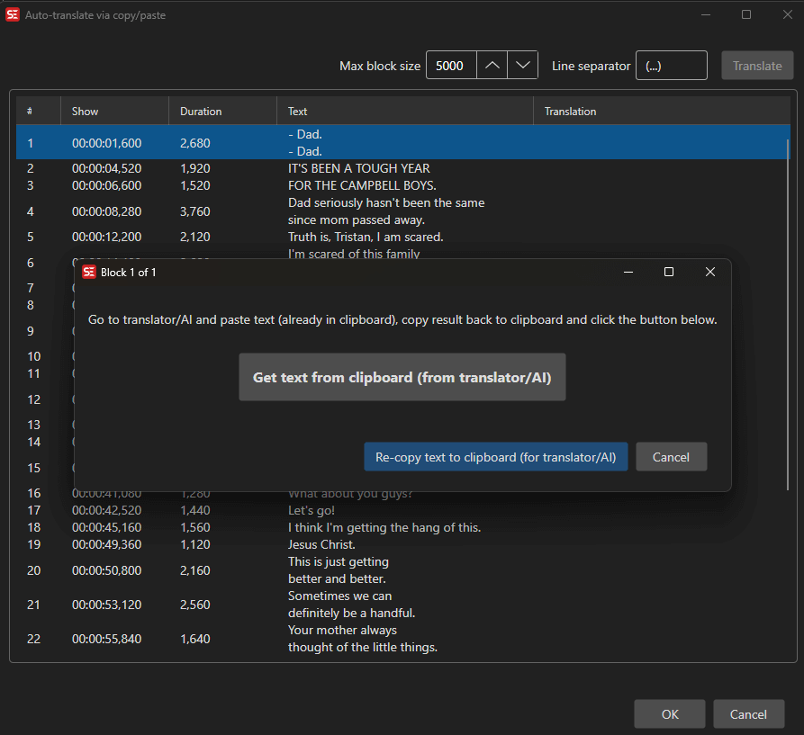

# Copy/Paste Translate

Translate subtitles by copying text blocks for translation in an external tool, then pasting back the results.

- **Menu:** Auto translate → Copy/paste translate...
- **Shortcut:** Configurable

<!-- Screenshot: Copy/paste translate window -->

## How to Use

1. Open **Auto translate → Copy/paste translate...**
2. Set the **Max block size** — maximum block size in characters
3. Set the **Line separator** — character(s) used between subtitle lines in the copied text
4. Click **Translate** to start; the next block of subtitle text is copied to the clipboard
5. Paste the text into your preferred translation tool (e.g., Google Translate, DeepL website)
6. Copy the translated text
7. Paste the translated text back into the dialog and confirm
8. Repeat for all blocks
9. Click **OK** to apply all translations

## Settings

- **Max block size** — Maximum number of characters per block (default 5000, range 100–500,000). Smaller blocks generally give more reliable translations.
- **Line separator** — The separator inserted between subtitle lines in the clipboard text (default: `(...)`)

## Keyboard Shortcuts

| Key | Action |
|-----|--------|
| Escape | Close / Cancel |
