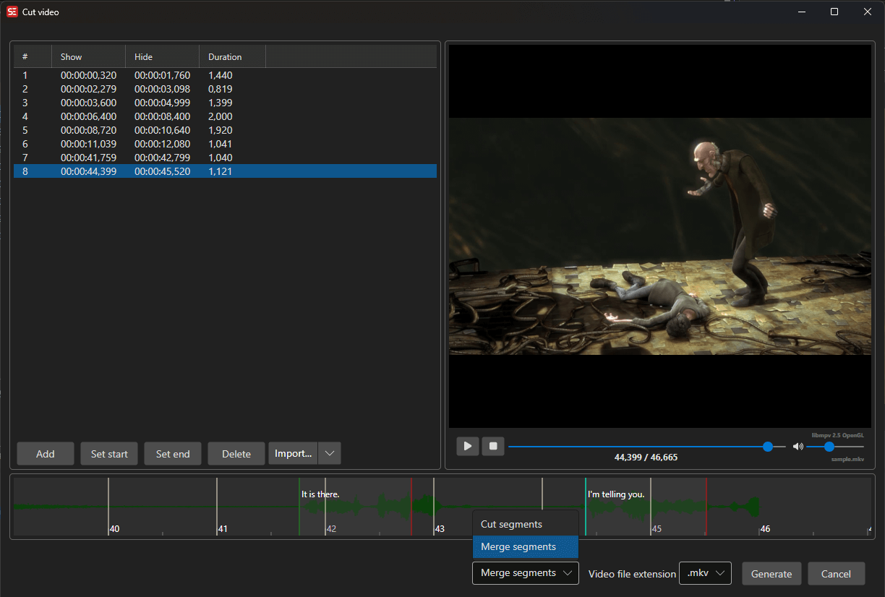

# Cut Video

Cut segments from a video file using an audio visualizer and video player.

- **Menu:** Video → Cut video...
- **Shortcut:** Configurable

<!-- Screenshot: Cut video window -->

## How to Use

1. Open **Video → Cut video...**
2. The video is loaded with the audio visualizer
3. Define cut segments by setting start and end points
4. Choose the cut type (keep or remove selected segments)
5. Select the output format and settings
6. Click **Generate** to create the cut video

## Segment Controls

- **Set start** — Set the start point of a segment at the current video position
- **Set end** — Set the end point of a segment at the current video position
- **Delete** — Remove the selected segment
- The segment list shows all defined cut points

## Cut Types

- **Keep selected segments** — Output only the selected portions
- **Remove selected segments** — Output everything except the selected portions

## Video Settings

- **Resolution** — Output video width and height
- **Frame rate** — Output frame rate
- **Video extension** — Output container format

## Audio Visualizer

The built-in audio visualizer helps you precisely identify cut points by showing the waveform.

## Keyboard Shortcuts

| Key | Action |
|-----|--------|
| Escape | Close / Cancel |
| F1 | Open help |
