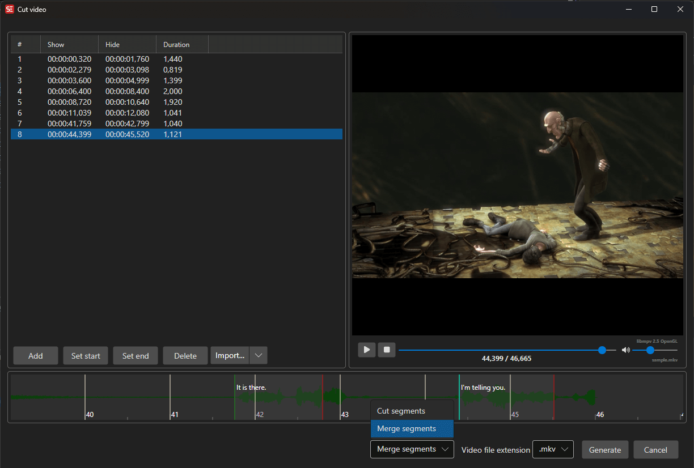

# Cut Video

Cut segments from a video file using an audio visualizer and video player.

- **Menu:** Video → Cut video...
- **Shortcut:** Configurable

<!-- Screenshot: Cut video window -->

## How to Use

1. Open **Video → Cut video...**
2. The video is loaded with the audio visualizer
3. Define segments by adding entries and setting their start/end points
4. Choose the cut type (cut or merge segments)
5. Select the output container extension
6. Click **Generate** to create the cut video

## Segment Controls

- **Add** — Add a new segment
- **Set start** — Set the start point of the selected segment at the current video position
- **Set end** — Set the end point of the selected segment at the current video position
- **Delete** — Remove the selected segment
- **Import...** — Import segments from a file, or use the split-button menu to import from the current subtitle
- The segment list shows all defined cut points

## Cut Types

- **Cut segments** — Output only the selected segments
- **Merge segments** — Concatenate the selected segments into a single output file

## Video Settings

- **Video extension** — Output container format (`.mkv`, `.mp4`, `.webm`, `.mp3`, `.wav`)

## Audio Visualizer

The built-in audio visualizer helps you precisely identify cut points by showing the waveform.

## Keyboard Shortcuts

| Key | Action |
|-----|--------|
| Escape | Close / Cancel |
| Space | Toggle video play/pause |
| F1 | Open help |
