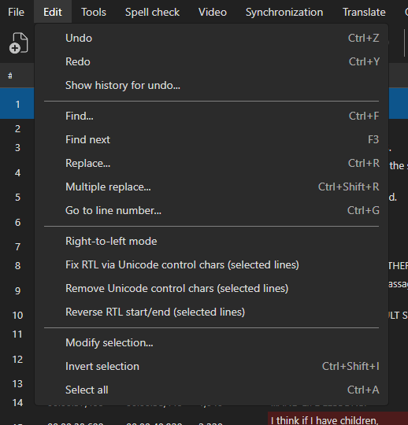
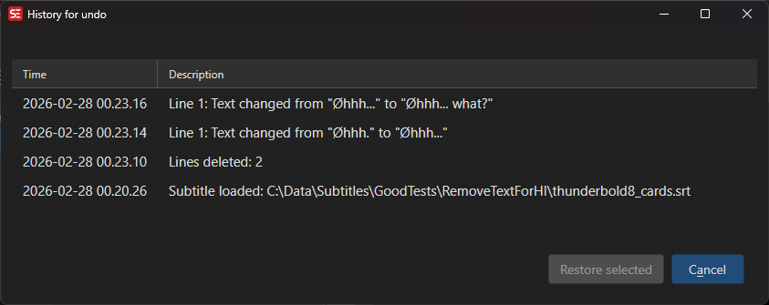
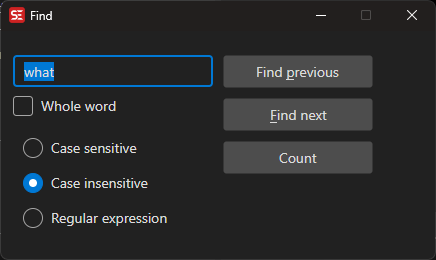
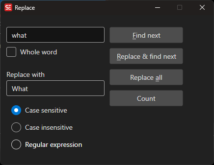
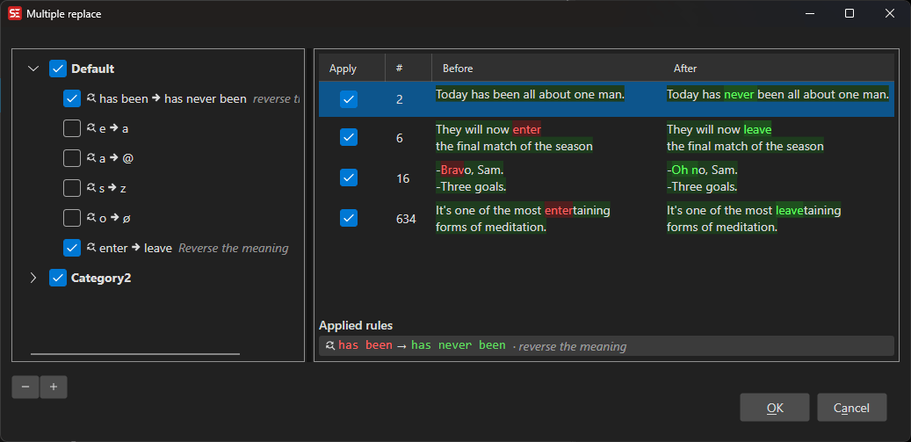
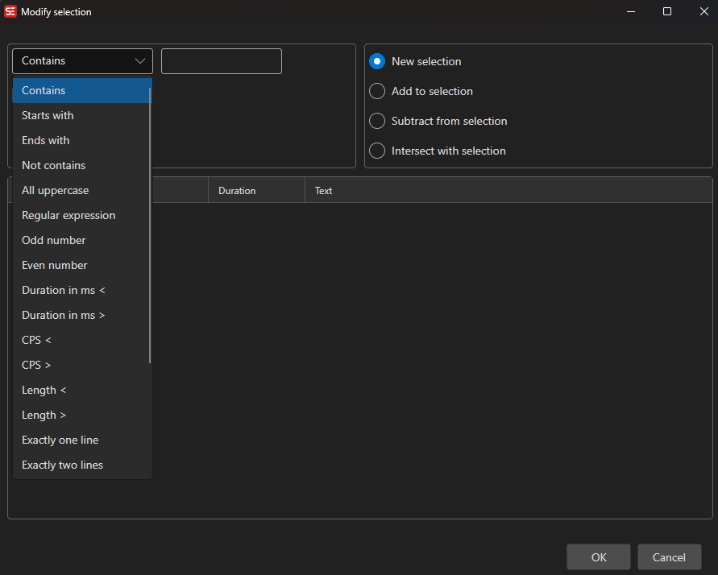

# Edit Menu

The Edit menu provides tools for finding, replacing, and modifying subtitle text and selections.

<!-- Screenshot: Edit menu -->

## Undo / Redo

Undo or redo the last editing action.

- **Undo:** `Ctrl+Z`
- **Redo:** `Ctrl+Y`

## Show History

View the complete history of changes made to the subtitle file and restore any previous state.

<!-- Screenshot: Show history window -->

## Find

Search for text in the subtitle.

- **Menu:** Edit → Find
- **Shortcut:** `Ctrl+F`
- **Find next:** `F3`
- **Find previous:** `Shift+F3`

Options:
- Case sensitive
- Whole word
- Regular expressions

<!-- Screenshot: Find window -->

## Replace

Find and replace text in the subtitle.

- **Menu:** Edit → Replace
- **Shortcut:** `Ctrl+H`

<!-- Screenshot: Replace window -->

## Multiple Replace

Apply multiple find-and-replace rules at once. Rules can be organized into groups and saved.

- **Menu:** Edit → Multiple replace
- Supports regular expressions
- Import/export rule sets

<!-- Screenshot: Multiple replace window -->

## Modify Selection

Select or deselect subtitle lines based on rules (e.g., text contains, duration, etc.).

- **Menu:** Edit → Modify selection...

<!-- Screenshot: Modify selection window -->

## Select All

Select all subtitle lines.

- **Shortcut:** `Ctrl+A`

## Inverse Selection

Invert the current selection (select unselected lines, deselect selected ones).

## Toggle Right-to-Left

Toggle right-to-left text direction for languages like Arabic and Hebrew.
