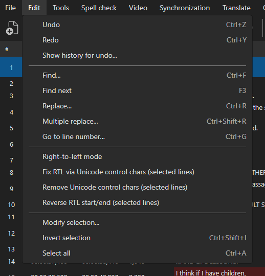
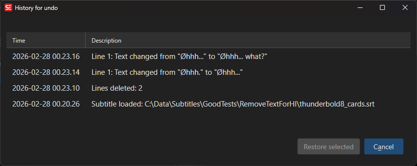
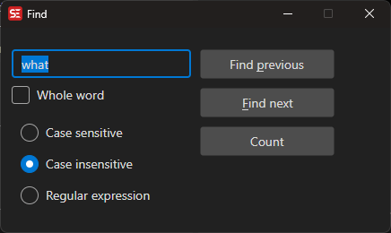
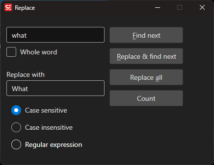
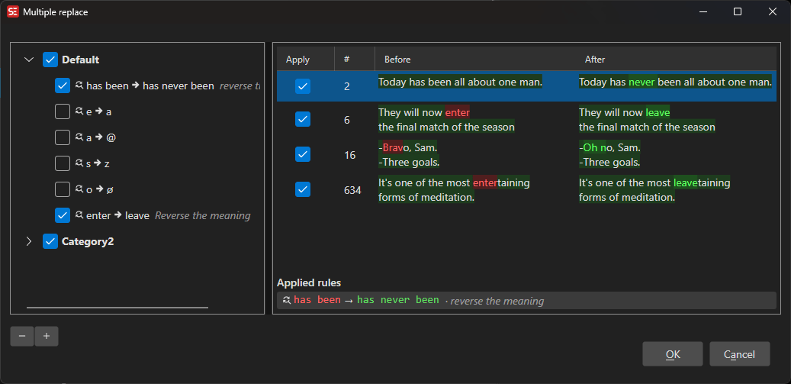
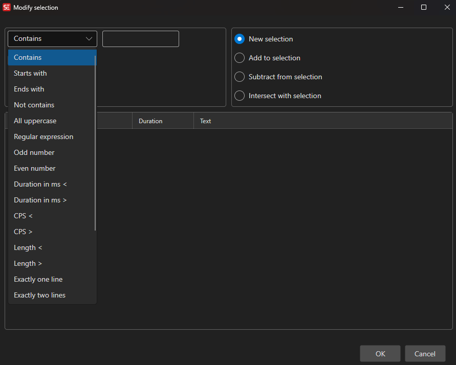

# Edit Menu

The Edit menu provides tools for finding, replacing, and modifying subtitle text and selections.

<!-- Screenshot: Edit menu -->


## Undo / Redo

Undo or redo the last editing action.

- **Undo:** `Ctrl+Z`
- **Redo:** `Ctrl+Y`

## Show History

View the complete history of changes made to the subtitle file and restore any previous state.

<!-- Screenshot: Show history window -->


## Find

Search for text in the subtitle.

- **Menu:** Edit → Find
- **Shortcut:** `Ctrl+F`
- **Find next:** `F3`
- **Find previous:** `Shift+F3`

Options:
- Whole word (checkbox)
- Search type (radio buttons): Case sensitive, Case insensitive, or Regular expression

> **Matching a line break with a regular expression:** use `\n` between the words on the two lines (for example `ear\ntwice`). `\r\n` and `\r` are accepted too and are treated the same as `\n`, so a rule works regardless of how it was written or which platform created it.

<!-- Screenshot: Find window -->


## Replace

Find and replace text in the subtitle.

- **Menu:** Edit → Replace
- **Shortcut:** `Ctrl+H`

<!-- Screenshot: Replace window -->


## Multiple Replace

Apply multiple find-and-replace rules at once, organized into named categories. Rules are persisted across sessions.

- **Menu:** Edit → Multiple replace

<!-- Screenshot: Multiple replace window -->


### Window layout

The window is split into two resizable panels:

| Panel | Description |
|---|---|
| **Left — Rules** | Tree of categories and their rules. Each rule shows its type icon, find pattern, replacement, and an optional description. |
| **Right — Fixes** | Preview of all lines that will be changed. The **Before** column highlights removed characters in red and the **After** column highlights added characters in green. Selecting a row reveals an **Applied rules** detail panel at the bottom listing every rule that matched that line. |

### Rule types

Each rule has one of three match types, shown as an icon in the tree:

| Type | Description |
|---|---|
| Case insensitive | Plain text match, ignores case |
| Case sensitive | Plain text match, exact case |
| Regular expression | Full .NET regex syntax. Use `\n` to match a line break between two lines (`\r\n` and `\r` are accepted too and treated as `\n`). |

### Managing categories

Right-click a category node to open its context menu:

- **Edit** — rename the category
- **New category** — add a sibling category
- **New rule** — add a rule to this category
- **Move up / Move down** — reorder categories
- **Delete** — remove the category and all its rules
- **Import** — load rules from a `.template` file (JSON or legacy SE4 XML) or a `.csv` file
- **Export** — save selected categories to a `.template` (JSON) or `.csv` file

### Managing rules

Right-click a rule node to open its context menu:

- **Edit rule** — change find/replace text, type, and description
- **Duplicate** — insert a copy of the rule above the current one
- **Insert before / Insert after** — add a new rule relative to this one
- **Move up / Move down** — reorder within the category
- **Delete** — remove the rule

Double-clicking a rule also opens the **Edit rule** dialog.

### Keyboard shortcuts

| Shortcut | Action |
|---|---|
| `Ctrl+N` | Add a new rule to the selected category, or insert after the selected rule |
| `Ctrl+D` | Duplicate the selected rule |
| `Ctrl+F` | Find a rule by name / text |
| `Ctrl+Shift+-` | Collapse all categories |
| `Ctrl+Shift++` | Expand all categories |
| `Delete` | Delete the selected rule (focus must be in the rules tree) |
| `Space` | Toggle the selected node (category or rule) on/off |
| `Escape` | Close the window |
| `F1` | Open help |

The expand/collapse buttons (`+` / `−`) above the tree expand or collapse all categories at once (`Ctrl+Shift++` / `Ctrl+Shift+-`).

### Import / Export

Rule sets are stored as JSON `.template` files and can be shared across installations. The export dialog lets you choose which categories to include. SE4-format XML files can also be imported.

Rules can also be exported to and imported from **CSV** (choose the `.csv` type in the export/import dialog), which is convenient for editing rules in a spreadsheet or sharing them as a simple table.

The CSV has one row per rule with this header:

```csv
Category,Find,ReplaceWith,Description,Active,Type
```

| Column | Description |
|---|---|
| `Category` | Category the rule belongs to (rules with the same name are grouped; empty becomes `Default`) |
| `Find` | Text or pattern to search for |
| `ReplaceWith` | Replacement text (may be empty) |
| `Description` | Optional note |
| `Active` | `true` or `false` — whether the rule is enabled |
| `Type` | `CaseInsensitive`, `CaseSensitive`, or `RegularExpression` |

Values are quoted per RFC 4180, so `Find`/`ReplaceWith` may contain commas, double quotes (written as `""`) and line breaks. The header row is optional on import; unknown `Type` values fall back to `CaseInsensitive`. Files are written as UTF-8 (with BOM) so non-ASCII rules open correctly in spreadsheet apps.

Example:

```csv
Category,Find,ReplaceWith,Description,Active,Type
General,"hello, world","say ""hi""",greeting,true,CaseInsensitive
Regex,\d+,#,strip numbers,true,RegularExpression
```

## Modify Selection

Select or deselect subtitle lines based on rules (e.g., text contains, duration, etc.).

- **Menu:** Edit → Modify selection...

<!-- Screenshot: Modify selection window -->


## Select All

Select all subtitle lines.

- **Shortcut:** `Ctrl+A`

## Inverse Selection

Invert the current selection (select unselected lines, deselect selected ones).

## Toggle Right-to-Left

Toggle right-to-left text direction for languages like Arabic and Hebrew.
