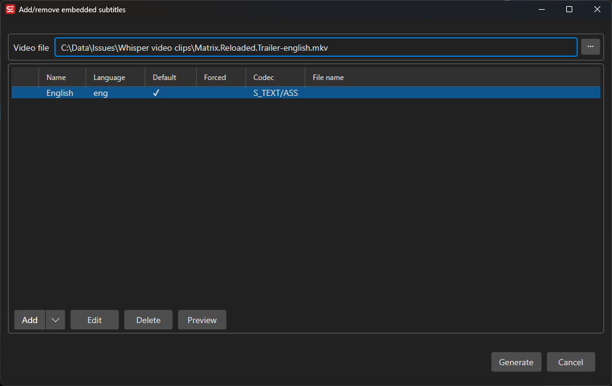

# Embedded Subtitles

Add, remove, preview, and edit subtitle tracks embedded in a video file.

- **Menu:** Video → Add/remove embedded subtitles...

<!-- Screenshot: Embedded subtitles window -->

## Supported Video Files

The embedded subtitle editor edits subtitle tracks in Matroska containers:

- `.mkv`
- `.webm`

Subtitle tracks can also be inspected from MP4-style containers (`.mp4`, `.m4v`, `.mov`), but the editor warns when the loaded file cannot be edited as a Matroska container.

Embedded subtitle reading supports a range of sources elsewhere in Subtitle Edit, including PGS/VobSub/DVB image tracks in Matroska, MP4-embedded VobSub/WebVTT, and CEA-708 (DTVCC) captions carried in H.264 SEI messages inside MP4.

FFmpeg is required. If FFmpeg is not available, Subtitle Edit will prompt you to install or configure it before generating the output video.

## What You Can Do

- View existing subtitle tracks in the loaded video.
- Add the current subtitle as a new embedded track.
- Add an external subtitle file as a new embedded track.
- Add Blu-ray SUP subtitles as image-based tracks.
- Mark existing tracks for deletion.
- Preview an embedded track before generating the new video.
- Edit track metadata such as title/language, default flag, and forced flag.
- Generate a new video file with the selected embedded subtitle track changes.

## Add the Current Subtitle

1. Open a video file.
2. Open or create the subtitle you want to embed.
3. Select **Video → Add/remove embedded subtitles...**.
4. Click **Add current**.
5. Edit the track metadata if needed.
6. Click **Generate** and choose an output file name.

If the current subtitle format is not suitable for Matroska embedding, Subtitle Edit converts it to ASSA for the generated output.

## Add an External Subtitle File

1. Open **Video → Add/remove embedded subtitles...**.
2. Click **Add**.
3. Choose a subtitle file.
4. Review the detected language and title.
5. Generate the output video.

Common text formats such as SRT, WebVTT, ASSA, and SSA can be embedded. Unsupported text formats are converted to ASSA before embedding.

## Remove or Edit Existing Tracks

- Select a track and click **Delete** to mark it for removal.
- Select a track and click **Edit** to change language/title, default, or forced flags.
- Select a track and click **Preview** to inspect its contents.
- Click **Clear** to mark all tracks for removal.

Changes are applied only when you click **Generate** and create the new video file.

## Keyboard Shortcuts

| Key | Action |
|-----|--------|
| Insert | Add an external subtitle file |
| Delete | Mark the selected track for deletion / undo deletion mark |
| Escape | Close or cancel generation |
| F1 | Open help |

## Notes

- The original video is not overwritten unless you explicitly choose the same output file name.
- Track editing is intended for Matroska/WebM files. Other containers may expose embedded subtitles elsewhere in Subtitle Edit, but this editor warns when the loaded file cannot be edited as a Matroska container.
- Output naming follows the same output-folder and suffix preferences used by the video generation tools.
