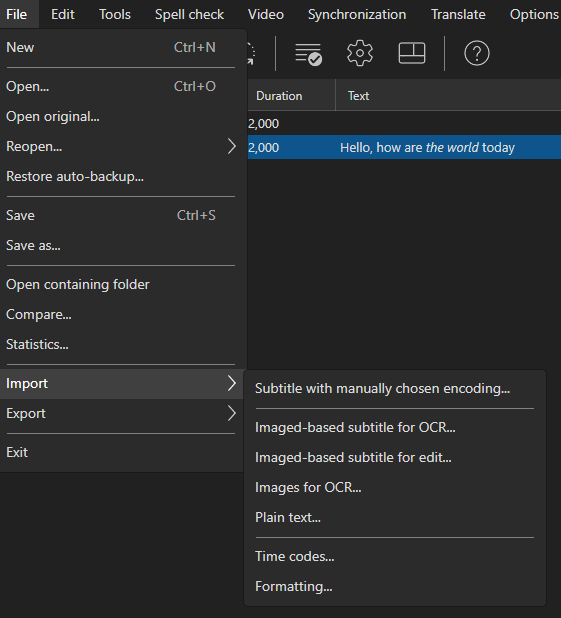
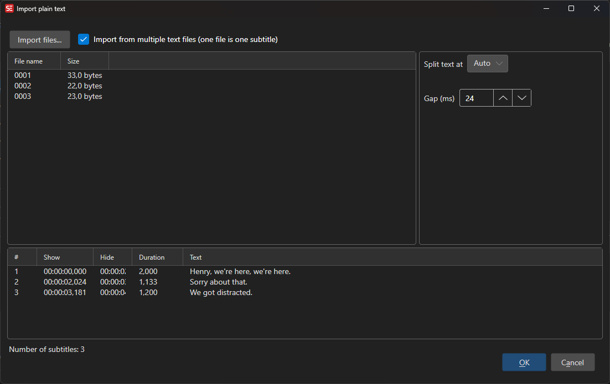
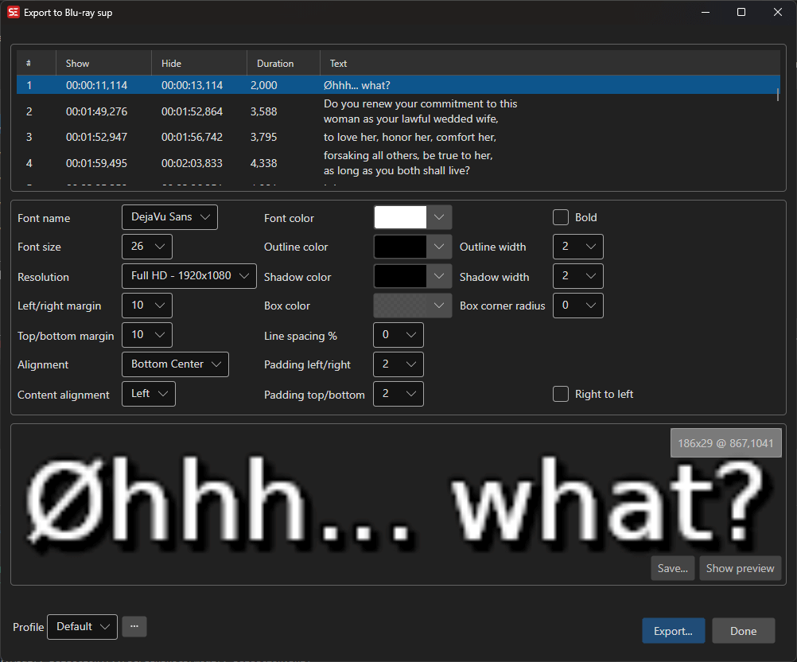
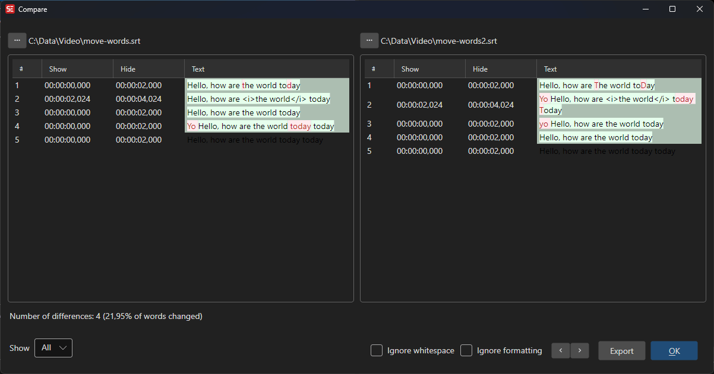

# File Menu

The File menu provides operations for creating, opening, saving, importing, and exporting subtitle files.

<!-- Screenshot: File menu -->

## New

Create a new empty subtitle.

- **Menu:** File → New
- **Shortcut:** `Ctrl+N`

### New (keep video)

Create a new subtitle while keeping the currently loaded video.

## Open

Open an existing subtitle file.

- **Menu:** File → Open
- **Shortcut:** `Ctrl+O`

### Open (keep video)

Open a subtitle file while keeping the currently loaded video.

### Open original subtitle

Open a second subtitle file for translation mode (shown side by side).

## Save

Save the current subtitle file.

- **Menu:** File → Save
- **Shortcut:** `Ctrl+S`

## Save As

Save the current subtitle to a new file or format.

- **Menu:** File → Save as...
- **Shortcut:** `Ctrl+Shift+S`

## Close Original

Close the secondary (original) subtitle file in translation mode.

## Recent Files

Quick access to recently opened subtitle files.

## Import

### Import subtitle with manually chosen encoding

Open a subtitle file with a specific text encoding.

### Import time codes

Import time codes from another subtitle file, applying them to the current text.

### Import plain text

Import plain text and create subtitle lines from it.

- Split by line breaks, sentence endings, or fixed length
- Set duration and gap settings

<!-- Screenshot: Import plain text window -->

### Import images

Import image files and create subtitle entries from them.

## Export

### Export as plain text

Export subtitle text without time codes.

### Export custom text format

Export using a customizable text template.

### Export to Blu-ray SUP

Export subtitles as Blu-ray SUP image format.

### Export to EBU STL

Export subtitles in EBU STL format (used in European broadcasting).

### Export to PAC

Export subtitles in PAC format.

### Export to Cavena 890

Export subtitles in Cavena 890 format.

### Export image-based

Export subtitles as images (BDN XML, VobSub, Blu-ray SUP, FCP, etc.).

<!-- Screenshot: Export image-based window -->

## Compare

Compare two subtitle files side by side.

- **Menu:** File → Compare...

<!-- Screenshot: Compare window -->

## Statistics

View subtitle file statistics (character count, line count, reading speed, etc.).

- **Menu:** File → Statistics...

## Restore Auto Backup

Restore a previously auto-saved backup of a subtitle file.

## Open Containing Folder

Open the folder containing the current subtitle file in the file manager.

## Open Data Folder

Open the Subtitle Edit data/settings folder.
