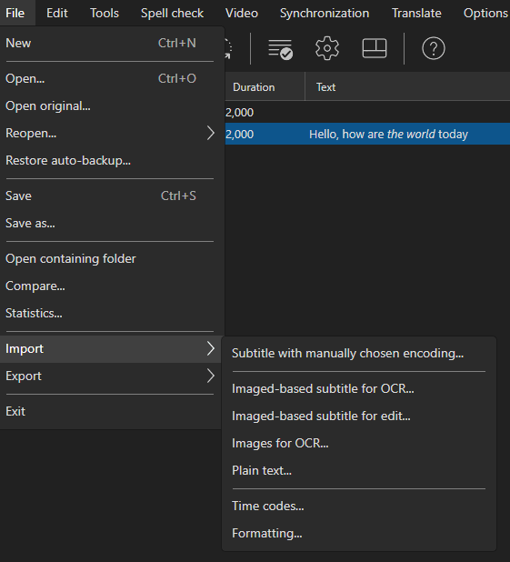
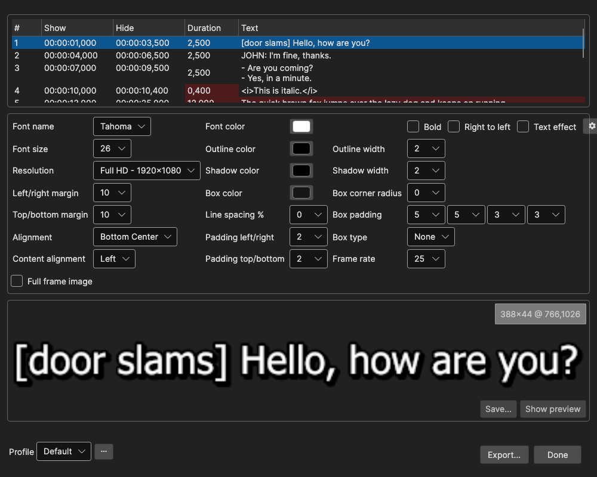
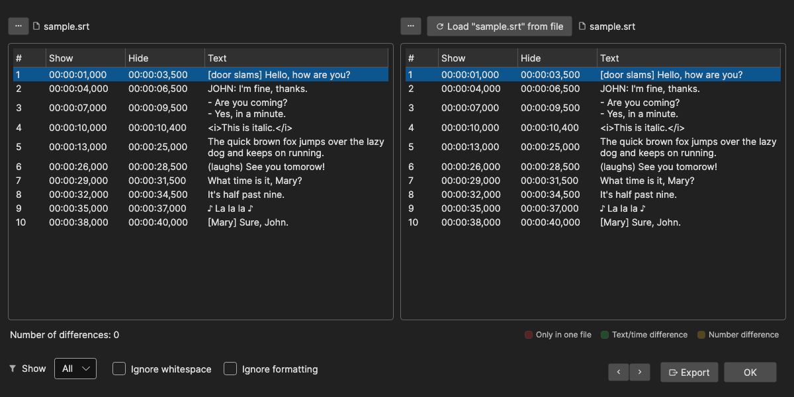

# File Menu

The File menu provides operations for creating, opening, saving, importing, and exporting subtitle files.

<!-- Screenshot: File menu -->

## New

Create a new empty subtitle.

- **Menu:** File → New
- **Shortcut:** `Ctrl+N`

### New (keep video)

Create a new subtitle while keeping the currently loaded video.

## Open

Open an existing subtitle file.

- **Menu:** File → Open
- **Shortcut:** `Ctrl+O`

### Open (keep video)

Open a subtitle file while keeping the currently loaded video.

### Open original subtitle

Open a second subtitle file for translation mode (shown side by side). See [Translation Mode](main-window.md#translation-mode) for how a file that does not line up 1:1 is handled.

### Edit original subtitle

Toggle "edit original" mode: the original subtitle (even one opened as a read-only reference) becomes the file being edited, and the working subtitle's text box goes read-only. See [Edit original mode](main-window.md#edit-original-mode).

## Save

Save the current subtitle file.

- **Menu:** File → Save
- **Shortcut:** `Ctrl+S`

## Save As

Save the current subtitle to a new file or format.

- **Menu:** File → Save as...
- **Shortcut:** `Ctrl+Shift+S`

## Close Original

Close the secondary (original) subtitle file in translation mode.

## Recent Files

Quick access to recently opened subtitle files.

## Import

### Import subtitle with manually chosen encoding

Open a subtitle file with a specific text encoding.

### Import time codes

Import time codes from another subtitle file, applying them to the current text.

### Import plain text

Import plain text and create subtitle lines from it, with optional forced-aligner timing against the video's audio.

See [Import Plain Text](import-plain-text.md) for details.

### Import images

Import image files and create subtitle entries from them.

## Export

### Export as plain text

Export subtitle text without time codes.

### Export custom text format

Export using a customizable text template. A template has a header, a per-subtitle text part, and a footer.

Placeholders for the text part include `{start}`, `{end}`, `{text}`, `{number}`, `{number-1}`, `{duration}`, `{gap}`, `{actor}`, `{text-line-1}`, `{text-line-2}`, `{text-length}`, `{cps-period}`, `{bookmark}`, `{media-file-name}`, `{text-csv}`, and `{tab}`.

The time code format is built from these letters (anything else is kept as-is):

| Letters | Meaning |
|---------|---------|
| `hh` / `h` | hours |
| `mm` / `m` | minutes |
| `ss` / `s` | seconds |
| `zzz` | milliseconds / fraction of a second |
| `ff` / `f` | frames (uses the current frame rate) |

So `hh:mm:ss,zzz` gives `00:01:01,160` and `hh:mm:ss:ff` gives `00:01:01:04`.

A time code format that *starts* with `s`'s or `z`'s means totals instead of clock components: `ss.zzz` gives total seconds `61.160`, `ss.zzzzzz` gives `61.160000` (Audacity/Tenacity label style), `ss` gives `61`, and `zzz` gives total milliseconds `61160`. A format of exactly `ff` gives total frames.

### Export to Blu-ray SUP

Export subtitles as Blu-ray SUP image format.

### Export to EBU STL

Export subtitles in EBU STL format (used in European broadcasting).

### Export to PAC

Export subtitles in PAC format.

### Export to Cavena 890

Export subtitles in Cavena 890 format.

### Export image-based

Export subtitles as images (BDN XML, VobSub, Blu-ray SUP, Final Cut Pro + image, IMSC 1.1 image profile, etc.).

**BDN/xml** writes 32-bit PNGs; **BDN/xml 8-bit** writes the same index.xml with 8-bit palette-indexed PNGs, which is what most Blu-ray authoring tools expect.

The **IMSC 1.1 image profile** export writes a single self-contained TTML file with each subtitle embedded as a base64 PNG (`smpte:image` / `smpte:backgroundImage`), media timebase, and percentage-positioned regions — the standardized image-subtitle carriage for streaming and broadcast delivery.

#### ASSA override tags

Tags in the text are read rather than drawn as literal characters:

| Tag | Effect on the exported image |
|-----|------------------------------|
| `{\an1}` - `{\an9}` | Places the subtitle, overriding the alignment chosen in the window |
| `{\pos(x,y)}` | Positions the subtitle (coordinates are in the script's own resolution) |
| `{\i1}`, `{\b1}`, `{\c&H..&}`, `{\fn..}`, `{\fs..}` | Italic, bold, colour, font and size |
| `{\alpha&H80&}`, `{\1a}`, `{\3a}`, `{\4a}` | Transparency — all parts at once, or text, outline and shadow separately |
| `{\3c&H..&}`, `{\4c&H..&}` | Outline and shadow colour, overriding the colours chosen in the window |
| `{\bord2}`, `{\shad0}` | Outline and shadow width (in the script's own resolution) — `{\bord0}` turns the outline off |
| `{\fad(in,out)}`, `{\fade(..)}` | Fade in/out — **Blu-ray SUP only** (see below) |

Anything else is removed before rendering.

**Fading (Blu-ray SUP).** A subtitle with `{\fad(400,400)}` is written the way a Blu-ray disc does it: the image is encoded once and the fade follows as palette updates, one per video frame, which cost about a kilobyte each instead of a whole new image. Long fades are sampled coarser so a single subtitle never adds more than 60 of them. The other image formats have no way to animate a subtitle and ignore the tag - the image is written fully opaque.

<!-- Screenshot: Export image-based window -->

## Compare

Compare two subtitle files side by side.

- **Menu:** File → Compare...

<!-- Screenshot: Compare window -->

## Statistics

View subtitle file statistics (character count, line count, reading speed, etc.).

- **Menu:** File → Statistics...

## Restore Auto Backup

Restore a previously auto-saved backup of a subtitle file.

## Open Containing Folder

Open the folder containing the current subtitle file in the file manager.
