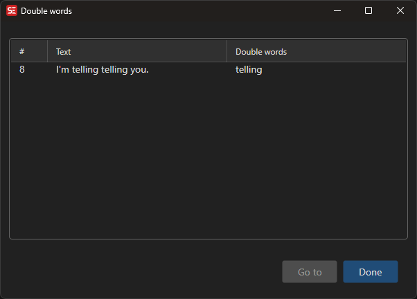

# Find Double Words

Find and fix repeated/double words in subtitle text (e.g., "the the").

- **Menu:** Spell check → Find double words
- **Shortcut:** Configurable

<!-- Screenshot: Find double words window -->

## How to Use

1. Open **Spell check → Find double words**
2. The tool scans all subtitle lines for consecutive repeated words
3. Each occurrence is listed with the line number and the repeated word
4. Click on an entry to navigate to the subtitle line
5. Fix the text manually or use the provided actions

## What It Detects

- Consecutive identical words (e.g., "the the", "is is")
- Works across line breaks within the same subtitle

## Keyboard Shortcuts

| Key | Action |
|-----|--------|
| Escape | Close |
