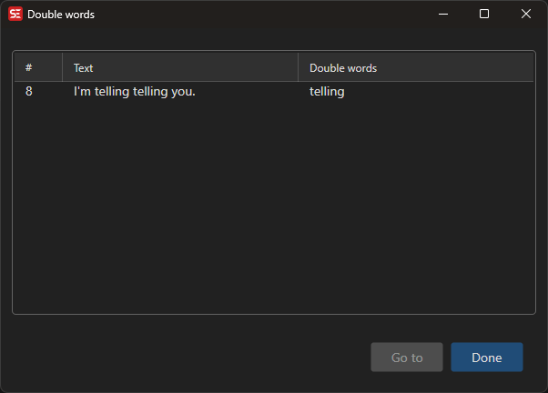

# Find Double Words

Find and fix repeated/double words in subtitle text (e.g., "the the").

- **Menu:** Spell check → Find double words
- **Shortcut:** Configurable

<!-- Screenshot: Find double words window -->

## How to Use

1. Open **Spell check → Find double words...**
2. The tool scans all subtitle lines for consecutive repeated words
3. Each occurrence is listed with the line number, the subtitle text, and the repeated word
4. Select a row and click **Go to**, press **Enter**, or double-click to jump to that subtitle in the main grid
5. Edit the text manually in the main window

## What It Detects

- Consecutive identical words (e.g., "the the", "is is")
- Works across line breaks within the same subtitle

## Keyboard Shortcuts

| Key | Action |
|-----|--------|
| Escape | Close |
