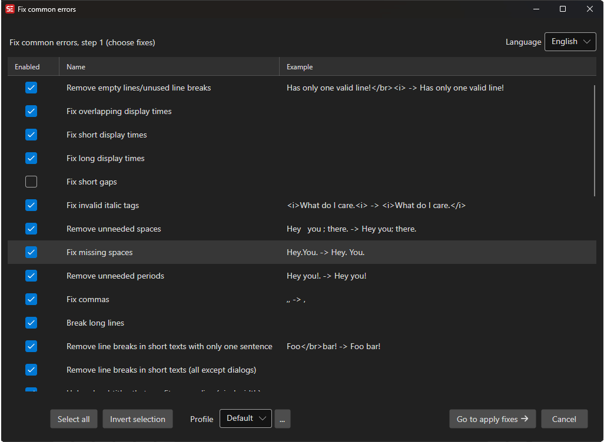
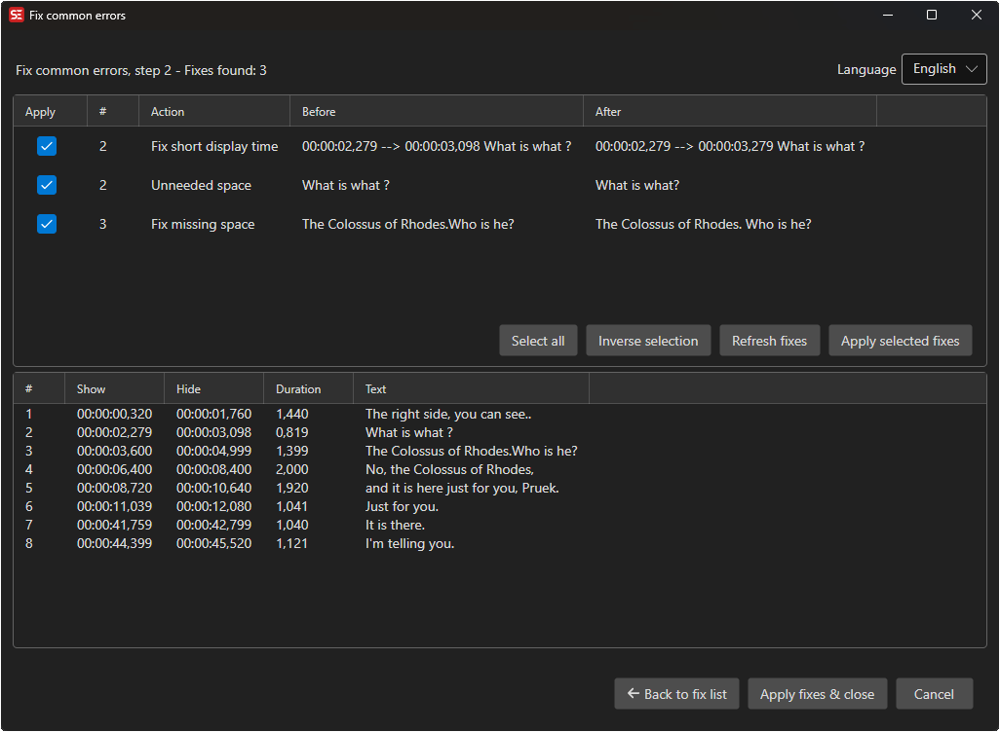

# Fix Common Errors

Automatically detect and fix common subtitle errors.

- **Menu:** Tools → Fix common errors...
- **Shortcut:** Configurable

## Step 1 - Rules

<!-- Screenshot: Fix common errors rules -->

## Step 2 - Fixes

<!-- Screenshot: Fix common errors fixes -->

## How to Use

1. Open **Tools → Fix common errors...**
2. Select the language for language-specific rules
3. Check/uncheck the rules you want to apply
4. Click **Next** to see the proposed fixes
5. Review each fix and check/uncheck individual items
6. Click **Apply selected fixes**

## Available Fixes

Common fixes include:
- Remove empty lines
- Remove lines with only a period
- Fix overlapping display times
- Fix short display times
- Fix long display times
- Fix invalid italic tags
- Fix unbalanced bold/italic tags
- Fix missing periods at end of lines
- Fix missing spaces
- Fix double spaces
- Fix short lines that can be merged
- Remove blank lines between subtitles
- Fix music symbols
- Fix ellipsis notation
- And many more...

## Profiles

You can save different sets of fix rules as profiles for different workflows (e.g., broadcast, streaming, fansubbing).

- **Save profile** — Save current rule selections
- **Load profile** — Load a previously saved profile

