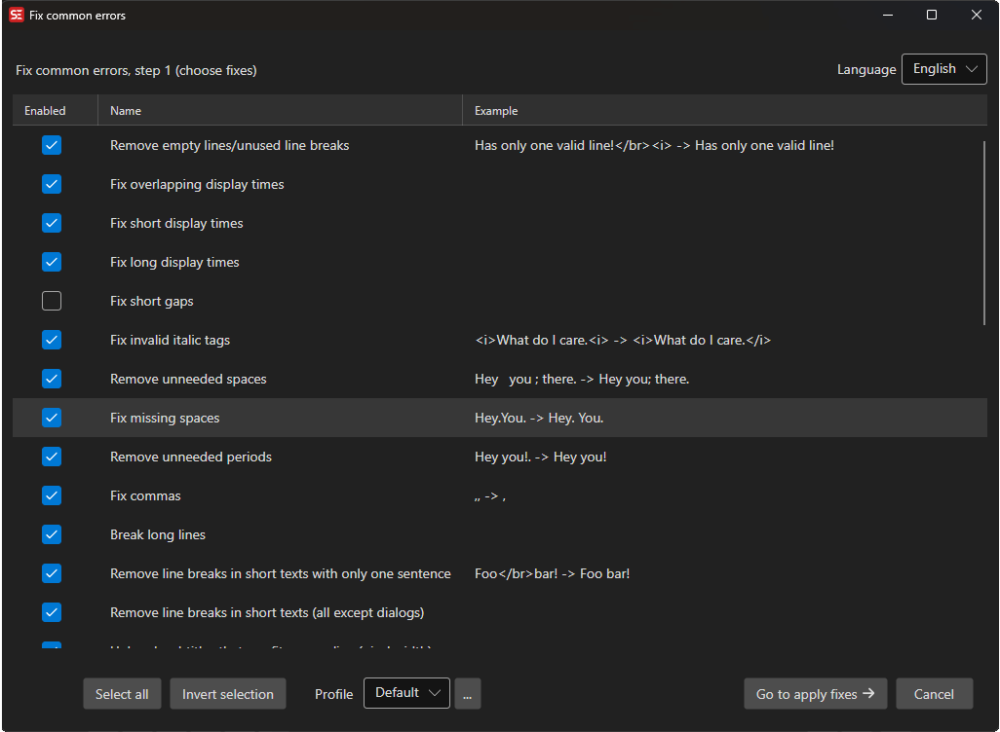
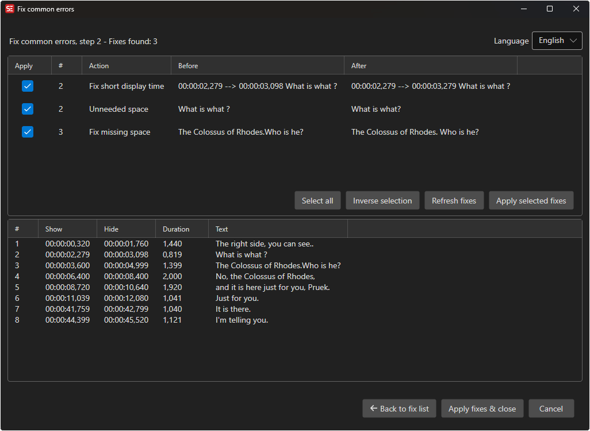

# Fix Common Errors

Automatically detect and fix common subtitle errors.

- **Menu:** Tools → Fix common errors...
- **Shortcut:** Configurable

## Step 1 - Rules

<!-- Screenshot: Fix common errors rules -->

## Step 2 - Fixes

<!-- Screenshot: Fix common errors fixes -->

## How to Use

1. Open **Tools → Fix common errors...**
2. Select the language for language-specific rules
3. Check/uncheck the rules you want to apply
4. Click **Go to apply fixes** to see the proposed fixes
5. Review each fix and check/uncheck individual items
6. Click **Apply selected fixes**

## Available Fixes

Common fixes include:
- Remove empty lines / unused line breaks
- Fix overlapping display times
- Fix short display times
- Fix long display times
- Fix short gaps
- Fix invalid italic tags
- Remove unneeded spaces
- Fix missing spaces
- Remove unneeded periods
- Fix commas
- Break long lines
- Remove line breaks in short lines (text length / pixel width)
- Fix double apostrophes (`''` → `"`)
- Fix music notation
- Add missing periods at end of lines
- Start with uppercase letter after paragraph / period / colon
- Add missing quotes
- Break dialogs on one line
- Fix hyphens / dashes in dialog
- Fix 3+ lines
- Fix double dash (`--` → `…`)
- Fix double greater-than (`>>`)
- Fix continuation style
- Fix missing open bracket (e.g. `(`, `[`)
- Fix common OCR errors
- Fix uppercase `I` inside lowercase words
- Remove space between numbers
- Remove dialog dash on first line of non-dialog
- Normalize strings (Unicode normalization)

Additional language-specific rules are added when applicable (e.g. lowercase `i` → uppercase `I` for English, Turkish ANSI → Unicode, Danish letter `i`, inverted `¿`/`¡` for Spanish).

## Profiles

You can save different sets of fix rules as profiles for different workflows (e.g., broadcast, streaming, fansubbing).

- Pick the active profile from the **Profile** combo box at the top of the window
- Click the **...** button next to the combo box to add, rename, delete, import, or export profiles

