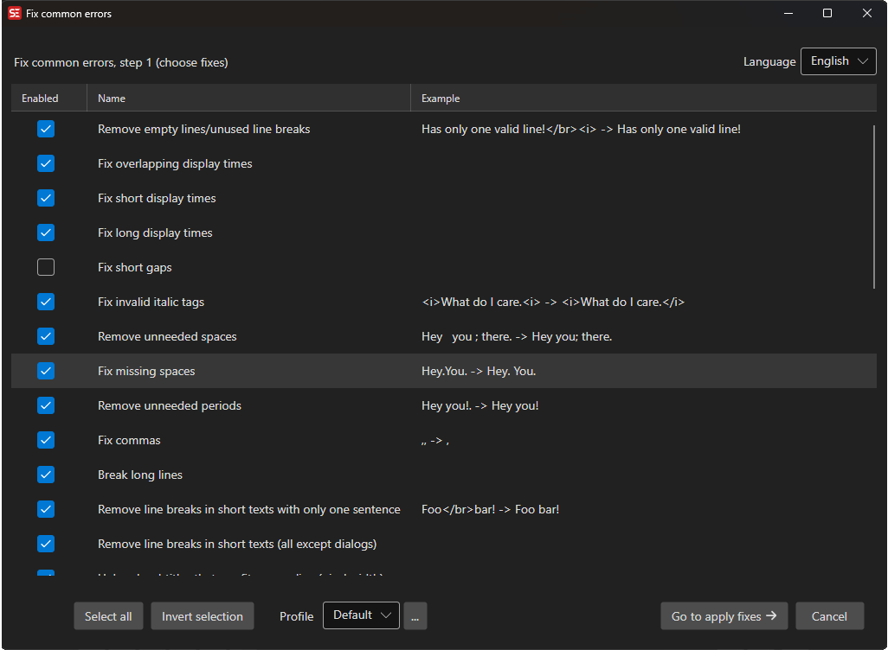
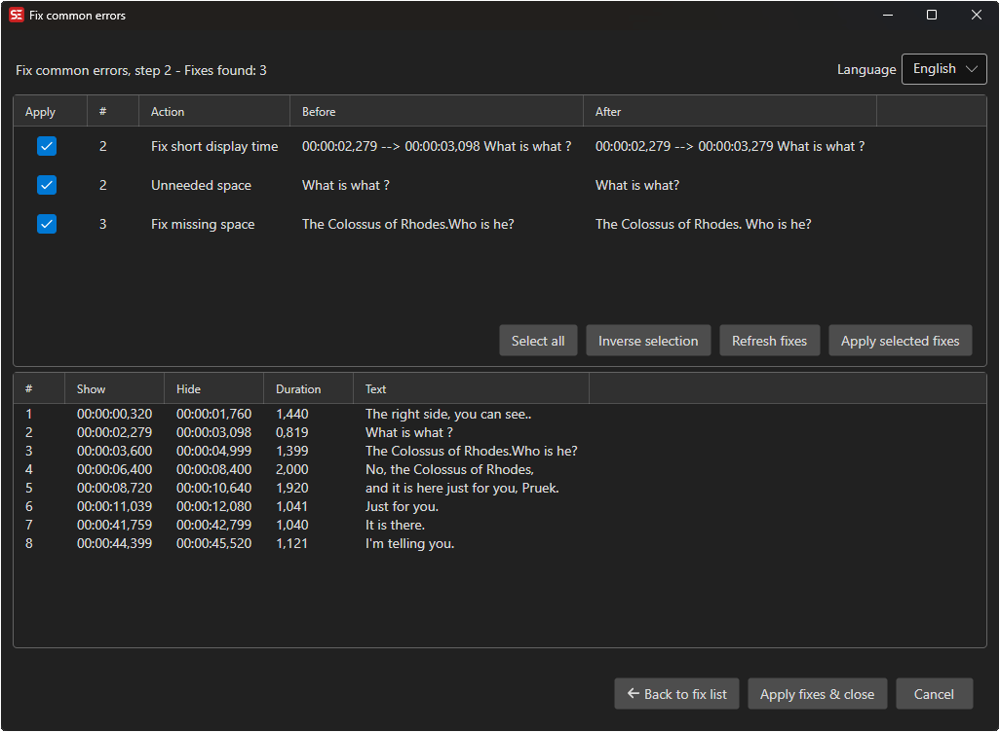

# Fix Common Errors

Automatically detect and fix common subtitle errors.

- **Menu:** Tools → Fix common errors...
- **Shortcut:** Configurable

## Step 1 - Rules

<!-- Screenshot: Fix common errors rules -->

## Step 2 - Fixes

<!-- Screenshot: Fix common errors fixes -->

## How to Use

1. Open **Tools → Fix common errors...**
2. Select the language for language-specific rules
3. Check/uncheck the rules you want to apply. The search box filters the rule list, and **Select all** / **Invert selection** flip many rules at once
4. Optionally tick **Try to guess unknown words** to let the OCR fix engine correct words it does not know
5. Click **Go to apply fixes** to see the proposed fixes
6. Review each fix and check/uncheck individual items
7. Click **Apply selected fixes**, then **Done** to close the window

### Step 2 controls

- **Refresh available fixes** re-scans the subtitle after you have applied some fixes or edited text in the preview
- The **filter chips** above the list show one chip per rule that found something; click a chip to show only that rule's fixes
- Right-click a fix for **Rule details...** (what the rule does and an example) or **Show only this rule**
- The **Log** link opens a window with everything the run changed, plus errors that were found but could not be fixed automatically

## Available Fixes

Common fixes include:
- Remove empty lines / unused line breaks
- Fix overlapping display times
- Fix short display times
- Fix long display times
- Fix short gaps
- Fix invalid italic tags
- Remove unneeded spaces
- Fix missing spaces
- Remove unneeded periods
- Fix commas
- Break long lines
- Remove line breaks in short lines (text length / pixel width)
- Fix double apostrophes (`''` → `"`)
- Fix music notation
- Add missing periods at end of lines
- Start with uppercase letter after paragraph / period / colon
- Add missing quotes
- Break dialogs on one line
- Fix hyphens / dashes in dialog
- Fix 3+ lines
- Fix double dash (`--` → `…`)
- Fix double greater-than (`>>`)
- Fix continuation style
- Fix missing open bracket (e.g. `(`, `[`)
- Fix common OCR errors
- Fix uppercase `I` inside lowercase words
- Remove space between numbers
- Remove dialog dash on first line of non-dialog
- Normalize strings (Unicode normalization)
- Remove leading `...` (only offered when the continuation style in Settings → General is *None*)

Additional language-specific rules are added when applicable (e.g. lowercase `i` → uppercase `I` for English, Turkish ANSI → Unicode, Danish letter `i`, inverted `¿`/`¡` for Spanish).

## Profiles

You can save different sets of fix rules as profiles for different workflows (e.g., broadcast, streaming, fansubbing).

- Pick the active profile from the **Profile** combo box at the top of the window
- Click the **...** button next to the combo box to add, rename, or delete profiles

