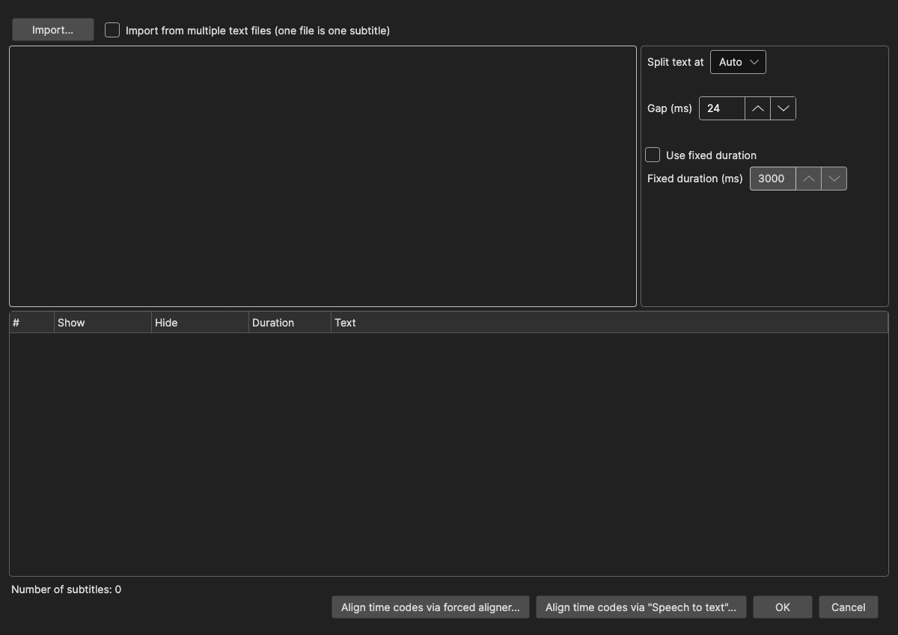

# Import Plain Text

Turn a plain text file — or pasted text — into subtitle lines, with generated time codes. The time codes can then be aligned to the actual audio with a forced aligner or via speech to text.

- **Menu:** File → Import → Plain text...
- **Shortcut:** Configurable (no default)

<!-- Screenshot: Import plain text window -->

## Importing Text

Paste or type text into the edit box, or click **Import...** to load a text file. Tick **Import from multiple text files (one file is one subtitle)** to switch to a file list where each file becomes one subtitle line — useful for batch workflows; `.txt` and `.rtf` files can also be dragged onto the list, and time codes embedded in file names are picked up automatically.

## Options

- **Split text at** — How the text is divided into subtitles:
  - **Auto** — Splits into subtitles using your max line length and line count settings, breaking preferentially at sentence endings, then at commas and other pauses
  - **Blank lines** — Each paragraph (text between blank lines) becomes one subtitle
  - **One line is one subtitle**
  - **Two lines are one subtitle**
- **Gap (ms)** — Pause inserted between generated subtitles
- **Use fixed duration** / **Fixed duration (ms)** — Give every subtitle the same duration instead of calculating it from text length

Without fixed duration, each subtitle's duration is calculated from its text length using your optimal characters/second setting, clamped between the minimum and maximum display duration. Lines are laid out sequentially starting at zero.

The preview grid updates as you change options and shows the resulting subtitles with their time codes.

## Aligning Time Codes to the Audio

Sequential time codes from text length are only a starting point. If you have the video, two buttons at the bottom can time the text against the actual speech:

### Align time codes via forced aligner...

A forced aligner matches the text you already have against the audio, without transcribing it first — this is fast and keeps your text exactly as written. Long videos are aligned in windowed chunks, so any length works.

Setup dialog:

- **Engine** — Uses the Crisp ASR engine; click **Download / update engine...** if it is not installed yet
- **Aligner model** — Pick an alignment model. The wav2vec2 aligners are language-specific and small (~200–300 MB); the Canary CTC and Qwen3 forced aligner models are multilingual

Missing models are downloaded automatically when you press OK. Progress is shown per window and line while aligning. If the script is longer than the speech in the video, the trailing lines cannot be aligned and a warning tells you how many lines were matched.

### Align time codes via "Speech to text"...

Runs normal [speech to text](speech-to-text.md) on the video, then matches your script against the transcript. Useful when the forced aligner does not support your language. Lines that cannot be matched get interpolated time codes.

## OK / Result

Pressing **OK** replaces the currently loaded subtitle with the imported lines. Save your current work first if you need it.
