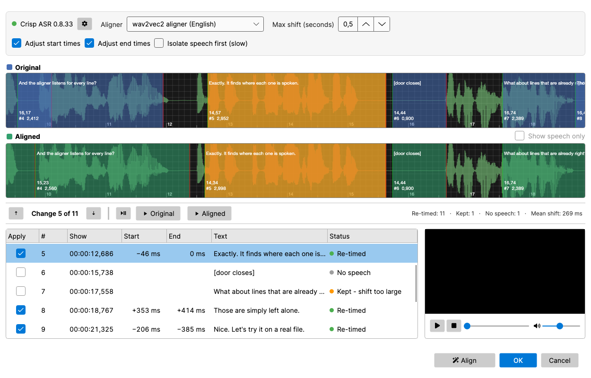

# Improve Time Codes (forced alignment)

Tighten the time codes of a subtitle that is already roughly in sync, by letting a forced aligner listen for every line in the audio. Nothing is transcribed and no text is changed - only the in- and out-cues move.

- **Menu:** Tools → Improve time codes (forced alignment)…
- **Requires:** a video or audio file loaded in the main window, and the Crisp ASR engine (downloaded on first use).

<!-- Screenshot: Improve time codes window with Original/Aligned waveforms and the line list after an alignment -->

The subtitle has to be close to begin with: each line is looked for round its current position only. If the whole file is off by seconds, use [Adjust all times](adjust-all-times.md), [Point sync](point-sync.md) or [Visual sync](visual-sync.md) first.

## Setup bar

- **Engine status + gear icon** — shows the installed Crisp ASR version. The gear opens the engine settings (backend, update / re-download), the same dialog as in Speech to text.
- **Aligner** — the model that does the listening. The list is ordered best first for the language of the subtitle:
  1. the *wav2vec2 aligner* for that language, when there is one (English, German, French, Spanish, Italian, Japanese, Chinese, Dutch, Portuguese, Arabic, Ukrainian, Czech) — the most precise, and its line ends stop where the speech stops;
  2. the *Canary CTC aligner* — one model for 25 European languages, accurate to about 80 ms;
  3. the *Qwen3 forced aligner* — for the languages only it covers (e.g. Korean).

  A model that is not installed yet says how much will be downloaded; the download starts when you press **Align**.
- **Max shift (seconds)** — how far the subtitle may be out of sync (default 0.5). A line whose *start* would move further is left alone and flagged. An *end* that would move further is not pulled in to the speech - subtitles are often held long after the last word so they can be read - it travels with the start, so the line keeps its duration. Raise the value for a file that is off by a second or so; it is safe to do so, because single lines are checked against their neighbours (see [Large moves](#large-moves)).
- **Adjust start times / Adjust end times** — untick one to leave that side of every line alone.
- **Isolate speech first (slow)** — removes music and sound effects before aligning, so the aligner only hears the dialogue. Worth it for lines spoken over loud music or action; on clean dialogue it changes little. It takes about as long as the audio itself with a GPU, and many times longer without one. The first use downloads the *Mel-Band RoFormer (vocals)* model (457 MB) - the same one as *Isolate speech* in [Speech to text](speech-to-text.md). If the isolation fails, the original audio is aligned instead and the status line says so. A successful run also produces the speech-only waveform for the preview (see below).
- **Align** (bottom button bar, highlighted until there is a result) — extracts the audio and runs the aligner. Length is not a limit: the audio is processed in short windows of a few lines each, so long films use no more memory than short clips. **Cancel** stops a running alignment.

## Preview

Two stacked waveforms show the same stretch of audio:

- **Original** (blue) — the time codes as they are now.
- **Aligned** (green) — the time codes after alignment.

**Show speech only** (on the *Aligned* row) redraws the **Aligned** waveform from the audio with music and sound effects removed - the same audio the aligner listened to when *Isolate speech first* was on, which makes it much easier to judge whether a cue starts and stops with the words. The *Original* waveform always shows the audio as it is, so the two can be compared. It becomes available as soon as the speech has been isolated once for this video, and is switched on automatically after such a run. The speech-only waveform is shared with *Show speech only* in the main window's [waveform](audio-visualizer.md): whichever of the two generates it first, the other reuses it.

The line being looked at is amber in both. Scrolling or zooming either waveform moves the other, and clicking a line in a waveform selects it in the list. A small video player sits beside the line list, so you can watch as well as listen.

Under the waveforms:

- **Play / pause** (or **Space**, wherever the focus is) plays from the playhead. Click in either waveform to move the playhead.
- **▶ Original** (**Shift+F5**) and **▶ Aligned** (**F5**) play just the selected line, with its old or its new time codes - the quickest way to hear whether a cue now starts and stops with the speech. Double-clicking a cue in a waveform plays it with that waveform's time codes; double-clicking a row plays the aligned version.
- **▲ / ▼** (or **F7** / **F8**) step to the previous / next re-timed line, and *Change X of Y* shows where you are.
- The summary on the right counts re-timed lines, lines that were kept, lines with no speech, and the mean shift.

## Line list

One row per subtitle line, with the shift of its start and end in milliseconds and a status:

| Status | Meaning |
|---|---|
| Re-timed | The aligner moved the line. |
| Moved with its neighbours | The lines round it all moved by about the same amount, but the aligner wanted this one somewhere else - or further than *Max shift*. It was given the neighbours' offset instead. |
| Large move - listen, tick to apply | The line wants to move more than half a second while its neighbours stay put. The new time codes are the aligner's, but the row is **not ticked**: play ▶ Original and ▶ Aligned and tick it if the move is right. |
| Already in place | The aligner agrees with the current time codes. |
| No speech | Nothing to listen for - blank lines, `[sound descriptions]`, `(sighs)`, `♪`. These lines are never moved. |
| Kept - shift too large | The start would have moved more than *Max shift*, so the line was left alone. |
| Kept - aligner failed | The aligner could not process this group of lines. |

Untick **Apply** on a row to keep that line's original time codes; the green waveform updates at once.

Press **OK** to write the ticked changes to the subtitle (one undo step), or **Cancel** to discard.

## Large moves

A forced aligner places exactly the words it is given. Subtitles are often not exactly what is said: a condensed line may drop the "Okay, and, uh," the speaker opens with, or the line before may trail off in a "you know" that was never subtitled. The aligner then puts the line confidently in the wrong place - starting late, after the dropped words, or early, on the stray ones - and does so identically every time, so it cannot be caught by running it twice.

With a small *Max shift* such a line is simply refused. With a larger one it would be moved wrong, so every move of more than half a second is checked against the lines round it:

- **The neighbours all moved by about the same amount** - the subtitle is out of sync by that much. A line that went somewhere else (or was refused for going too far) is *moved with its neighbours* instead.
- **The neighbours stayed where they were** - the line is either genuinely mistimed or has unsubtitled speech beside it, and the audio cannot say which. It is listed as *Large move* and left unticked for you to judge by ear. The status line says how many there are.
- **The neighbours moved all over the place** - there is nothing to measure against, and the aligner is believed.

Isolating the speech first does not help with this: the extra words are speech too.

## How the new time codes are chosen

- The start is where the first word of the line begins.
- The end is where the last word ends - but a line is never cut shorter than the minimum display time or the optimal reading speed from Settings → General, as long as that does not show it for longer than it used to be shown or run into the next line.
- Overlaps that were in the subtitle on purpose are left alone; the tool never creates new ones.

Run [Beautify time codes](beautify-time-codes.md) afterwards to snap the result to frames and shot changes.
