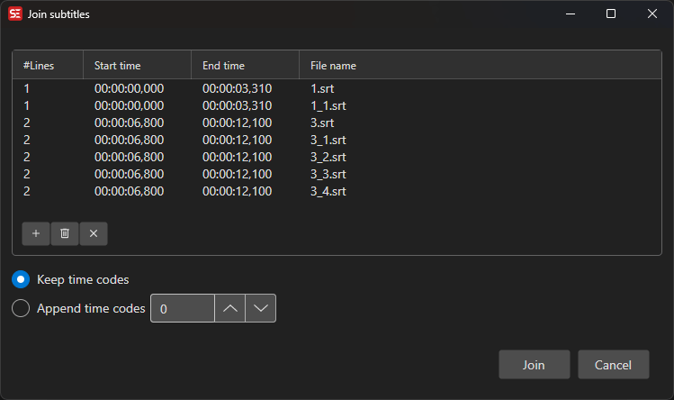

# Join Subtitles

Join multiple subtitle files into a single file.

- **Menu:** Tools → Join subtitles...

<!-- Screenshot: Join subtitles window -->

## How to Use

1. Click **New** to add subtitle files (or drag-and-drop them onto the file list).
2. Reorder, remove, or clear files as needed.
3. Choose how to handle time codes:
   - **Keep time codes** — Use the existing time codes from each file as-is. The lines from all files are merged and sorted by start time, so you can, for example, combine a forced-subtitle track with a full track that is missing those lines.
   - **Append time codes** — Shift each file so it starts after the previous one, with an optional **Add ms after each file** offset. Files are joined in list order (for example part 1 + part 2), so reorder them first if needed.
4. Click **Join** to merge them into the current subtitle.
