# Main Window

The main window is where you spend most of your time in Subtitle Edit. It combines all the key editing areas into a single, customizable interface.

<!-- Screenshot: Full main window -->

## Window Areas

The main window is divided into the following areas (the yellow lines at draggable area splitters):

<!-- Screenshot: Annotated main window with numbered labels for each area -->
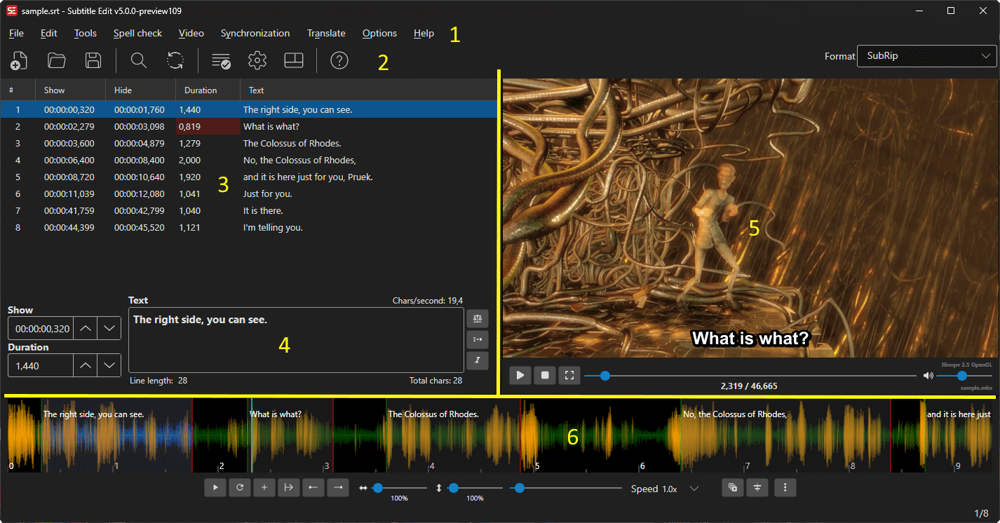

### 1. Menu Bar

The menu bar provides access to all features organized into categories:

| Menu | Description |
|------|-------------|
| **File** | New, Open, Save, Import, Export, Compare, Statistics |
| **Edit** | Undo, Redo, Find, Replace, Multiple Replace, Modify Selection |
| **Tools** | Fix Common Errors, Batch Convert, Change Casing, Merge/Split, etc. |
| **Spell check** | Spell checking, dictionaries, find double words |
| **Video** | Open/close video, Speech to Text, Text to Speech, Burn-In, etc. |
| **Sync** | Adjust All Times, Visual Sync, Point Sync, Change Frame Rate/Speed |
| **Translate** | Auto Translate, Copy/Paste Translate |
| **ASSA** | Styles, Properties, Attachments, Drawing, Positioning, etc. |
| **Options** | Settings, Shortcuts, Word Lists, Language |
| **Help** | About |

See the individual [feature pages](../index.md) for details on each menu item.

<!-- Screenshot: Menu bar with a menu expanded -->
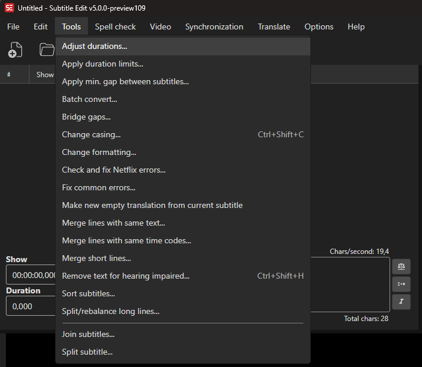

### 2. Toolbar

The toolbar provides quick one-click access to the most common actions. You can customize which buttons appear in **Options → Settings → Appearance → Toolbar**.

Available toolbar buttons include:

| Button | Action |
|--------|--------|
| **New** | Create a new subtitle |
| **Open** | Open a subtitle file |
| **Save** | Save the current subtitle |
| **Find** | Open the Find dialog |
| **Replace** | Open the Replace dialog |
| **Fix Common Errors** | Open Fix Common Errors |
| **Spell Check** | Run spell check |
| **Help** | Show help / about |
| *...and more* | Configurable in Settings |

Note: You can right-click on the **Subtitle format** combobox for a format search window.

<!-- Screenshot: Toolbar -->
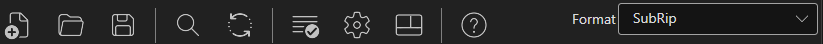

### 3. Subtitle Grid

The subtitle grid shows all subtitle lines in a table format. Each row represents a single subtitle entry.

| Column | Description |
|--------|-------------|
| **#** | Line number |
| **Start time** | When the subtitle appears (e.g., `00:01:23,456`) |
| **End time** | When the subtitle disappears |
| **Duration** | Display duration |
| **CPS** | Characters per second (reading speed) |
| **WPM** | Words per minute |
| **Text** | The subtitle text content |
| **Original** | Original text (visible in translation mode) |

**Mouse:**
- **Click** a row to select it and load its text into the text editor
- **Ctrl+Click** to add/remove rows from a multi-selection
- **Shift+Click** to select a range
- **Double-click** a cell to edit inline
- **Right-click** for a context menu

**Keyboard:**
- **Up/Down arrows** — Navigate between lines
- **Delete** — Delete selected lines
- **Ctrl+A** — Select all lines

See [Subtitle Grid](subtitle-grid.md) for full details.

<!-- Screenshot: Subtitle grid with some lines selected -->
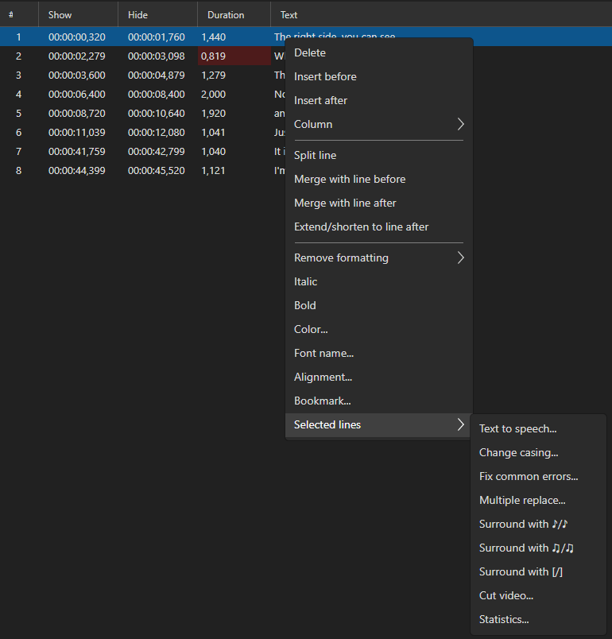

### 4. Text Editor

Below (or beside) the subtitle grid is the text editor, where you edit the text of the currently selected subtitle line. Start time, end time, and duration controls are also shown here.

**Formatting shortcuts:**
- **Ctrl+I** — Toggle italic
- **Ctrl+B** — Toggle bold

**Other shortcuts:**
- **Ctrl+Z** — Undo
- **Ctrl+C / Ctrl+X / Ctrl+V** — Copy / Cut / Paste

See [Text Editor](text-editor.md) for full details.

<!-- Screenshot: Text editor area showing time code controls and text -->
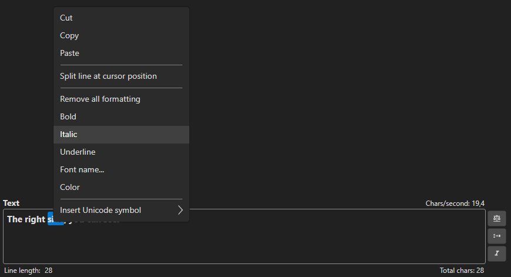

### 5. Video Player

The video player shows the currently loaded video with subtitles overlaid. Controls are displayed below the video.

**Playback controls:**
- Play / Pause / Stop
- Seek bar (drag to scrub)
- Playback speed controls
- Volume

**Keyboard (configurable):**
- Toggle play/pause
- Jump forward/backward by frame, 100ms, 500ms, 1s, or custom amount
- Go to start/end of current subtitle

See [Video Player](video-player.md) for full details.

<!-- Screenshot: Video player with subtitles visible -->
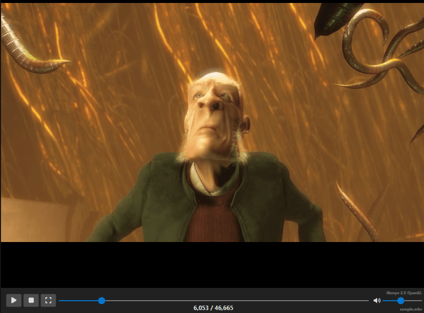

### 6. Audio Visualizer (Waveform / Spectrogram)

The audio visualizer shows the audio waveform and/or spectrogram, enabling precise visual timing of subtitles. Subtitle time spans are shown as colored bars overlaid on the waveform, and the current video position is displayed as a vertical cursor line.

<!-- Screenshot: Audio visualizer with waveform, subtitle bars, and shot changes -->
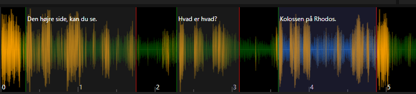

<!-- Screenshot: Audio visualizer with waveform and spectrogram -->
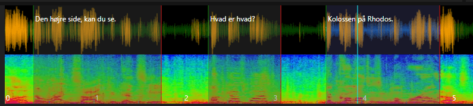

#### Display Modes

Switch between modes via the right-click context menu:

| Mode | Description |
|------|-------------|
| **Waveform only** | Shows audio amplitude over time |
| **Spectrogram only** | Shows frequency distribution over time (useful for identifying speech vs. noise) |
| **Waveform + Spectrogram** | Combined view with both overlaid |

Two draw styles are available for the waveform: **Classic** (simple lines) and **Fancy** (gradient fill with glow). Configure in **Options → Settings → Waveform**.

#### Visual Elements

- **Subtitle bars** — Colored rectangles representing each subtitle's time span. The selected subtitle is highlighted in a distinct color.
- **Left/right edges** — Green (left/start) and red (right/end) edge markers on each subtitle bar. Drag these to resize.
- **Subtitle text** — The text of each subtitle is displayed inside its bar.
- **Video position cursor** — A vertical cyan line showing the current video playback position.
- **Shot change lines** — Vertical markers indicating scene cuts (when loaded). Subtitle edges snap to nearby shot changes automatically.
- **Grid lines** — Optional time grid lines (toggle via settings or context menu).
- **New selection** — When you click+drag in an empty area, a new selection range is drawn that can become a new subtitle.

#### Mouse Controls

| Mouse Action | Area | Effect |
|--------------|------|--------|
| **Click** | Empty area | Set video position |
| **Click** | Subtitle bar | Select subtitle and set video position |
| **Double-click** | Subtitle bar | Select subtitle and set video position |
| **Ctrl+Click** | Subtitle bar | Toggle subtitle in multi-selection |
| **Shift+Click** | Subtitle bar | Set start time of selected subtitle |
| **Ctrl+Click** | Empty area | Set end time of selected subtitle (macOS: Shift+Click) |
| **Alt+Click** | Empty area | Set start time of selected subtitle |
| **Drag** | Left edge of subtitle | Resize start time |
| **Drag** | Right edge of subtitle | Resize end time |
| **Alt+Drag** | Left edge | Resize start and adjust previous subtitle's end simultaneously |
| **Alt+Drag** | Right edge | Resize end and adjust next subtitle's start simultaneously |
| **Drag** | Middle of subtitle | Move entire subtitle (preserving duration) |
| **Click+Drag** | Empty area | Create a new subtitle selection |
| **Scroll wheel** | Anywhere | Scroll waveform left/right |
| **Alt+Scroll** | Anywhere | Horizontal zoom in/out |
| **Shift+Scroll** | Anywhere | Vertical zoom in/out |
| **Ctrl+Scroll** | Anywhere | Scroll and move video position |
| **Right-click** | Anywhere | Open context menu |

> **Note:** On macOS, use **Cmd** instead of **Ctrl** for most modifier actions. **Ctrl+Click** on macOS opens the context menu.

#### Keyboard Controls (in Waveform)

| Key | Action |
|-----|--------|
| **Escape** | Cancel current drag/selection |
| **Enter** | Insert the new selection as a subtitle |
| **Delete** | Delete the selected subtitle |

> Additional waveform shortcuts (set start, set end, center, zoom, etc.) are configurable via **Options → Shortcuts**. See the [Keyboard Shortcuts Reference](../reference/keyboard-shortcuts.md).

#### Right-Click Context Menu

<!-- Screenshot: Waveform context menu -->

The context menu changes dynamically based on context (e.g., whether a new selection exists, whether a subtitle is selected):

| Menu Item | Description |
|-----------|-------------|
| **Insert new selection** | Insert the drawn selection as a new subtitle |
| **Paste new selection** | Paste subtitle from clipboard at current position |
| **Insert at position** | Insert a new empty subtitle at the video position |
| **Paste from clipboard** | Paste subtitle text from clipboard |
| **Insert subtitle file at position** | Import an entire subtitle file at the current video position |
| **Delete at position** | Delete the subtitle at the current position |
| **Delete** | Delete the selected subtitle(s) |
| **Insert before / Insert after** | Insert a new line before or after the selected subtitle |
| **Split** | Split the selected subtitle at the video position |
| **Merge before / Merge after** | Merge with the previous or next subtitle |
| **Filter by layer** | Filter visible subtitles by ASSA layer (ASSA format only) |
| **Guess time codes** | Auto-detect subtitle timing from audio silence |
| **Toggle shot change** | Add or remove a shot change marker at the video position |
| **Seek silence** | Find the next silent section in the audio |
| **Show only waveform** | Switch to waveform-only display |
| **Show only spectrogram** | Switch to spectrogram-only display |
| **Show waveform and spectrogram** | Switch to combined display |

#### Waveform Toolbar

When enabled (toggle via shortcut or **Options → Shortcuts → Toggle waveform toolbar**), a toolbar appears below the waveform with buttons for:

| Button | Action |
|--------|--------|
| **Play/Pause** | Toggle video playback |
| **Play selection** | Play only the selected subtitle |
| **Play selection (repeat)** | Play selected subtitle in a loop |
| **Play next** | Play the next subtitle |
| **New** | Insert a subtitle at the current position |
| **Set start + offset rest** | Set start time and shift all following subtitles |
| **Set start** | Set the start time of the selected subtitle |
| **Set end** | Set the end time of the selected subtitle |
| **Remove blank lines** | Remove empty subtitle lines |
| **Horizontal zoom slider** | Adjust horizontal zoom (0.1× – 20×) |
| **Vertical zoom slider** | Adjust vertical zoom (0.1× – 20×) |
| **Position slider** | Scrub through the video |

<!-- Screenshot: Waveform toolbar -->
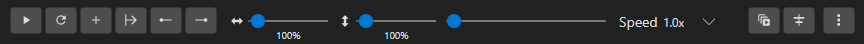

#### Shot Changes

Shot changes (scene cuts) appear as vertical lines on the waveform. They help align subtitle timing with scene transitions for a professional result.

- Subtitle edges **snap** to nearby shot changes automatically (configurable snap distance)
- You can toggle snapping behavior in settings
- Shot changes can be generated via **Video → Generate/import shot changes** or toggled manually via the context menu

#### Customization

Waveform appearance is highly configurable via **Options → Settings → Waveform**:

| Setting | Description |
|---------|-------------|
| Waveform color | Color of the waveform line |
| Background color | Background of the waveform area |
| Selected color | Color of the selected subtitle bar |
| Cursor color | Color of the video position cursor |
| Draw grid lines | Show/hide time grid |
| Draw style | Classic or Fancy waveform rendering |
| Invert mouse wheel | Reverse scroll direction |
| Focus on mouse over | Auto-focus waveform when mouse enters |
| Allow overlap | Allow subtitle bars to overlap |
| Right-click selects subtitle | Whether right-clicking a subtitle selects it |

See [Audio Visualizer / Waveform](audio-visualizer.md) for even more details.

### 7. Status Bar (Footer)

The status bar at the bottom shows:
- Waveform generation progress (when generating)
- Current subtitle format
- Line/character count information
- Other status messages

<!-- Screenshot: Status bar -->
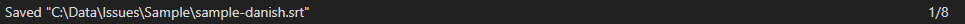

## Layouts

Subtitle Edit offers **12 predefined layouts** for arranging the main window areas. Choose a layout via **Options → Choose layout** or the keyboard shortcut.

| Layout | Description |
|--------|-------------|
| 1 | Video right, grid left, waveform bottom |
| 2 | Video right, grid and text left |
| 3 | Video top-right, grid bottom |
| 4 | Video left, grid right |
| 5 | Grid only (no video) |
| 6 | Video top, grid bottom |
| 7 | Video bottom-right, grid left |
| 8 | Video bottom, grid top |
| 9 | Grid left, video and waveform right |
| 10 | Video right, grid left (wide) |
| 11 | Video top-right, stacked panels |
| 12 | Minimal layout without video |

<!-- Screenshot: Layout chooser window showing thumbnails -->
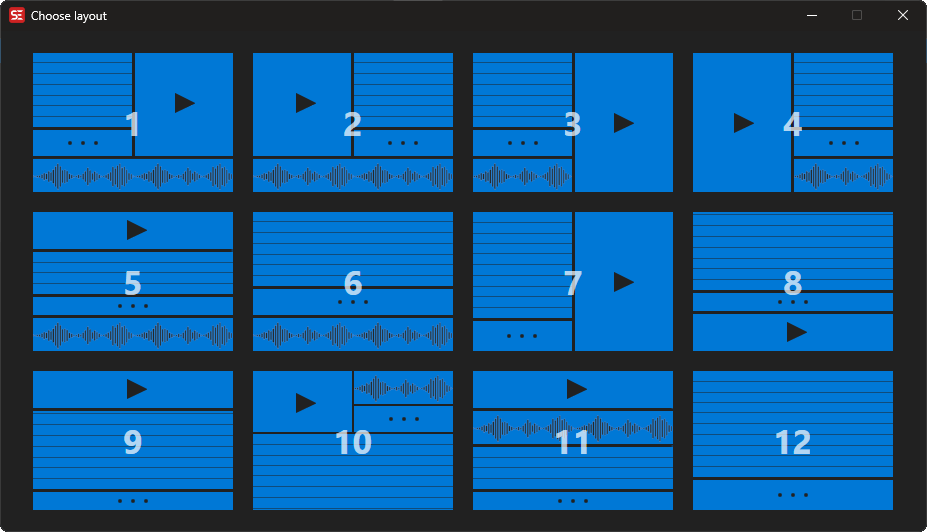

Panel sizes can be adjusted by dragging the splitters (dividers) between areas. Your layout preferences are saved automatically.

## Undocking

You can undock the video player or audio visualizer into separate windows for multi-monitor setups:
- **Undock video controls** — Move video player to its own window
- **Redock video controls** — Return video player to the main window

## Translation Mode

When you open an original subtitle file (**File → Open original subtitle**), the main window enters translation mode:
- The subtitle grid shows an additional **Original** column
- The text editor shows both the original and translation text
- This allows side-by-side translation work

<!-- Screenshot: Main window in translation mode -->
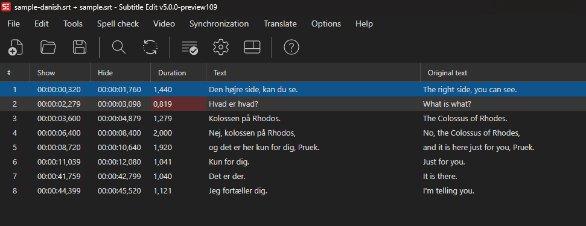
