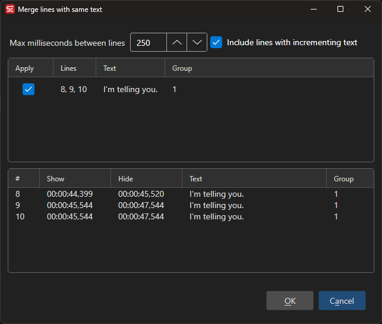

# Merge Lines with Same Text

Merge consecutive subtitle lines that have identical text content into one entry covering the combined time span.

- **Menu:** Tools → Merge lines with same text...

<!-- Screenshot: Merge same text window -->

## Options

- **Max ms between lines** — Only merge lines that are at most this many milliseconds apart
- **Include incrementing lines** — Also merge sequences where the text increments (e.g. countdowns or revealing text)

The preview updates live; uncheck any group in the list to exclude it before clicking **OK**.
