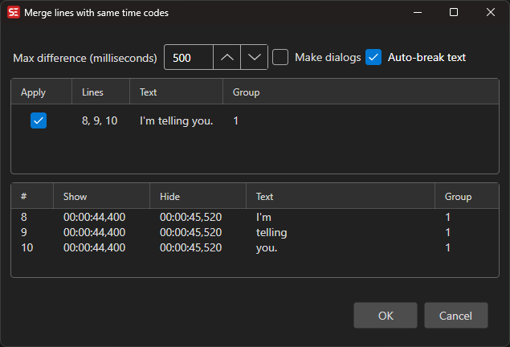

# Merge Lines with Same Time Codes

Merge consecutive subtitle lines whose start and end times are (almost) identical into one entry that combines the texts.

- **Menu:** Tools → Merge lines with same time codes...

<!-- Screenshot: Merge same time codes window -->

## Options

- **Max ms difference** — Maximum difference in start and end times that still counts as "same time codes"
- **Make dialog** — Format the merged text as a two-speaker dialog (using the dash style from General settings)
- **Auto break** — Re-break the merged text into balanced lines

The preview updates live; uncheck any group in the list to exclude it before clicking **OK**.
