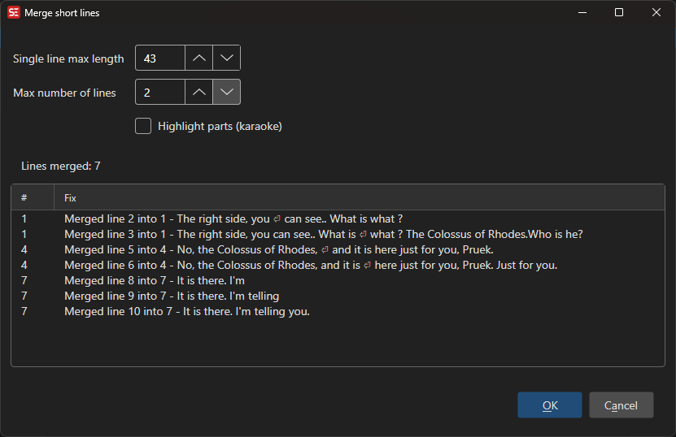

# Merge Short Lines

Merge consecutive short subtitle lines into single lines.

- **Menu:** Tools → Merge short lines...

<!-- Screenshot: Merge short lines window -->

## Options

- **Single line max length** — Maximum character count allowed for a single merged line
- **Max number of lines** — Maximum number of lines (1-10) the merged subtitle may span
- **Highlight parts** — Highlight which portion of the merged text came from which source line

The preview list updates live and shows all proposed merges.
