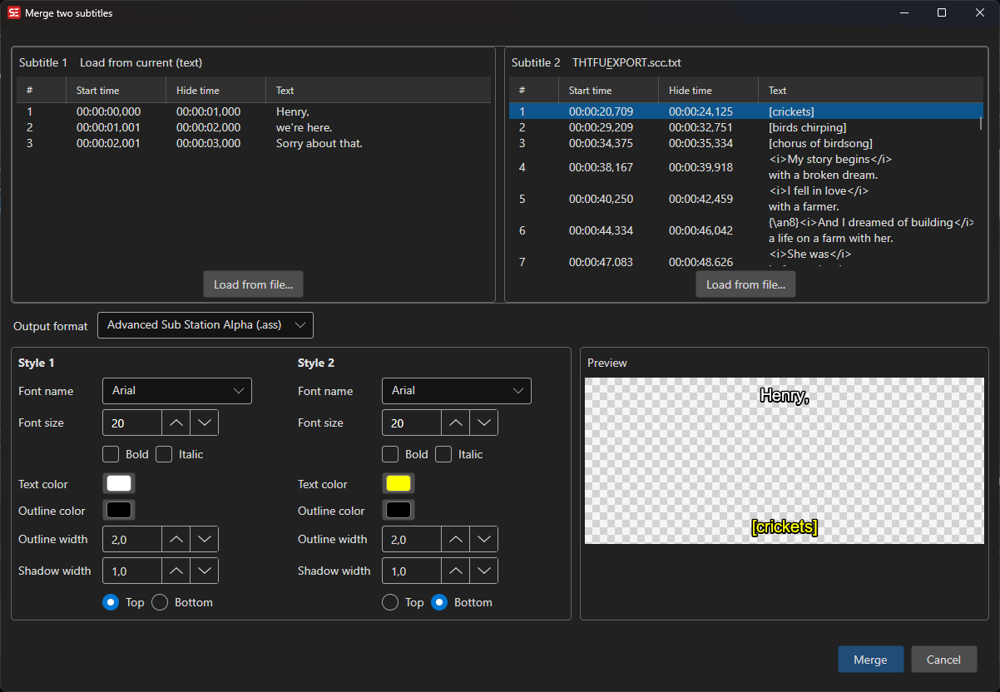

# Merge Two Subtitles

Combine two subtitles into one bilingual subtitle — for example an original and its translation.

- **Menu:** Tools → Merge two subtitles...

<!-- Screenshot: Merge two subtitles window -->

## How to Use

1. Open **Tools → Merge two subtitles...**
2. Load **Subtitle 1** and **Subtitle 2** — from a file, from the current subtitle's text, or (in translation mode) from the current translation
3. Pick the **output format**
4. Review the live preview
5. Click **Merge**

## Output Formats

- **SubRip (.srt)** — overlapping pairs are stacked into one subtitle, subtitle 1's text as the first line(s) and subtitle 2's text below
- **Advanced Sub Station Alpha (.ass)** — each source keeps its own configurable style (**Style 1** / **Style 2**): font, color, outline width, shadow width, and top/bottom alignment, so e.g. the original can sit at the top and the translation at the bottom

## Tips

- To create a bilingual subtitle from a translation you are working on, use **Load from current (text)** for subtitle 1 and **Load from current (translation)** for subtitle 2
- For two independent files, timing does not need to match exactly — lines are paired by overlap
