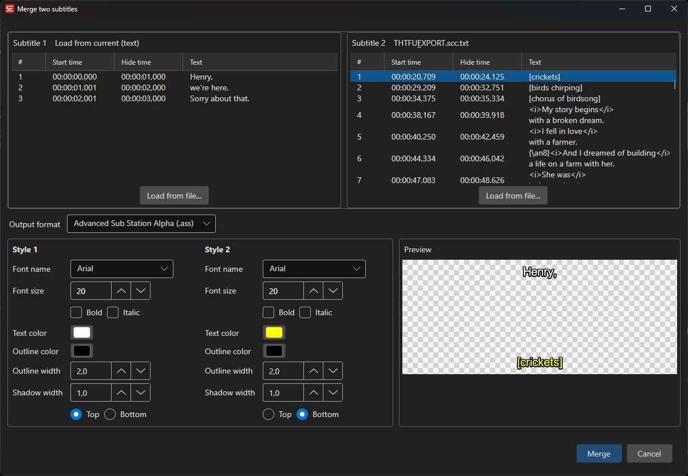

# Merge Two Subtitles

Combine two subtitles into one bilingual subtitle — for example an original and its translation.

- **Menu:** Tools → Merge two subtitles...

<!-- Screenshot: Merge two subtitles window -->

## How to Use

1. Open **Tools → Merge two subtitles...**
2. **Subtitle 1** is pre-filled with the current subtitle and, in translation mode, **Subtitle 2** with the original/translation. Use **Load from file** on either side to pick a different file
3. Pick the **output format**
4. Review the live preview
5. Click **Merge**

## Output Formats

- **SubRip (.srt)** — overlapping pairs are stacked into one subtitle, subtitle 1's text as the first line(s) and subtitle 2's text below
- **Advanced Sub Station Alpha (.ass)** — each source keeps its own configurable style (**Style 1** / **Style 2**): font, font size, bold, italic, primary color, outline color, outline width, shadow width, and top/bottom alignment, so e.g. the original can sit at the top and the translation at the bottom. A rendered preview of each style is shown next to its settings

## Tips

- To create a bilingual subtitle from a translation you are working on, open the tool while in translation mode — the current text and the translation are loaded as subtitle 1 and 2 automatically
- For two independent files, timing does not need to match exactly — lines are paired by overlap
