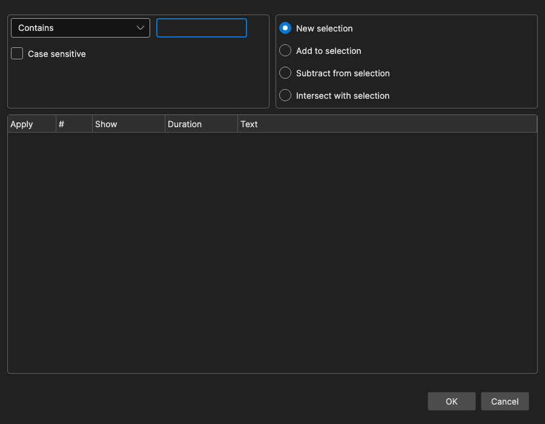

# Modify Selection

Select or deselect subtitle lines based on rules — text content, hearing-impaired text, duration, characters per second, gaps, line count, bookmarks, styles, actors, and more.

- **Menu:** Edit → Modify selection...
- **Shortcut:** Configurable (no default)

<!-- Screenshot: Modify selection window -->

## How It Works

1. Pick a **rule** and, where relevant, enter a text or number to match against.
2. Choose how the matches should affect the current selection (new/add/subtract/intersect).
3. The preview list updates automatically and shows every matching line. All matches start checked — uncheck **Apply** on a row to leave that line out.
4. Click **OK** to apply the selection in the subtitle grid.

## Rules

Text rules:

- **Contains** — Text contains the entered string
- **Starts with** — Text starts with the entered string
- **Ends with** — Text ends with the entered string
- **Not contains** — Text does not contain the entered string
- **Regular expression** — Text matches the entered regex (case-insensitive; an invalid pattern matches nothing)
- **All uppercase** — Text has letters and none of them are lowercase
- **Blank lines** — Text is empty or whitespace only

For **Contains**, **Starts with**, **Ends with**, **Not contains**, and **Bookmark contains**, a **Case sensitive** checkbox is shown. Text rules with an empty text box match nothing.

Timing and length rules (the number box sets the threshold):

- **Duration in ms <** / **Duration in ms >** — Display duration below/above the threshold
- **CPS <** / **CPS >** — Characters per second below/above the threshold
- **Single line max length <** / **Single line max length >** — Longest line in the subtitle below/above the threshold (defaults to the max-length setting)
- **Pixel length >** — Rendered width in pixels above the threshold
- **Gap in ms <** / **Gap in ms >** — Gap to the next subtitle below/above the threshold

Structure rules:

- **Odd number** / **Even number** — Line number is odd/even
- **Exactly one line** / **Exactly two lines** / **More than two lines** — Number of text lines in the subtitle

Metadata rules:

- **Bookmarked** — Line has a bookmark
- **Bookmark contains** — Bookmark text contains the entered string
- **Style** — Line uses one of the checked styles (list built from the styles present in the file; ASSA subtitles)
- **Actor** — Line has one of the checked actors

Hearing impaired:

- **Hearing impaired (SDH)** — Line contains hearing-impaired text, i.e. anything [Remove text for hearing impaired](remove-text-hi.md) would remove or change

## Hearing Impaired (SDH)

This rule runs the *Remove text for hearing impaired* engine over every line and matches the ones it would change — sound descriptions in brackets, `SPEAKER:` labels, uppercase-only lines, interjections, and so on. Plain dialogue is left alone.

Use it to get the SDH out of a file as a separate subtitle: pick the rule, click **OK**, then cut the selected lines (Ctrl+X) and paste them into a new window to save as `.srt`. This is handy before aligning a subtitle, so the SDH can be merged back in afterwards.

Click **Settings** to choose what counts as hearing-impaired text:

- **Remove text between** — **Brackets [...]**, **Curly brackets {...}**, **Parentheses (...)**, **Custom** (the delimiters set in *Remove text for hearing impaired* are shown next to the box)
- **Text before colon** — Speaker labels like `SPEAKER:`
- **Uppercase line** — Lines that are entirely uppercase
- **Line contains** — Lines containing one of the configured substrings
- **Only music symbols** — Lines that consist only of music symbols
- **Interjections** — Common interjections such as "hmm" and "uh"

The boxes start out matching what *Remove text for hearing impaired* is currently set to remove, so by default the selection is exactly what that tool would delete. Changes made here are not written back to that tool — they last until the Modify selection window is closed.

Everything else the engine needs — the custom delimiters, the *if line contains* list, the uppercase whitelist, and the per-language interjections — is taken from **Tools → Remove text for hearing impaired**. Change it there if the rule matches too much or too little.

## Selection Actions

- **New selection** — Select only the matching lines
- **Add to selection** — Keep the current selection and add the matches
- **Subtract from selection** — Remove the matches from the current selection
- **Intersect with selection** — Keep only currently selected lines that also match

The rule, text, number, and selection mode are remembered between sessions.
