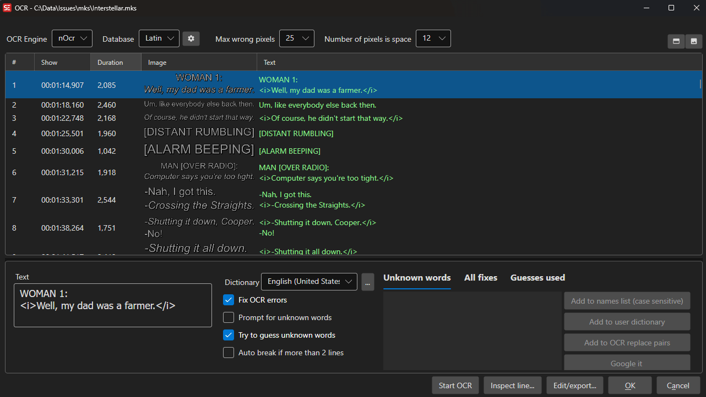
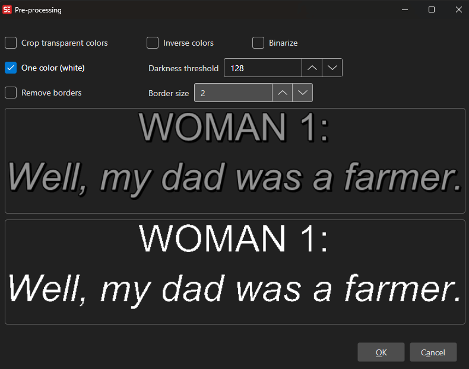

# OCR (Optical Character Recognition)

Subtitle Edit can convert image-based subtitle formats to text using OCR.

- **Menu:** File → Import image subtitle for edit (OCR)...

<!-- Screenshot: OCR window -->


## Supported Image Formats

- Blu-ray SUP (.sup)
- VobSub (.sub/.idx)
- DVD subtitles
- BDN XML
- Transport stream (DVB) subtitles
- Matroska embedded image subtitles (PGS, VobSub, DVB)
- MP4 embedded VobSub
- WebVTT with embedded images

## OCR Engines

### Tesseract
Open-source OCR engine with language packs.
- Download language packs via the OCR window
- Good general-purpose accuracy

### nOCR (Nikse OCR)
Built-in trainable OCR engine.
- Train character databases for specific fonts
- Very accurate once trained
- Best for consistent fonts (like DVD/Blu-ray subtitles)

### Binary OCR
Binary image comparison engine.
- Compares against a database of known character images
- Fast and accurate for known fonts

### Google Lens OCR
Cloud-based OCR using Google Lens.
- Requires internet connection

### Google Vision OCR
Cloud-based OCR using Google Cloud Vision API.
- Requires API key

### Ollama OCR
Local LLM-based OCR using Ollama.
- Requires Ollama installation

### Mistral OCR
Cloud-based OCR using Mistral API.

### PaddleOCR
Local OCR engine.
- Download required

## How to Use

1. Open an image-based subtitle file
2. The OCR window opens automatically
3. Select an OCR engine
4. Configure engine-specific settings
5. Click **Start OCR**
6. Review and correct any errors
7. Click **OK** to import the text subtitles

## Keyboard Shortcuts

### General
| Shortcut | Action |
|----------|--------|
| Escape | Cancel OCR / Close window |
| Ctrl+G | Go to line number |
| F1 | Show help |

### Subtitle Grid
| Shortcut | Action |
|----------|--------|
| Ctrl+I | Toggle italic formatting |
| Ctrl+P | View selected image (use arrow keys to navigate) |
| Delete | Delete selected line(s) |
| Home | Jump to first line |
| End | Jump to last line |
| Double-click | Inspect line (nOCR/Binary OCR only) |

### Unknown Words List
| Shortcut | Action |
|----------|--------|
| Enter | Jump to subtitle line containing the selected unknown word |

> **Note:** All shortcuts can be customized. Go to **Options → Shortcuts** to view and change key bindings.

## Pre-processing

Before OCR, you can apply image pre-processing:
- Crop
- Binarize (convert to black/white)
- Invert colors
- Resize

<!-- Screenshot: OCR pre-processing -->


## Unknown Words

When the OCR engine encounters uncertain characters, you can:
- Choose from suggested alternatives
- Type the correct text
- Add to the OCR fix dictionary for automatic correction

## OCR Fix Replacement Lists

Subtitle Edit uses language-specific XML files to automatically correct common OCR errors. These files are named `{language}_OCRFixReplaceList.xml` (e.g., `eng_OCRFixReplaceList.xml` for English) and are located in the `Dictionaries` folder.

See the example file: `Dictionaries/eng_OCRFixReplaceList.xml`

### XML Structure

The OCR fix replacement list contains several sections that handle different types of corrections:

#### 1. WholeWords

Replaces entire words that match exactly. This is the most common section for fixing OCR mistakes.

```xml
<WholeWords>
    <Word from="tñere" to="there" />
    <Word from="ri9ht" to="right" />
    <Word from="0f" to="of" />
    <Word from="alot" to="a lot" />
    <Word from="becuase" to="because" />
</WholeWords>
```

**Use cases:**
- Common character misrecognitions (e.g., `0` → `o`, `l` → `I`)
- Typical OCR errors for specific words
- Common misspellings that OCR produces

#### 2. PartialWordsAlways

Replaces character sequences within words, always applied without spell checking.

```xml
<PartialWordsAlways>
    <WordPart from="¤" to="o" />
    <WordPart from="lVI" to="M" />
    <WordPart from="IVl" to="M" />
</PartialWordsAlways>
```

**Use cases:**
- Fixing specific character combinations that are always wrong
- Removing special characters that OCR incorrectly inserted

#### 3. WholeLines

Replaces entire lines that match exactly (including formatting tags).

```xml
<WholeLines>
    <Line from="[chitte rs]" to="[chitters]" />
    <Line from="Hil' it!" to="Hit it!" />
    <Line from="&lt;i&gt;Hil' it!&lt;/i&gt;" to="&lt;i&gt;Hit it!&lt;/i&gt;" />
    <Line from="ISIGHS]" to="[SIGHS]" />
</WholeLines>
```

**Use cases:**
- Fixing common sound effect text
- Correcting specific phrases that always appear incorrectly

#### 4. PartialLinesAlways

Replaces text fragments within lines, always applied without spell checking.

```xml
<PartialLinesAlways>
    <LinePart from="Apollo 1 3" to="Apollo 13" />
    <LinePart from=",.," to="..." />
    <LinePart from=" lt " to=" it " />
    <LinePart from=" lf " to=" if " />
</PartialLinesAlways>
```

**Use cases:**
- Fixing common spacing issues
- Correcting punctuation errors
- Fixing common word fragments

#### 5. PartialLines

Replaces text fragments within lines (may be spell-checked).

```xml
<PartialLines>
    <LinePart from=" /be " to=" I be " />
    <LinePart from=" aren '1'" to=" aren't" />
    <LinePart from=" aren'tyou" to=" aren't you" />
</PartialLines>
```

#### 6. RegularExpressionsIfSpelledCorrectly

Uses regex patterns to fix errors, but only applies the replacement if the corrected word is in the dictionary.

```xml
<RegularExpressionsIfSpelledCorrectly>
    <!-- Fix lowercase 'l' to uppercase 'I' if result is a valid word -->
    <RegEx find="\bl([A-Z]+)\b" spellCheck="I$1" replaceWith="I$1" />
    <RegEx find="\b([A-Z]+)l\b" spellCheck="$1I" replaceWith="$1I" />

    <!-- Fix possessive forms: David's, there's -->
    <RegEx find="\b([A-Z][a-z]+)['']s\b" spellCheck="$1" replaceWith="$1's" />
    <RegEx find="\b([a-z]+)['']s\b" spellCheck="$1" replaceWith="$1's" />

    <!-- Fix missing spaces: ofDavid → of David -->
    <RegEx find="\bof([A-Z][a-z]+)\b" spellCheck="$1" replaceWith="of $1" />
    <RegEx find="\bin([A-Z][a-z]+)\b" spellCheck="$1" replaceWith="in $1" />

    <!-- Fix 'l' in brackets: [GRlNDlNG] → [GRINDING] -->
    <RegEx find="\[([A-Z ]*)l([A-Z ]*)\]" spellCheck="[$1I$2]" replaceWith="[$1I$2]" />
</RegularExpressionsIfSpelledCorrectly>
```

**Attributes:**
- `find`: The regex pattern to match
- `spellCheck`: The text to check against the dictionary (use `$1`, `$2` for capture groups)
- `replaceWith`: The replacement text if spell check passes
- `replaceAllFrom` / `replaceAllTo`: Optional character replacement before spell checking

**Use cases:**
- Fixing lowercase `l` to uppercase `I` (e.g., `lTEM` → `ITEM`)
- Correcting apostrophes in possessive forms
- Fixing missing spaces after common words
- Pattern-based corrections that should only apply if the result is a valid word

### Creating Custom Rules

To add your own OCR fix rules:

1. Open the appropriate language file: `Dictionaries/{language}_OCRFixReplaceList.xml`
2. Add entries to the relevant section based on the type of error
3. Save the file
4. Restart Subtitle Edit for changes to take effect

**Tips:**
- Use `WholeWords` for simple word replacements
- Use `RegularExpressionsIfSpelledCorrectly` for pattern-based fixes where you want to verify the result is a real word
- Test your regex patterns carefully to avoid unintended replacements
- The replacements are applied in the order they appear in the file
