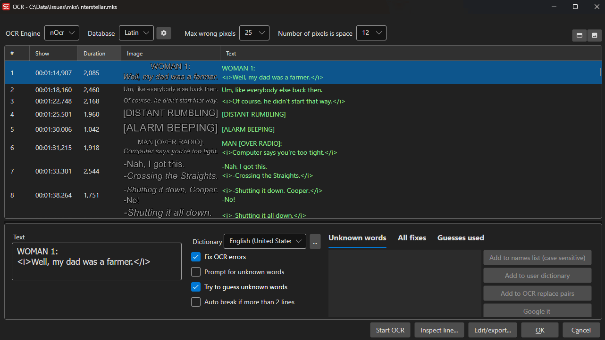
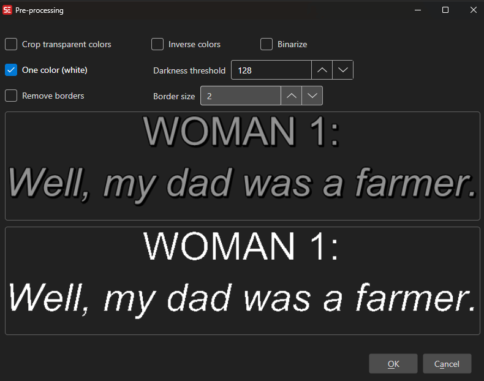

# OCR (Optical Character Recognition)

Subtitle Edit can convert image-based subtitle formats to text using OCR.

- **Menu:** File → Import → Image-based subtitle for OCR...

<!-- Screenshot: OCR window -->


## Supported Image Formats

- Blu-ray SUP (.sup)
- VobSub (.sub/.idx)
- DVD subtitles
- BDN XML
- Transport stream (DVB) subtitles
- Matroska embedded image subtitles (PGS, VobSub, DVB)
- MP4 embedded VobSub
- WebVTT with embedded images

## OCR Engines

### Tesseract
Open-source OCR engine with language packs.
- Download language packs via the OCR window
- Good general-purpose accuracy

### nOCR (Nikse OCR)
Built-in trainable OCR engine.
- Train character databases for specific fonts
- Very accurate once trained
- Best for consistent fonts (like DVD/Blu-ray subtitles)

### Binary OCR
Binary image comparison engine, listed as **Binary image compare** in the engine dropdown.
- Compares against a database of known character images
- Fast and accurate for known fonts
- Supports database editing, character history, max error percentage, and pixels-are-space tuning

### Apple Vision
Built-in OCR on macOS using Apple's Vision framework.
- macOS only; nothing to download or configure
- Good accuracy on clean subtitle images

### Google Lens Sharp / Google Lens Standalone
Cloud-based OCR using Google Lens (free, but capped).
- Requires internet connection.
- The Standalone variant is Windows-only.

### Google Vision
Cloud-based OCR using Google Cloud Vision API.
- Requires API key

### Ollama
Local LLM-based OCR via an Ollama server (e.g. with a vision model).
- Default endpoint: `http://localhost:11434/api/chat`

### llama.cpp
Local LLM-based OCR using a llama.cpp-compatible server. Subtitle Edit can download llama.cpp and the model for you, or talk to a server you run yourself.
- Default endpoint: `http://127.0.0.1:8080/v1/chat/completions`
- Curated vision models, listed best-first for subtitles: **GLM-OCR 0.9B** (Q8_0, about 1.4 GB — the default, and the most accurate on subtitle images), **LFM2.5-VL 3B** (Q8_0, about 3.5 GB — a general vision model with flawless character recognition, slower and a bigger download; it uses its own prompt as long as the shared prompt below is unedited), **PaddleOCR-VL 1.6** (about 1.8 GB, 109 languages), **HunyuanOCR 1.5** (Q8_0, about 1.3 GB) and **LightOnOCR 1B** (Q8_0, about 1.2 GB — the least accurate and much the slowest). Custom vision models also appear in the list: put the `*.gguf` in the llama.cpp models folder together with its `mmproj` vision projector, named either `mmproj-<file>.gguf` or `<file>-mmproj.gguf` (the two naming schemes used on Hugging Face). A `*.gguf` without a projector next to it is not offered — it cannot see the image
- The settings dialog has a download/update button for the llama.cpp engine itself; the dot next to it turns amber when a newer build than the one installed is available

### CrispEmbed
Local OCR engine with multiple model backends (free/open source).
- Backends: **PP-OCRv6**, **GLM-OCR**, **GOT-OCR2**, **Qwen3-VL-2B**, and **DeepSeek-OCR-2**
- **PP-OCRv6** is a text detector plus recognizer rather than a vision language model, so it needs only two small files (about 79 MB in total) and is the quickest way to get started
- **DeepSeek-OCR-2** is the most accurate backend on subtitle-style images; it ships a single `q4_k` model of about 2.31 GB
- **GLM-OCR**, **GOT-OCR2** and **Qwen3-VL-2B** each offer a smaller `q4_k` and a higher-quality `q8_0` model (from about 445 MB for GOT-OCR2 q4_k up to about 2.29 GB for Qwen3-VL-2B q8_0)
- The engine and models are downloaded from the OCR window on first use

### Mistral OCR
Cloud-based OCR using Mistral API.
- Requires a Mistral API key

### Paddle OCR Standalone / Paddle OCR Python
Local OCR engine.
- Standalone (downloadable CPU/GPU builds) is available on Windows and Linux.
- The Python variant works anywhere a Paddle OCR Python install is available.

## Engine Setup Notes

- **nOCR** databases are stored in the Subtitle Edit OCR folder and can be created, renamed, edited, and deleted from the OCR window.
- **Binary OCR** databases use image comparison and are edited separately from nOCR databases.
- **PaddleOCR** can download standalone CPU/GPU builds and support files on Windows and Linux, or use a Python installation.
- **Ollama** and **llama.cpp** are useful when you want local AI-based OCR and have a vision-capable model available.
- **CrispEmbed** is fully self-contained: pick a backend and model in the OCR window and Subtitle Edit downloads what is needed.
- **Mistral OCR** and **Google Vision** require cloud credentials.

## How to Use

1. Open an image-based subtitle file
2. The OCR window opens automatically
3. Select an OCR engine
4. Configure engine-specific settings
5. Click **Start OCR**
6. Review and correct any errors
7. Click **OK** to import the text subtitles

## Options

Checkboxes below the engine settings:

- **Fix OCR errors**, **Prompt for unknown words**, **Try to guess unknown words** — Shown once a dictionary is loaded
- **Auto break if more than X lines** — X is the *Max number of lines* rule from Settings

Toggle buttons above the image:

- **Auto-detect ASSA alignment** — Capture top alignment
- **Image pre-processing** — Opens the [pre-processing](#pre-processing) settings
- **VobSub/DVD colors...** — VobSub/DVD input only
- **Fallback OCR database** — nOCR and Binary image compare only
- **Show only forced subtitles** — Only when the file has forced subtitles

## Subtitle List Menu

Right-click the subtitle list for:

- **OCR selected lines**
- **Inspect line...** — nOCR and Binary image compare only
- **Show image**, **Save image as...**, **Copy image to clipboard**
- **Delete**, and **Fill selected lines with clipboard text** when several lines are selected
- **Italic**, **Bold**
- **Edit/export...**, **Import text from subtitle...**, **Export text as subtitle...**
- **Save all images with HTML index...** — See [Saving the Images](#saving-the-images)

## Saving the Images

The subtitle list's right-click menu has **Save all images with HTML index...**. Pick a folder and
Subtitle Edit writes `index.html` plus `images/0001.png`, `0002.png`, ... — every subtitle bitmap
next to the text OCR produced for it, which is the quickest way to proof-read a run against the
originals.

The page is self-contained (no external css, js or fonts), so it opens straight off the file
system. It follows the reader's light/dark preference, with an Auto/Light/Dark override, and adds
a text filter, an "only lines without text" filter for spotting images that produced nothing, a
dark/light/checkerboard backdrop for the transparent bitmaps, click-to-zoom, and each line's
number, time codes, duration and image size.

## Keyboard Shortcuts

### General

| Shortcut | Action |
|----------|--------|
| Escape | Cancel OCR / Close window |
| Ctrl+G | Go to line number |
| Ctrl++ | Zoom in (images in grid) |
| Ctrl+- | Zoom out (images in grid) |
| F1 | Show help |

### Subtitle Grid

| Shortcut | Action |
|----------|--------|
| Ctrl+I | Toggle italic formatting |
| Ctrl+P | View selected image (use arrow keys to navigate) |
| Delete | Delete selected line(s) |
| Home | Jump to first line |
| End | Jump to last line |
| Double-click | Inspect line (nOCR/Binary OCR only) |

### Unknown Words List

| Shortcut | Action |
|----------|--------|
| Enter | Jump to subtitle line containing the selected unknown word |

> **Note:** All shortcuts can be customized. Go to **Options → Shortcuts** to view and change key bindings.

## Pre-processing

Before OCR, you can apply image pre-processing:
- Crop transparent colors
- Remove borders (with configurable border size)
- Invert colors
- To one color (keep pixels brighter than a darkness threshold)
- Binarize (convert to black/white using Otsu thresholding)

## Batch OCR

Batch Convert can process image-based subtitle files with OCR. Subtitle Edit 5 includes Binary OCR in Batch Convert and can auto-detect several nOCR/Binary OCR settings such as language and pixels-are-space values.

For VobSub files, Batch Convert isolates the glyph color before OCR (on by default, configurable in the Batch Convert settings): the subpicture is rebuilt as a crisp black-on-white bitmap from pixel frequency, so outline and anti-alias colors no longer melt adjacent characters together.

For command-line workflows, see [Command Line (seconv)](../reference/command-line.md), which documents OCR engines and options for headless conversion.

<!-- Screenshot: OCR pre-processing -->


## Unknown Words

When the OCR engine encounters uncertain characters, you can:
- Choose from suggested alternatives
- Type the correct text
- Add to the OCR fix dictionary for automatic correction

The unknown-words list in the OCR window has buttons for the selected word: **Add to names list (case sensitive)**, **Add to user dictionary**, **Add to OCR replace pairs** and **Google it**.

### What is remembered

Some of the choices in the unknown-word prompt are saved to disk and reused on later
OCR runs; others only last as long as the OCR window is open.

| Choice | Remembered? | Stored in |
|---|---|---|
| **Change all** | Yes | `{language}_OCRFixReplaceList.xml` |
| **Add to names list** | Yes | `{language}_names.xml` |
| **Add to user dictionary** | Yes | `{language}_user.xml` |
| **Skip once** | No | — |
| **Skip all** | No — current OCR session only | — |

**"Skip all" is deliberately temporary.** It silences a word for the rest of the current
OCR session and is forgotten when the OCR window closes, so a mis-click never has lasting
consequences. If you want a word to be accepted permanently, use **Add to user
dictionary** (or **Add to names list** for proper nouns) instead, and use **Change all**
for a correction that should be applied automatically from now on.

## OCR Fix Replacement Lists

Subtitle Edit uses language-specific XML files to automatically correct common OCR errors. These files are named `{language}_OCRFixReplaceList.xml` (e.g., `eng_OCRFixReplaceList.xml` for English) and are located in the `Dictionaries` folder.

See the example file: `Dictionaries/eng_OCRFixReplaceList.xml`

### XML Structure

The OCR fix replacement list contains several sections that handle different types of corrections:

#### 1. WholeWords

Replaces entire words that match exactly. This is the most common section for fixing OCR mistakes.

```xml
<WholeWords>
    <Word from="tñere" to="there" />
    <Word from="ri9ht" to="right" />
    <Word from="0f" to="of" />
    <Word from="alot" to="a lot" />
    <Word from="becuase" to="because" />
</WholeWords>
```

**Use cases:**
- Common character misrecognitions (e.g., `0` → `o`, `l` → `I`)
- Typical OCR errors for specific words
- Common misspellings that OCR produces

#### 2. PartialWordsAlways

Replaces character sequences within words, always applied without spell checking.

```xml
<PartialWordsAlways>
    <WordPart from="¤" to="o" />
    <WordPart from="lVI" to="M" />
    <WordPart from="IVl" to="M" />
</PartialWordsAlways>
```

**Use cases:**
- Fixing specific character combinations that are always wrong
- Removing special characters that OCR incorrectly inserted

#### 3. WholeLines

Replaces entire lines that match exactly (including formatting tags).

```xml
<WholeLines>
    <Line from="[chitte rs]" to="[chitters]" />
    <Line from="Hil' it!" to="Hit it!" />
    <Line from="&lt;i&gt;Hil' it!&lt;/i&gt;" to="&lt;i&gt;Hit it!&lt;/i&gt;" />
    <Line from="ISIGHS]" to="[SIGHS]" />
</WholeLines>
```

**Use cases:**
- Fixing common sound effect text
- Correcting specific phrases that always appear incorrectly

#### 4. PartialLinesAlways

Replaces text fragments within lines, always applied without spell checking.

```xml
<PartialLinesAlways>
    <LinePart from="Apollo 1 3" to="Apollo 13" />
    <LinePart from=",.," to="..." />
    <LinePart from=" lt " to=" it " />
    <LinePart from=" lf " to=" if " />
</PartialLinesAlways>
```

**Use cases:**
- Fixing common spacing issues
- Correcting punctuation errors
- Fixing common word fragments

#### 5. PartialLines

Replaces text fragments within lines (may be spell-checked).

```xml
<PartialLines>
    <LinePart from=" /be " to=" I be " />
    <LinePart from=" aren '1'" to=" aren't" />
    <LinePart from=" aren'tyou" to=" aren't you" />
</PartialLines>
```

#### 6. RegularExpressionsIfSpelledCorrectly

Uses regex patterns to fix errors, but only applies the replacement if the corrected word is in the dictionary.

```xml
<RegularExpressionsIfSpelledCorrectly>
    <!-- Fix lowercase 'l' to uppercase 'I' if result is a valid word -->
    <RegEx find="\bl([A-Z]+)\b" spellCheck="I$1" replaceWith="I$1" />
    <RegEx find="\b([A-Z]+)l\b" spellCheck="$1I" replaceWith="$1I" />

    <!-- Fix possessive forms: David's, there's -->
    <RegEx find="\b([A-Z][a-z]+)['']s\b" spellCheck="$1" replaceWith="$1's" />
    <RegEx find="\b([a-z]+)['']s\b" spellCheck="$1" replaceWith="$1's" />

    <!-- Fix missing spaces: ofDavid → of David -->
    <RegEx find="\bof([A-Z][a-z]+)\b" spellCheck="$1" replaceWith="of $1" />
    <RegEx find="\bin([A-Z][a-z]+)\b" spellCheck="$1" replaceWith="in $1" />

    <!-- Fix 'l' in brackets: [GRlNDlNG] → [GRINDING] -->
    <RegEx find="\[([A-Z ]*)l([A-Z ]*)\]" spellCheck="[$1I$2]" replaceWith="[$1I$2]" />
</RegularExpressionsIfSpelledCorrectly>
```

**Attributes:**
- `find`: The regex pattern to match
- `spellCheck`: The text to check against the dictionary (use `$1`, `$2` for capture groups)
- `replaceWith`: The replacement text if spell check passes
- `replaceAllFrom` / `replaceAllTo`: Optional character replacement before spell checking

**Use cases:**
- Fixing lowercase `l` to uppercase `I` (e.g., `lTEM` → `ITEM`)
- Correcting apostrophes in possessive forms
- Fixing missing spaces after common words
- Pattern-based corrections that should only apply if the result is a valid word

### Creating Custom Rules

To add your own OCR fix rules:

1. Open the appropriate language file: `Dictionaries/{language}_OCRFixReplaceList.xml`
2. Add entries to the relevant section based on the type of error
3. Save the file
4. Restart Subtitle Edit for changes to take effect

**Tips:**
- Use `WholeWords` for simple word replacements
- Use `RegularExpressionsIfSpelledCorrectly` for pattern-based fixes where you want to verify the result is a real word
- Test your regex patterns carefully to avoid unintended replacements
- The replacements are applied in the order they appear in the file
