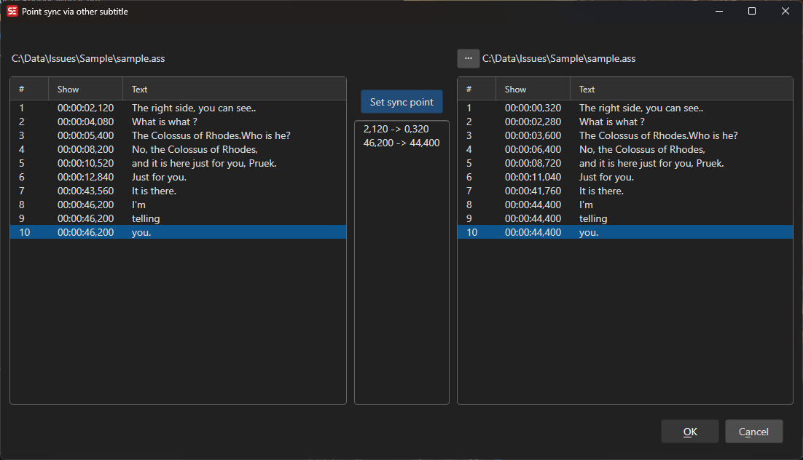

# Point Sync Via Other Subtitle

Synchronize a subtitle file using another subtitle file as reference.

- **Menu:** Sync → Point sync via other subtitle...

<!-- Screenshot: Point sync via other window -->

## How to Use

1. Open the subtitle you want to sync
2. Open **Sync → Point sync via other subtitle...**
3. Select the reference subtitle file
4. Match corresponding lines between the two files
5. Click **OK** to apply
