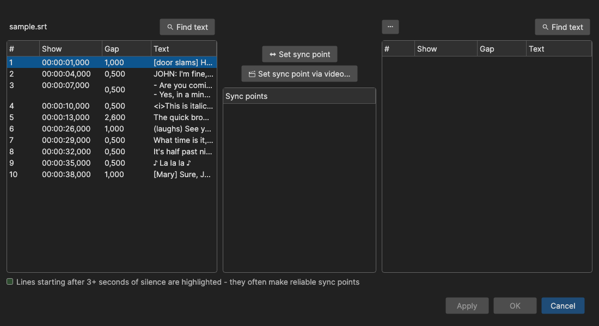

# Point Sync Via Other Subtitle

Synchronize a subtitle file using another subtitle file as reference.

- **Menu:** Synchronization → Point sync via other subtitle...

<!-- Screenshot: Point sync via other window -->

## How to Use

1. Open the subtitle you want to sync
2. Open **Sync → Point sync via other subtitle...**
3. Click the browse button in the right pane to load the reference subtitle
4. Select a line in your subtitle and the matching line in the other subtitle, then click **Set sync point** — or **Set sync point via video...** to pick the time from the video for a line the other subtitle does not cover
5. Repeat for more sync points; they are listed in the middle and can be removed with right-click **Delete** or the Delete/Backspace key
6. Click **Apply** to apply the sync points and keep working, or **OK** to apply and close

Both grids have a **Gap** column with the silence before each line; lines starting after 3+ seconds of silence are highlighted, as they often make reliable sync points. **Find text** above each grid searches that subtitle.

The window remembers its size and position between sessions.
