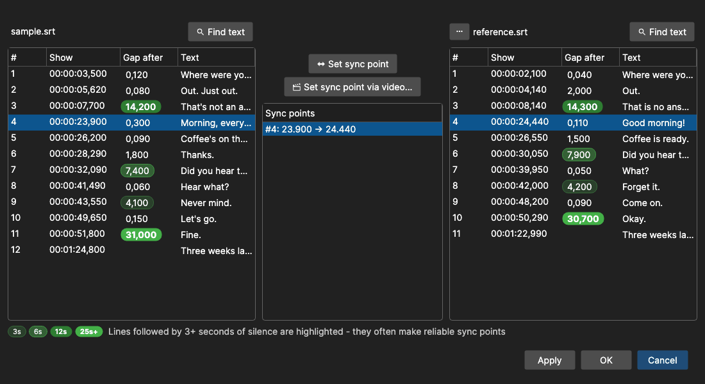

# Point Sync Via Other Subtitle

Synchronize a subtitle file using another subtitle file as reference.

- **Menu:** Synchronization → Point sync via other subtitle...

<!-- Screenshot: Point sync via other window -->

## How to Use

1. Open the subtitle you want to sync
2. Open **Sync → Point sync via other subtitle...**
3. Click the browse button in the right pane to load the reference subtitle
4. Select a line in your subtitle and the matching line in the other subtitle, then click **Set sync point** — or **Set sync point via video...** to pick the time from the video for a line the other subtitle does not cover
5. Repeat for more sync points; they are listed in the middle and can be removed with right-click **Delete** or the Delete/Backspace key
6. Click **Apply** to apply the sync points and keep working, or **OK** to apply and close

Both grids have a **Gap after** column with the silence after each line, the same as the main window's **Gap** column. Gaps of 3 seconds or more are shown as a green badge that gets stronger at 6, 12 and 25+ seconds, so the long silences stand out. **Find text** above each grid searches that subtitle.

### Choosing good sync points

Two subtitle files made independently rarely agree on every line - lines are split, merged and timed differently. They do tend to agree right after a long silence, where both have to start the next line when the speech starts again:

1. Look for a strong badge in the **Gap after** column - the longer the silence, the better
2. Select the line *after* the badge in both grids - sync points match start times, and that line's start is where the speech resumes
3. Pick a few such points spread over the whole file, e.g. one near the start, one in the middle and one near the end, then check the result with **Apply**

The sync point list in the middle is kept in subtitle order, and a line has at most one sync point - setting one again for the same line re-points it. **Delete** in the list's right-click menu, or Delete/Backspace with the list focused, removes the selected point; **OK** and **Apply** need at least one point.

**Set sync point via video...** opens the same window as [Point sync](point-sync.md#set-sync-point-window): the video with the subtitle drawn on it, playing the audio track selected in the main window, and a **Sync point time code** box that follows the video and can be edited by hand. Opened from here the window has no waveform pane.

The window remembers its size and position between sessions.
