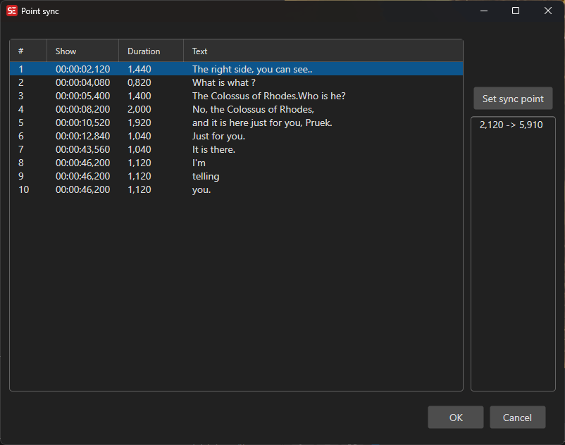

# Point Sync

Synchronize subtitles using multiple reference points.

- **Menu:** Sync → Point sync...

<!-- Screenshot: Point sync window -->

## How to Use

1. Open **Sync → Point sync...**
2. For each sync point, match a subtitle line to its correct video position
3. Add as many sync points as needed for accuracy
4. Click **OK** to apply

More sync points provide better accuracy for subtitles with non-linear drift.
