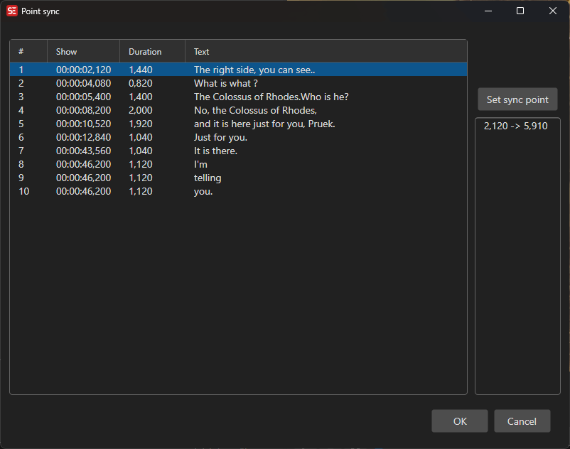

# Point Sync

Synchronize subtitles using multiple reference points.

- **Menu:** Synchronization → Point sync...

<!-- Screenshot: Point sync window -->

## How to Use

1. Open **Sync → Point sync...**
2. Select a subtitle line in the list and click **Set sync point** to set its correct video position
3. Repeat for additional sync points as needed for accuracy
4. Click **OK** to apply

More sync points provide better accuracy for subtitles with non-linear drift. The window remembers its size and position between sessions.
