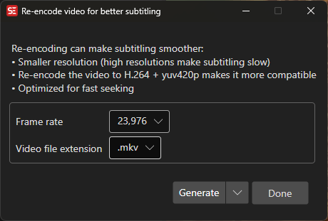

# Re-encode Video

Re-encode a video file with different resolution, frame rate, or container format using FFmpeg.

- **Menu:** Video → Re-encode video...
- **Shortcut:** Configurable

<!-- Screenshot: Re-encode video window -->

## How to Use

1. Open **Video → Re-encode video...**
2. Select the output frame rate
3. Select the output container format (`.mkv`, `.mp4`, `.webm`)
4. Click **Generate** to start re-encoding (or use the **Generate** split-button menu to prompt for FFmpeg parameters before encoding)

## Options

- **Frame rate** — Output frame rate
- **Video extension** — Output container format
- **Prompt for FFmpeg parameters and generate** — Edit the FFmpeg command line before encoding (available from the **Generate** split-button menu)

## Keyboard Shortcuts

| Key | Action |
|-----|--------|
| Escape | Close / Cancel |
| F1 | Open help |
