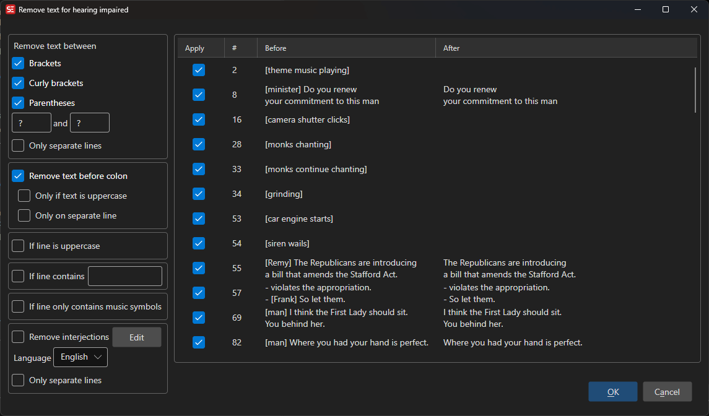
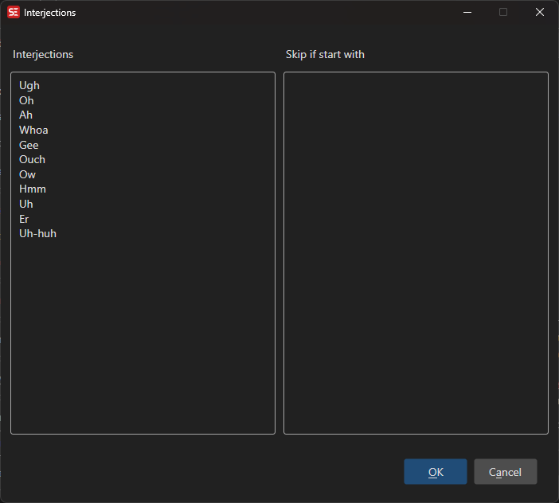

# Remove Text for Hearing Impaired

Remove hearing-impaired annotations such as speaker names, sound descriptions, and music notations.

- **Menu:** Tools → Remove text for hearing impaired...

<!-- Screenshot: Remove text for HI window -->

## Options

- **Remove text in brackets** — `[sound effect]`
- **Remove text in parentheses** — `(laughing)`
- **Remove text before colon** — `Speaker:`
- **Remove music symbols** — `♪ Music ♪`
- **Remove interjections** — Common interjections like "hmm", "uh", etc.

## Interjections

You can customize the list of interjections to remove. Click **Edit interjections...** to modify the list.

<!-- Screenshot: Interjections window -->

## Preview

All proposed removals are shown in a preview list before applying, allowing you to uncheck individual items.
