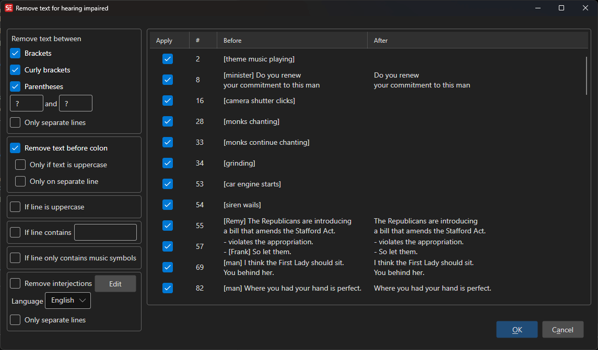
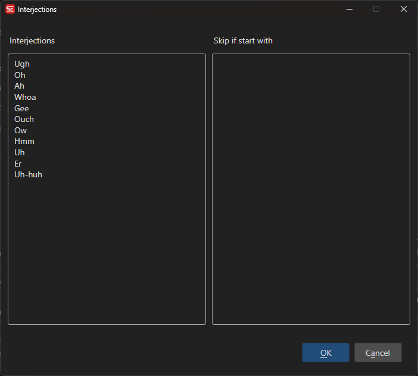

# Remove Text for Hearing Impaired

Remove hearing-impaired annotations such as speaker names, sound descriptions, and music notations.

- **Menu:** Tools → Remove text for hearing impaired...

<!-- Screenshot: Remove text for HI window -->

## Options

### Remove text between

- **[ ]** — Remove text inside square brackets, e.g. `[sound effect]`
- **{ }** — Remove text inside curly brackets
- **( )** — Remove text inside parentheses, e.g. `(laughing)`
- **Custom** — Remove text between any custom start and end characters
- **Only on separate lines** — Only remove the text when it sits on a line of its own

### Remove text before colon

- **Remove text before colon** — Remove speaker labels like `SPEAKER:`
- **Only if text is uppercase** — Only remove when the label is in uppercase
- **Only on separate lines** — Only remove when the label is on a line by itself

### Other

- **If line is uppercase** — Remove the whole line when it is entirely uppercase
- **If line contains** — Remove the line when it contains a given substring
- **If line only contains music symbols** — Remove lines that consist only of music symbols (e.g. `♪ Music ♪`)
- **Remove interjections** — Remove common interjections like "hmm", "uh"; the dictionary used follows the selected **Language**

## Interjections

Click **Edit** next to *Remove interjections* to modify the list of interjections for the selected language.

<!-- Screenshot: Interjections window -->

## Preview

All proposed removals are shown in a preview list with **Before** and **After** columns. Uncheck individual items to exclude them before clicking **OK**.
