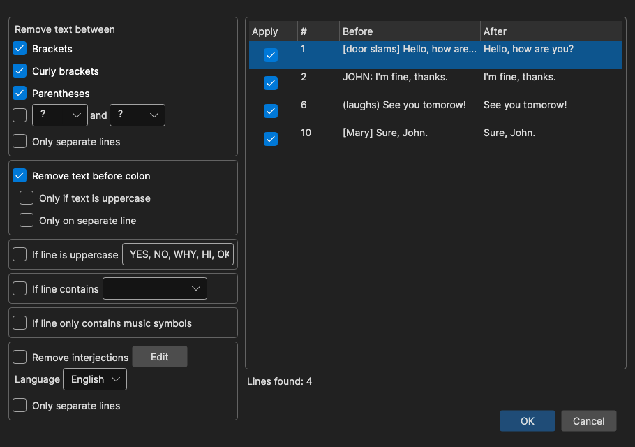
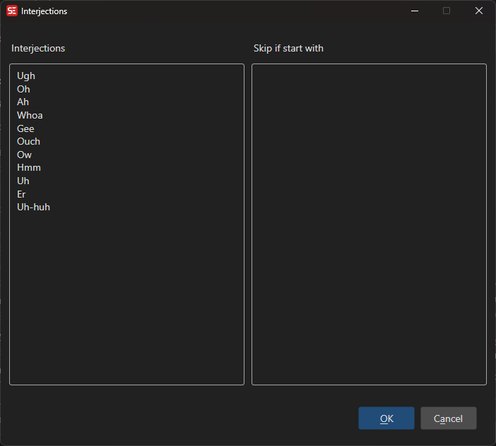

# Remove Text for Hearing Impaired

Remove hearing-impaired annotations such as speaker names, sound descriptions, and music notations.

- **Menu:** Tools → Remove text for hearing impaired...

<!-- Screenshot: Remove text for HI window -->

## Options

### Remove text between

- **[ ]** — Remove text inside square brackets, e.g. `[sound effect]`
- **{ }** — Remove text inside curly brackets
- **( )** — Remove text inside parentheses, e.g. `(laughing)`
- **Custom** — Remove text between any custom start and end characters
- **Only on separate lines** — Only remove the text when it sits on a line of its own

### Remove text before colon

- **Remove text before colon** — Remove speaker labels like `SPEAKER:`
- **Only if text is uppercase** — Only remove when the label is in uppercase
- **Only on separate lines** — Only remove when the label is on a line by itself

### Other

- **If line is uppercase** — Remove the whole line when it is entirely uppercase. The text box next to it is a whitelist: uppercase words listed there (e.g. `NASA FBI`) do not count as hearing-impaired text
- **If line contains** — Remove the line when it contains a given substring
- **If line only contains music symbols** — Remove lines that consist only of music symbols (e.g. `♪ Music ♪`)
- **Remove interjections** — Remove common interjections like "hmm", "uh"; the dictionary used follows the selected **Language**. **Only on separate lines** limits this to interjections that sit on a line of their own

## Interjections

Click **Edit** next to *Remove interjections* to modify the list of interjections for the selected language.

<!-- Screenshot: Interjections window -->

## Preview

All proposed removals are shown in a preview list with **Before** and **After** columns. Uncheck individual items to exclude them before clicking **OK**. When the tool is opened from the main window, **Apply** applies the ticked rows without closing so you can run another pass with different options, and **Done** closes the window.

Right-click the list to tick or untick many rows at once:

- **Select all** (`Ctrl+A`) — tick every row
- **Select none** (`Ctrl+D`) — untick every row, so single rows can be picked
- **Invert selection** (`Ctrl+Shift+I`) — tick the unticked rows and untick the ticked ones

`Space` toggles the checkbox of the rows that are highlighted, so a range selected with Shift+click can be flipped in one go.

## Keeping the Hearing-Impaired Text

To save the hearing-impaired text instead of just discarding it, use the **Hearing impaired (SDH)** rule in [Modify selection](modify-selection.md). It selects the lines this tool would change, so they can be cut out into a subtitle of their own — useful before aligning, when the SDH should be merged back in afterwards. That rule reads its options from the settings above.
