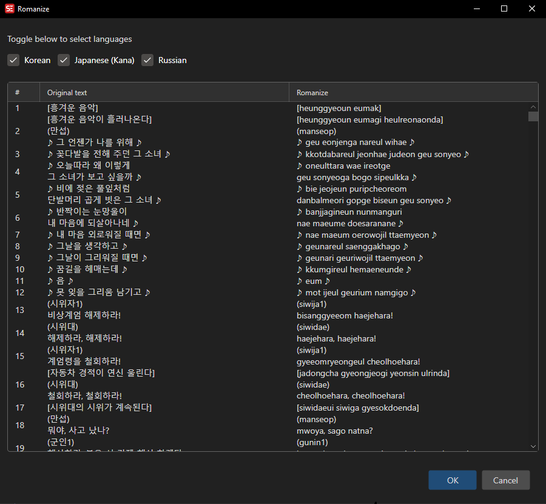

# Romanize

Trqnform non-latin letter languages to their roman equivalent

- **Menu:** Tools → Romanize...
- **Shortcut:** Configurable

<!-- Screenshot: Romanize window -->

## How to Use

1. Open **Tools → Romanize...**.
2. Check the languages which you would like to romanize
3. Click **OK**.

Subtitle Edit rewrites the text in in latin-letter equivalence. Timing, text, formatting, and comments are not changed.

## Keyboard Shortcuts

| Key | Action |
|-----|--------|
| Enter | Apply |
| Escape | Close / Cancel |
| F1 | Open help |
