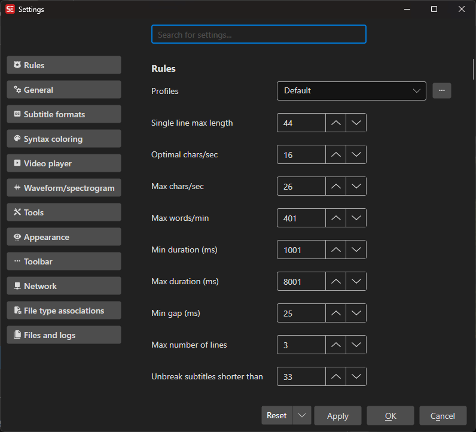

# Settings

Configure application preferences, profiles, subtitle defaults, video player, and more.

- **Menu:** Options → Settings...
- **Shortcut:** Configurable

<!-- Screenshot: Settings window -->

## How to Use

1. Open **Options → Settings...**
2. Navigate through the settings sections
3. Adjust settings as needed
4. Click **OK** to save

## Profiles

Profiles store subtitle rules and limits. You can switch between profiles for different workflows (e.g., Netflix, broadcast, default).

- **Single line max length** — Maximum characters per line
- **Optimal chars/sec** — Target reading speed
- **Max chars/sec** — Maximum reading speed
- **Max words/min** — Maximum words per minute
- **Min duration** — Minimum subtitle display time (ms)
- **Max duration** — Maximum subtitle display time (ms)
- **Min gap** — Minimum gap between subtitles (ms)
- **Max lines** — Maximum number of lines per subtitle
- **Dialog style** — How dialog dashes are handled
- **Continuation style** — How continuation markers work

## General

- **New empty default (ms)** — Default duration for new empty subtitles
- **Prompt before deleting lines** — Ask before deleting subtitle lines
- **Lock time codes** — Prevent accidental time code changes
- **Remember window position and size** — Restore layout between sessions
- **Use frame mode** — Display times as frame numbers instead of time codes
- **Auto backup** — Enable automatic backups at a set interval

## Subtitle Defaults

- **Default subtitle format** — Format used when creating new subtitles
- **Save format** — Default format for saving
- **Favorite formats** — Quick access to frequently used formats
- **Default encoding** — Text encoding for saving files
- **Auto-convert to UTF-8** — Automatically convert files to UTF-8
- **Force CR+LF on save** — Use Windows-style line endings
- **Auto-trim whitespace** — Remove trailing spaces

## Video Player (MPV Preview)

- **Font** — Subtitle preview font name, size, and bold
- **Colors** — Primary, outline, and shadow colors
- **Border style** — Outline or opaque box
- **Outline/shadow width** — Border dimensions

## Keyboard Shortcuts

| Key | Action |
|-----|--------|
| Escape | Close settings |
| F1 | Open help |
