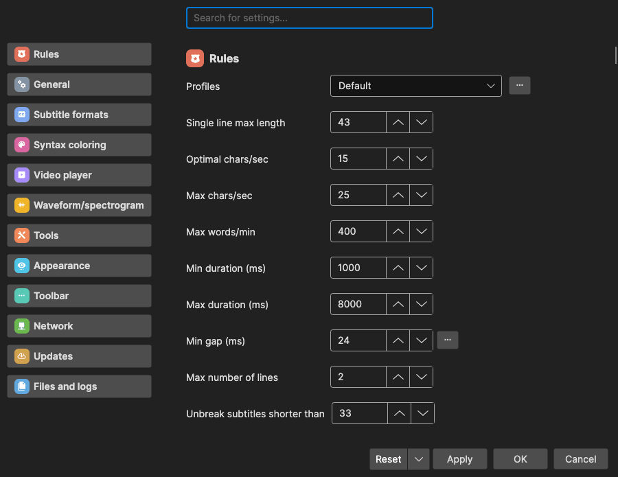

# Settings

Configure application preferences, rules and profiles, appearance, video player, waveform, and more.

- **Menu:** Options → Settings...
- **Shortcut:** Configurable

<!-- Screenshot: Settings window -->

## How to Use

1. Open **Options → Settings...**
2. Pick a section from the icons on the left
3. Adjust settings as needed
4. Click **OK** to save

The window is split into sections; the list below follows the order they appear in. Some sections and options only show up on the platform they apply to.

## Rules

The subtitle rules that drive error checking, the grid's warning colors, and tools such as [Fix common errors](fix-common-errors.md).

- **Profiles** — Rules are stored per profile, so you can switch between e.g. Netflix, broadcast and default. Profiles can be exported and imported
- **Single line max length**, **Optimal chars/sec**, **Max chars/sec**, **Max words/min**
- **Min duration (ms)**, **Max duration (ms)**
- **Min gap (ms)** — The "..." button opens a calculator: pick a frame rate and a number of frames and it works out the milliseconds. It opens on the current video's frame rate and the frame count already configured. Shown in millisecond mode only; in frame mode the value is entered in frames
- **Max number of lines**, **Unbreak subtitles shorter than**
- **Dialog style**, **Continuation style** — Including a custom continuation style editor
- **Cps/line-length** — Which characters count towards CPS and line length

## General

- **Prompt before delete**, **Lock time codes**, **Remember window position and size**
- **Use frame mode (hh.mm.ss.ff)** — Show times as frames instead of milliseconds
- **Limit number of lines in subtitle text box**
- **Open last recent file on start**
- **Auto-convert encoding to UTF-8 on open**, **Force CR+LF on save**, **Auto-trim white-space**
- **Remove blank lines when opening a subtitle** — Off by default
- **Default encoding**
- **Subtitle grid Enter-key / single-click / double-click action** — What each gesture does to the video position and focus
- **Subtitle grid, center when selecting prev/next row**
- **Save as behavior**, **Save as: append language code**, **Default save location** (with a custom folder)
- **Auto-save** — Save the open file while editing
- **Auto-backup** — Automatic backups at a set interval, with a restore dialog

## Subtitle Formats

- **Default format** and **default save-as format**
- **Favorite subtitle formats** and **favorite languages** — These float to the top of the pickers
- **WebVTT: use X-TIMESTAMP-MAP** — Offset time codes on load

## Syntax Coloring

- **Color text if too wide (pixels)** — With its own settings for how the width is measured
- **Error background color**

## Video Player

- **Video player** — Which player to use, plus **Download mpv** / **Download VLC** when the library is missing
- **Subtitle preview properties** — Font name, size and bold, primary/outline/shadow colors, border style and outline/shadow width for the subtitle drawn on the video

## Waveform / Spectrogram

- **Waveform draw style** and **spectrogram mode**
- **Toolbar items** — Which timing buttons the waveform toolbar shows, and in which order
- **Waveform single-click / double-click action**
- **Extract audio format, sample rate and bitrate** — What the audio Subtitle Edit extracts for the waveform looks like
- **Snap to shot changes (hold Shift to override)**
- **Mouse-wheel video position step**
- **Waveform text font size** and the full color set — text, waveform, subtitle background, background, selected subtitle background, selected, cursor/head, shot change, left/right border, fancy high color. Color themes can be imported and exported
- **Download ffmpeg** and a **disk space** readout for the extracted audio

## Tools

- **Allow single-letter shortcuts in text box**
- **Go-to-line-number also sets video position**
- **Adjust all times, remember line selection choice**
- **Merge lines: keep end time (allow overlap with next subtitle)**, and the variant that limits it to ASSA files
- **Auto-break** — Break early for end of sentence, comma or dash; break by pixel width; prefer bottom heavy and its **bottom heavy percentage**; **use do-not-break-after list** (with an editor for the list); **split odd lines action**
- **Spell check engine**, and *treat words ending in 'in'' as 'ing'* (English only)
- **OCR: use word split list**, **OCR: try to guess unknown words**
- **Speech to text: prompt for language/engine first time only**
- **Multiple replace: show context menu buttons**
- **Grid: focus text box after insert new subtitle**
- **Text to speech: prompt to merge continuation lines**
- **Fix common errors: skip step 1 (choose fixes)**
- **Music symbol** and **music symbols to replace**

## Appearance

- **Theme**, **icon theme**, **match icon color to dark theme foreground color**, **UI scale (%)**
- **Dark theme foreground / background color**, **focused button background color**
- **UI font**, and a separate font for the subtitle text box and grid
- **Grid** — Show subtitle text as single line (with the separator to use), text fit, [show formatted text](subtitle-grid.md#formatting-display), live spell check, compact mode, alternating row colors (light and dark), grid lines, bookmark color
- **Subtitle text box** — Bold text, color tags, live spell check, centered text, and which buttons are shown (auto-break, unbreak, italic, color, remove formatting, AI assistant), the up/down start/end/duration controls and their labels
- **Show button hints** — Turns the tooltips on and off
- **Show ASSA layer box**, **show horizontal line above toolbar**, **show Plugins menu**

## Toolbar

One checkbox per toolbar button, so the main toolbar can be trimmed to what you use: new, open, open video, save, save as, find, replace, multiple replace, spell check, fix common errors, remove text for hearing impaired, visual sync, point sync, beautify time codes, burn-in, auto-translate, speech to text, settings, layout, source view, help, encoding, frame rate, and the format-specific icons (style manager, properties, attachments, ASSA draw) that only appear for ASSA/SSA/WebVTT files.

## Network

Proxy settings for every download and online engine: **address**, **username**, **password**, **domain**, **bypass proxy for**, and what to **notify about**.

## Updates

- **Check for updates on startup** — Hidden for store-managed installs (e.g. Flatpak), which update through the store
- **Update channel** — Stable, or stable and beta

## File Type Associations

Windows only. Tick the subtitle file types Subtitle Edit should open by default.

## Files and Logs

Links to the **error log**, the **tools log** and the **settings file** (each enabled only when the file exists), plus **write tools log** to turn the tools log on.

## Keyboard Shortcuts

| Key | Action |
|-----|--------|
| Escape | Close settings |
| F1 | Open help |
