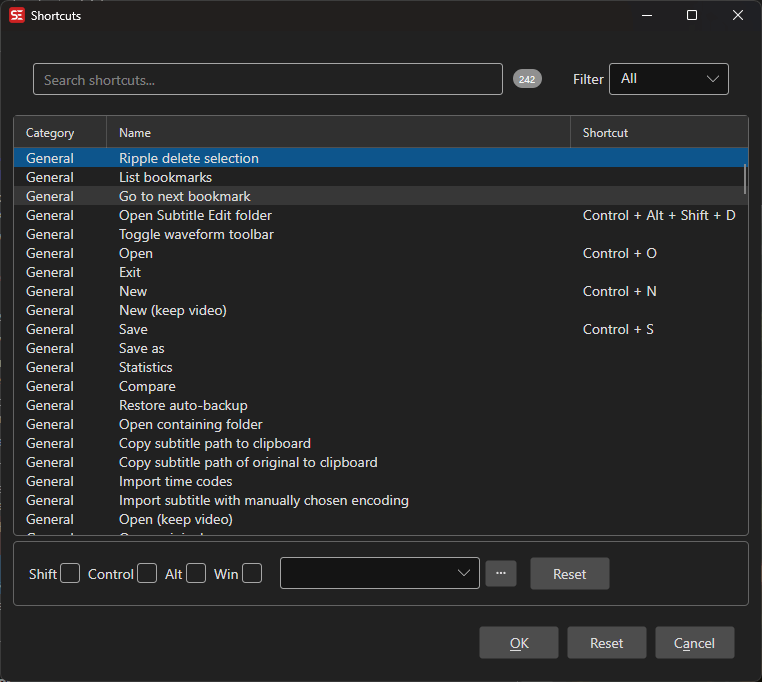

# Shortcuts

View, assign, and manage keyboard shortcuts for all commands in Subtitle Edit.

- **Menu:** Options → Shortcuts...
- **Shortcut:** Configurable

<!-- Screenshot: Shortcuts window -->

## How to Use

1. Open **Options → Shortcuts...**
2. Browse or search for the command you want to configure
3. Select the command in the list
4. Assign a shortcut by selecting modifier keys (Ctrl, Alt, Shift, Win) and a key
5. Click **OK** to save all changes

## Shortcut Categories

Shortcuts are organized into the following categories:

- **General** — Global shortcuts available everywhere (conflicts with all other categories)
- **Subtitle grid and text box** — Shortcuts active when working with subtitle text
- **Subtitle grid** — Shortcuts active when the subtitle grid is focused
- **Waveform** — Shortcuts active when the audio visualizer is focused

## Assigning a Shortcut

1. Select a command from the list
2. Check the desired modifier keys: **Ctrl**, **Alt**, **Shift**, **Win**
3. Select the key from the dropdown
4. The shortcut is applied immediately in the list
5. **Double-click** a command to open the key capture dialog, which lets you press the desired key combination directly

## Configurable Commands

Some commands have additional configuration beyond the shortcut key:

- **Set color 1–8** — Choose a color for each color shortcut
- **Surround with 1–3** — Define the left/right text to surround selected text with
- **Video move custom 1–2 back/forward** — Set the number of milliseconds to skip

Select a configurable command and click **Configure** to adjust its settings.

## Resetting Shortcuts

- **Reset** — Clear the shortcut for the selected command
- **Reset all** — Restore all shortcuts to their default values (requires confirmation)

## Filtering

Use the filter dropdown to narrow the list:

- **All** — Show all commands
- **Assigned** — Show only commands with a shortcut assigned
- **Unassigned** — Show only commands without a shortcut

Use the **search box** to filter commands by name.

## Duplicate Detection

When saving, Subtitle Edit checks for duplicate shortcut assignments. If duplicates are found within the same category (or if a "General" shortcut conflicts with any other category), you will be warned and can choose to save anyway or go back and fix them.

## Import / Export

- **Import** — Load shortcuts from a `.shortcuts` file (JSON format)
- **Export** — Save all configured shortcuts to a `.shortcuts` file

This is useful for sharing shortcut configurations between machines or team members.

## Keyboard Shortcuts

| Key | Action |
|-----|--------|
| Escape | Close shortcuts window |
| F1 | Open help |

Double-clicking a command opens the key capture dialog, allowing you to press the desired key combination directly.