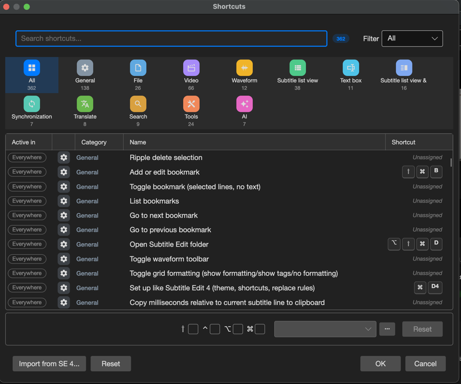

# Shortcuts

View, assign, and manage keyboard shortcuts for all commands in Subtitle Edit.

- **Menu:** Options → Shortcuts...
- **Shortcut:** Configurable

<!-- Screenshot: Shortcuts window -->

## How to Use

1. Open **Options → Shortcuts...**
2. Pick a category tile, or search for the command you want to configure
3. Select the command in the list
4. Assign a shortcut by selecting modifier keys (Ctrl, Alt, Shift, Win) and a key
5. Click **OK** to save all changes

## Browsing by Category

A row of category tiles above the list groups the commands thematically. Each tile has an icon, a color, and the number of commands in the group — click one to filter the list:

**All**, **General**, **File**, **Video**, **Waveform**, **Subtitle list view**, **Text box**, **Subtitle list view & text box**, **Synchronization**, **Translate**, **Search**, **Tools**, and **AI**.

In the list, each command shows its group with the matching icon and color, and assigned key combinations are rendered as keycap-style chips.

## Where a Shortcut Is Active

Independent of the thematic category, each command has a scope shown in the **Active in** column:

- **Everywhere** — global shortcuts, available in the whole main window (conflicts with all other scopes)
- **Subtitle list view** — active while the subtitle list view is focused
- **Text box** — active while the subtitle text box is focused
- **Subtitle list view & text box** — active in both
- **Waveform** — active while the audio visualizer is focused

## Assigning a Shortcut

1. Select a command from the list
2. Check the desired modifier keys: **Ctrl**, **Alt**, **Shift**, **Win**
3. Select the key from the dropdown
4. The shortcut is applied immediately in the list
5. Alternatively, **double-click a command in the list** to open the key capture dialog, then press the desired key combination directly

## Configurable Commands

Some commands have additional configuration beyond the shortcut key:

- **Set color 1–8** — Choose a color for each color shortcut
- **Surround with 1–3** — Define the left/right text to surround selected text with
- **Video move custom 1–2 back/forward** — Set the number of milliseconds to skip
- **Set actor 1–10** — Define the actor name assigned by each actor shortcut

Select a configurable command and click **Configure** to adjust its settings.

## Resetting Shortcuts

- **Reset** (next to the assignment controls) — Clear the shortcut for the selected command
- **Reset** (button bar) — Restore all shortcuts to their default values (requires confirmation)

## Filtering

Use the filter dropdown to narrow the list:

- **All** — Show all commands
- **Assigned** — Show only commands with a shortcut assigned
- **Unassigned** — Show only commands without a shortcut

Use the **search box** to filter commands by name.

## Duplicate Detection

When saving, Subtitle Edit checks for duplicate shortcut assignments. If duplicates are found within the same scope (or if an "Everywhere" shortcut conflicts with any other scope), you will be warned and can choose to save anyway or go back and fix them.

## Import / Export

Right-click the shortcut list to open the context menu:

- **Import...** — Load shortcuts from a `.shortcuts` file (JSON format)
- **Export...** — Save all configured shortcuts to a `.shortcuts` file
- **Import from SE 4...** — Import shortcuts from a Subtitle Edit 4 `Settings.xml` (also available as a button in the window)

This is useful for sharing shortcut configurations between machines or team members, or for keeping muscle memory when moving from Subtitle Edit 4.

## Keyboard Shortcuts

| Key | Action |
|-----|--------|
| Escape | Close shortcuts window |
| F1 | Open help |