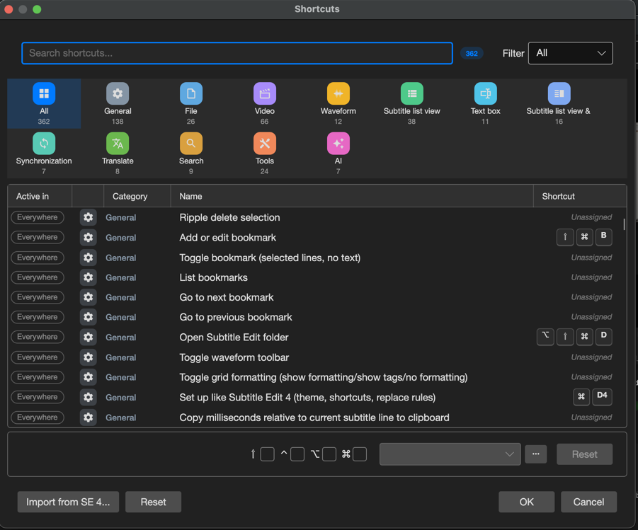

# Shortcuts

View, assign, and manage keyboard shortcuts for all commands in Subtitle Edit.

- **Menu:** Options → Shortcuts...
- **Shortcut:** Configurable

<!-- Screenshot: Shortcuts window -->

## How to Use

1. Open **Options → Shortcuts...**
2. Pick a category tile, or search for the command you want to configure
3. Select the command in the list
4. Assign a shortcut by selecting modifier keys (Ctrl, Alt, Shift, Win) and a key
5. Click **OK** to save all changes

## Browsing by Category

A row of category tiles above the list groups the commands thematically. Each tile has an icon, a color, and the number of commands in the group — click one to filter the list:

**All**, **General**, **File**, **Video**, **Waveform**, **Subtitle list view**, **Text box**, **Subtitle list view & text box**, **Synchronization**, **Translate**, **Search**, **Tools**, and **AI**.

In the list, each command shows its group with the matching icon and color, and assigned key combinations are rendered as keycap-style chips.

## Where a Shortcut Is Active

Independent of the thematic category, each command has a scope shown in the **Active in** column:

- **Everywhere** — global shortcuts, available in the whole main window (conflicts with all other scopes)
- **Subtitle list view** — active while the subtitle list view is focused
- **Text box** — active while the subtitle text box is focused
- **Subtitle list view & text box** — active in both
- **Waveform** — active while the audio visualizer is focused

## Assigning a Shortcut

1. Select a command from the list
2. Check the desired modifier keys: **Ctrl**, **Alt**, **Shift**, **Win**
3. Select the key from the dropdown
4. The shortcut is applied immediately in the list
5. Alternatively, **double-click a command in the list** to open the key capture dialog, then press the desired key combination directly

## Configurable Commands

Some commands have additional configuration beyond the shortcut key:

- **Set color 1–8** — Choose a color for each color shortcut
- **Surround with 1–8** — Define the left/right text to surround selected text with (this replaces the *Shortcut toggle custom start/end* setting from Subtitle Edit 4), and its **Behavior**: *Toggle* adds the text, or removes it when it is already there; *Add* adds it every time, so pressing the shortcut twice adds it twice; *Remove (all)* only removes it, all at once; *Remove (one each time)* removes one pair per press, so it undoes *Add* step by step. **Works on** picks *Selection, else whole text* (the selected part of the text box, otherwise the whole text of each selected subtitle) or *Each line* (every line of a subtitle gets its own pair, e.g. `[Hello]` / `[Bye]`)
- **Video move custom 1–4 back/forward** — Set the number of milliseconds to skip
- **Set actor 1–10** — Define the actor name assigned by each actor shortcut
- **Custom search 1–5** — Set the name and URL for each search slot
- **Custom shortcut 1–8** — Build your own shortcut from steps (see below)
- **Go to first line** / **Go to last line** — Whether the video position follows

Select a configurable command and click the **gear icon** to adjust its settings. The gear sits in the shortcut assignment row below the list, between the key detection button and **Reset** — it is only shown while a configurable command is selected, so if you cannot see it, the selected command has no extra settings.

## Custom Shortcuts

**Custom shortcut 1–8** (group **Custom**) are slots you build yourself. Select one, click the **gear icon**, give it an optional name and add steps that run from top to bottom:

- **Run command** — Runs any command from the shortcuts list (search by name). A command that opens a window waits for it to close before the next step runs.
- **Insert text** — Inserts text *at cursor* in the text box, or *at start of text* / *at end of text* of every selected line. Line breaks typed in the text box are inserted as line breaks.
- **Find and replace** — Replaces text in the selected lines, optionally as a **regular expression** (`$1` etc. in the replacement) and **case sensitive**.

Examples: *Insert text* `\N` at end of text to lift a subtitle one line per key press; *Find and replace* regex `(?m)^- ` with `– ` followed by *Run command* **Go to next line**.

**Active in** sets where the key works: *Everywhere*, *Subtitle list view*, *Text box*, *Subtitle list view & text box* or *Waveform* — so the same key can do something else elsewhere. For text box areas use a key with Ctrl/Alt, as a plain key would no longer type. Handy commands for steps: **Focus subtitle list view**, **Focus text box**, **Focus original text box**, **Focus waveform**, **Text box, go to start** and **Text box, go to end** — each step waits for focus to move before the next one runs. Assign a key like for any other command. The text changes of one run are undone in a single step. A custom shortcut cannot run another custom shortcut; a slot without steps does nothing.

## Resetting Shortcuts

- **Reset** (next to the assignment controls) — Clear the shortcut for the selected command
- **Reset** (button bar) — Restore all shortcuts to their default values (requires confirmation)

## Filtering

Use the filter dropdown to narrow the list:

- **All** — Show all commands
- **Assigned** — Show only commands with a shortcut assigned
- **Unassigned** — Show only commands without a shortcut

Use the **search box** to filter commands by name.

## Sorting

Click a column header to sort the list by that column — **Active in**, **Category**, **Name**, and **Shortcut** are all sortable. Click again to reverse the order. Sorting stays active while filtering by category tile or search text, so you can e.g. sort a single category by shortcut key.

## Duplicate Detection

When saving, Subtitle Edit checks for duplicate shortcut assignments. If duplicates are found within the same scope (or if an "Everywhere" shortcut conflicts with any other scope), you will be warned and can choose to save anyway or go back and fix them.

## Import / Export

Right-click the shortcut list to open the context menu:

- **Import...** — Load shortcuts from a `.shortcuts` file (JSON format)
- **Export...** — Save all configured shortcuts to a `.shortcuts` file
- **Import from SE 4...** — Import shortcuts from a Subtitle Edit 4 `Settings.xml` (also available as a button in the window)

This is useful for sharing shortcut configurations between machines or team members, or for keeping muscle memory when moving from Subtitle Edit 4.

## Keyboard Shortcuts

| Key | Action |
|-----|--------|
| Escape | Close shortcuts window |
| F1 | Open help |