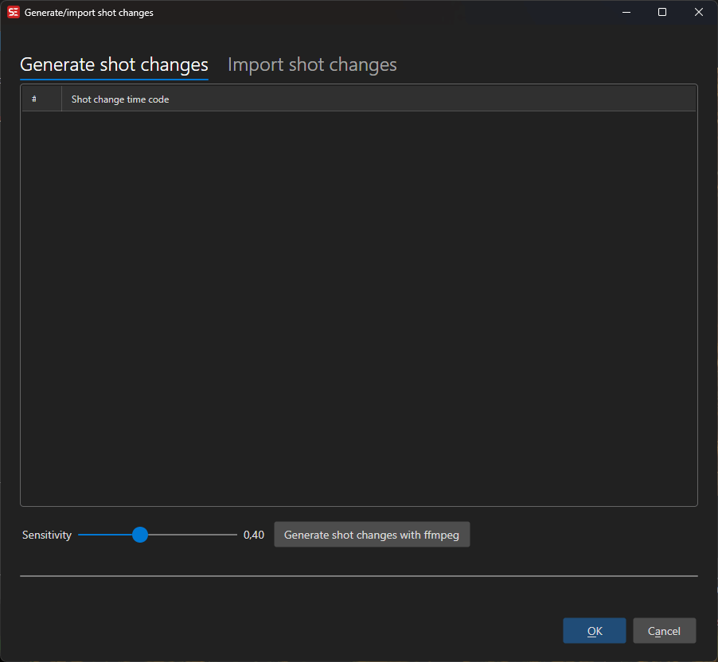

# Shot Changes

Detect scene/shot changes in a video using FFmpeg, or import them from a file.

- **Menu:** Video → Shot changes → Generate / Import
- **Shortcut:** Configurable

<!-- Screenshot: Shot changes window -->

## How to Use

1. Open **Video → Shot changes → Generate shot changes...**
2. Adjust the **Sensitivity** slider (higher = fewer detected changes)
3. Click **Generate** to run FFmpeg scene detection
4. Detected shot change times appear in the list
5. Click **OK** to apply them to the audio visualizer

## Time Code Format

Choose how shot change times are displayed and exported:

- **Seconds** — Decimal seconds
- **Frames** — Frame numbers
- **Milliseconds** — Millisecond values
- **HH:MM:SS.FFF** — Full time code format

## Import / Export

- **Import** — Load shot changes from a text file (one time code per line)
- **Export** — Save detected shot changes to a file

Shot changes are displayed as vertical lines on the audio visualizer waveform.

## Keyboard Shortcuts

| Key | Action |
|-----|--------|
| Escape | Close / Cancel |
| F1 | Open help |
