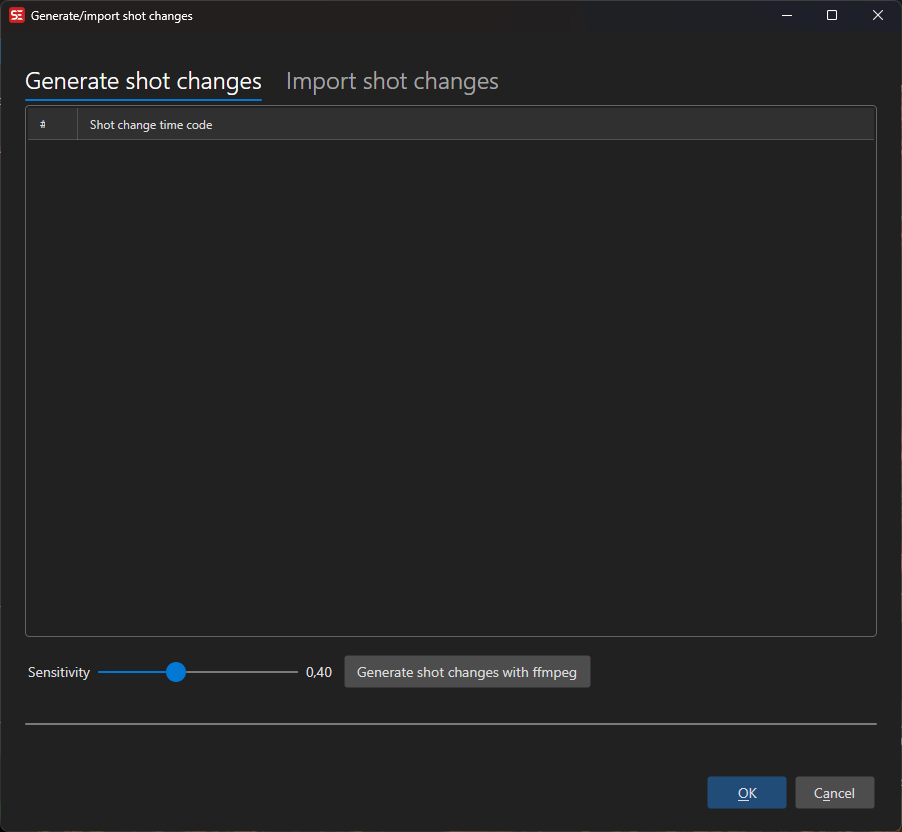

# Shot Changes

Detect scene/shot changes in a video using FFmpeg, or import them from a file.

- **Menu:** Video → Generate/import shot changes
- **Shortcut:** Configurable

A second menu item, **Show shot changes list**, appears under the Video menu once the loaded video has any shot changes. It lists the current shot changes with **Go to** (also double-click), **Clear**, and a right-click **Delete** for the selected entry.

<!-- Screenshot: Shot changes window -->

## How to Use

1. Open **Video → Generate/import shot changes**
2. Adjust the **Sensitivity** slider (higher = fewer detected changes)
3. Click **Generate** to run FFmpeg scene detection
4. Detected shot change times appear in the list
5. Click **OK** to apply them to the audio visualizer

## Time Code Format

Choose how imported shot change times are interpreted:

- **Seconds** — Decimal seconds
- **Frames** — Frame numbers
- **Milliseconds** — Millisecond values
- **HH:MM:SS.FFF** — Full time code format

## Import

The window has two tabs: **Generate shot changes** and **Import shot changes**.

- **Import shot changes from file** — Load shot changes from a text file (one time code per line); the text box on the tab can also be edited or pasted into directly

Shot changes are displayed as vertical lines on the audio visualizer waveform.

## Keyboard Shortcuts

| Key | Action |
|-----|--------|
| Escape | Close / Cancel |
| F1 | Open help |
