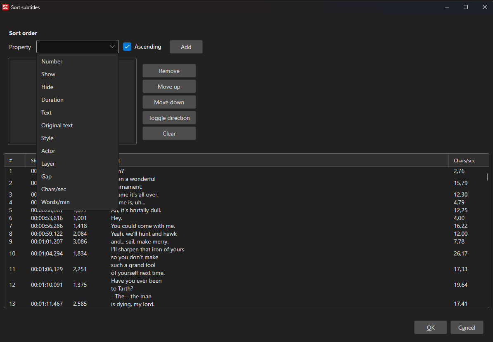

# Sort By

Sort subtitle lines by one or more criteria.

- **Menu:** Tools → Sort subtitles...

<!-- Screenshot: Sort by window -->

## Sort Options

Add one or more sort criteria from the available properties:

- Number
- Show (start time)
- Hide (end time)
- Duration
- Text
- Original text
- Style
- Actor
- Layer
- Gap
- Characters/sec
- Words/min
- Pixel width

Each criterion can be set to ascending or descending, and multiple criteria are applied in order (drag or use the up/down buttons to reorder).
