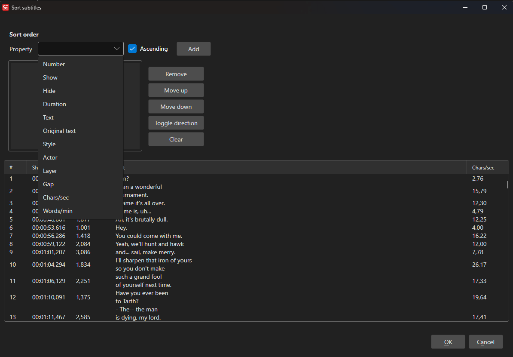

# Sort By

Sort subtitle lines by one or more criteria.

- **Menu:** Tools → Sort subtitles...

<!-- Screenshot: Sort by window -->

## Sort Options

Add one or more sort criteria from the available properties:

- Number
- Show (start time)
- Hide (end time)
- Duration
- Text
- Text total length
- Text single line max length
- Original text
- Style
- Actor
- Layer
- Gap
- Characters/sec
- Words/min
- Pixel width

Each criterion can be set to ascending or descending (**Toggle direction**), and multiple criteria are applied in order — use **Move up** / **Move down** to reorder them, or **Clear** to start over.
