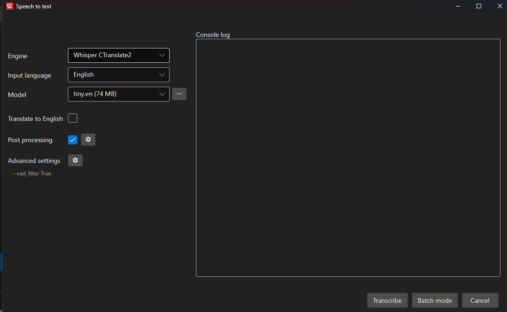

# Speech to Text

Subtitle Edit can automatically transcribe audio to text using Whisper-based speech recognition engines.

- **Menu:** Video → Speech to text (Whisper)...

<!-- Screenshot: Speech to text window -->

## Supported Engines

| Engine | Platform | GPU Support |
|--------|----------|-------------|
| Whisper.cpp | Windows, Linux, macOS | CPU only |
| Whisper.cpp (cuBLAS) | Windows | NVIDIA CUDA |
| Whisper.cpp (Vulkan) | Windows | Vulkan GPU |
| Purfview's Faster Whisper XXL | Windows, Linux | NVIDIA CUDA |
| Whisper CTranslate2 | Windows, Linux, macOs | CPU only |
| Const-me's Whisper | Windows | DirectX |
| OpenAI Whisper | All (Python required) | NVIDIA CUDA |
| Chat LLM cpp | Windows, Linux | CPU/GPU |

Engines and models are downloaded automatically on first use.

## How to Use

1. Open a video file in Subtitle Edit
2. Go to **Video → Speech to text (Whisper)...**
3. Select an **Engine** from the dropdown
4. Select a **Model** (larger models = better accuracy but slower)
5. Select the **Language** of the audio
6. Optionally enable:
   - **Translate to English** — Translate non-English audio to English
   - **Adjust timings** — Post-process timing using waveform data
   - **Post-processing** — Fix casing, merge lines, add periods, etc.
7. Click **Transcribe**

## Models

Each engine has its own set of models. Common model sizes:
- **tiny** — Fastest, least accurate
- **base** — Good balance for quick work
- **small** — Better accuracy
- **medium** — High accuracy
- **large** / **large-v2** / **large-v3** — Best accuracy, slowest

Models ending in `.en` are English-only and perform better for English audio.

## Batch Mode

Transcribe multiple video files at once:
1. Click **Batch mode**
2. Add video files
3. Click **Transcribe**
4. Results are saved as `.srt` files next to the video files

## Advanced Settings

Click the **Advanced** button to configure custom command-line arguments for the Whisper engine:
- Use VAD (voice activity detection) for better timing
- Highlight spoken words in the transcript
- Adjust temperature or other model parameters

## Post-Processing Settings

Click the **Post-processing** button to configure:
- Adjust timings (using waveform peak data)
- Fix short durations
- Fix casing
- Add periods
- Merge short lines
- Split long lines
- Change underline to color (useful for highlight spoken words)

## Console Log

The console log at the bottom shows real-time output from the Whisper process, useful for debugging issues.

## Tips

- For NVIDIA GPU users, use **Whisper.cpp (cuBLAS)** or **Purfview's Faster Whisper XXL** for fastest transcription
- If you get "CUDA out of memory" errors, try a smaller model
- The `--standard` parameter is automatically added for Purfview's Faster Whisper XXL
- You can re-download an engine by right-clicking the engine area
