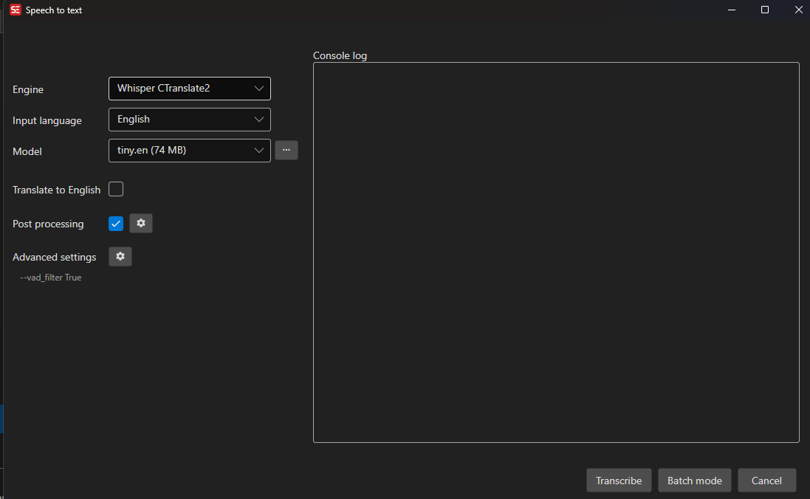

# Speech to Text

Subtitle Edit can automatically transcribe audio to text using Whisper-based and other modern speech recognition engines.

- **Menu:** Video → Speech to text...

<!-- Screenshot: Speech to text window -->

## Supported Engines

| Engine | Platform | Notes |
|--------|----------|-------|
| Whisper.cpp | Windows, Linux, macOS | Local CPU engine |
| Whisper.cpp (cuBLAS) | Windows | NVIDIA CUDA build |
| Whisper.cpp (Vulkan) | Windows | Vulkan GPU build |
| Purfview's Faster Whisper XXL | Windows, Linux | Fast local engine, often used with NVIDIA CUDA |
| Whisper CTranslate2 | Windows, Linux, macOS | CPU / NVIDIA CUDA depending on installation; CUDA requires [CUDA 12.x](https://developer.nvidia.com/cuda-12-0-0-download-archive) |
| Const-me's Whisper | Windows | DirectX-based engine |
| OpenAI Whisper | All | Python-based OpenAI Whisper workflow |
| Chat LLM.cpp | Windows, Linux, macOS | Local LLM transcription workflow; macOS download is for Apple Silicon |
| Qwen3 ASR CPP | Windows, Linux, macOS | Local Qwen3 ASR engine with downloadable GGUF models |
| Parakeet.cpp | Windows, Linux, macOS | Local Parakeet engine; some models are English-only, larger models are multilingual |
| Crisp ASR GLM | Windows, Linux, macOS | Crisp ASR backend |
| Crisp ASR Qwen3 | Windows, Linux, macOS | Crisp ASR backend |
| Crisp ASR Granite | Windows, Linux, macOS | Crisp ASR backend |
| Crisp ASR Omni | Windows, Linux, macOS | Crisp ASR backend |
| Crisp ASR Parakeet | Windows, Linux, macOS | Crisp ASR backend |
| Crisp ASR Canary | Windows, Linux, macOS | Crisp ASR backend |
| Crisp ASR Cohere | Windows, Linux, macOS | Crisp ASR backend |
| Crisp ASR Fire Red | Windows, Linux, macOS | Crisp ASR backend |

Engines and models are downloaded automatically on first use.

## SE5 Engine Notes

- **Qwen3 ASR CPP** includes 0.6B and 1.7B model options, plus a forced-aligner model used for timing workflows.
- **Parakeet.cpp** stores each model in its own folder because a model needs both weights and a vocabulary file.
- **Crisp ASR** engines share a common backend workflow and expose different model families such as GLM, Qwen3, Granite, Omni, Parakeet, Canary, Cohere, and Fire Red.
- Several newer engines support automatic language selection.
- Each engine can have separate advanced command-line parameters.

## How to Use

1. Open a video file in Subtitle Edit
2. Go to **Video → Speech to text...**
3. Select an **Engine** from the dropdown
4. Select a **Model** (larger models usually improve accuracy but take more time and disk space)
5. Select the **Language** of the audio, or use auto-language when the selected engine supports it
6. Optionally enable:
   - **Translate to English** — Translate non-English audio to English
   - **Adjust timings** — Post-process timing using waveform data
   - **Post-processing** — Fix casing, merge lines, add periods, etc.
7. Click **Transcribe**

## Models

Each engine has its own set of models. Common model sizes:
- **tiny** — Fastest, least accurate
- **base** — Good balance for quick work
- **small** — Better accuracy
- **medium** — High accuracy
- **large** / **large-v2** / **large-v3** — Best accuracy, slowest

Models ending in `.en` are English-only and perform better for English audio.

## Batch Mode

Transcribe multiple video files at once:
1. Click **Batch mode**
2. Add video files
3. Click **Transcribe**
4. Results are saved as `.srt` files next to the video files

## Advanced Settings

Click the **Advanced** button to configure custom command-line arguments for the Whisper engine:
- Use VAD (voice activity detection) for better timing
- Highlight spoken words in the transcript
- Adjust temperature or other model parameters

Advanced settings are stored per engine, so you can keep separate parameters for Whisper.cpp, Qwen3 ASR, Parakeet.cpp, Crisp ASR, and other engines.

## Post-Processing Settings

Click the **Post-processing** button to configure:
- Adjust timings (using waveform peak data)
- Fix short durations
- Fix casing
- Add periods
- Merge short lines
- Split long lines
- Change underline to color (useful for highlight spoken words)

## Console Log

The console log at the bottom shows real-time output from the Whisper process, useful for debugging issues.

## Tips

- For NVIDIA GPU users, use **Whisper.cpp (cuBLAS)** or **Purfview's Faster Whisper XXL** for fastest transcription
- If you get "CUDA out of memory" errors, try a smaller model
- The `--standard` parameter is automatically added for Purfview's Faster Whisper XXL
- You can re-download an engine by right-clicking the engine area
- If a new engine has no model installed yet, let Subtitle Edit download both the engine and the selected model before starting transcription
