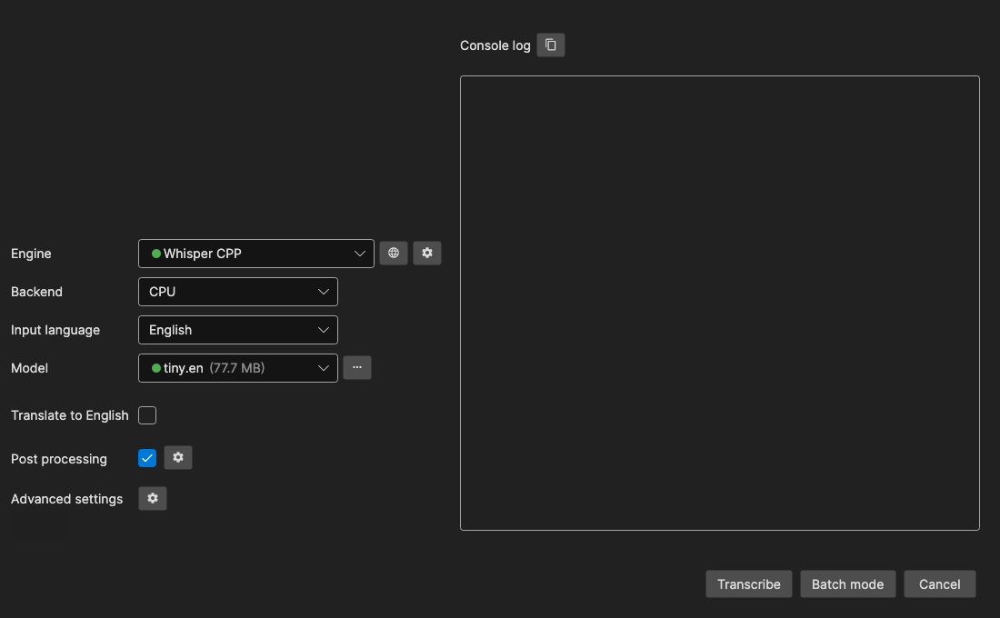

# Speech to Text

Subtitle Edit can automatically transcribe audio to text using Whisper-based and other modern speech recognition engines.

- **Menu:** Video → Speech to text...

<!-- Screenshot: Speech to text window -->

## Supported Engines

| Engine | Platform | Notes |
|--------|----------|-------|
| Whisper CPP | Windows, Linux, macOS | Local CPU engine. On Windows the cuBLAS (NVIDIA CUDA) and Vulkan GPU backends can also be selected from the Whisper CPP backend dropdown. |
| Purfview Faster Whisper XXL | Windows, Linux | Fast local engine, often used with NVIDIA CUDA |
| Whisper CTranslate2 | Windows, Linux (x64), macOS (Apple Silicon) | CPU / NVIDIA CUDA depending on installation; CUDA requires [CUDA 12.x](https://developer.nvidia.com/cuda-12-0-0-download-archive) |
| MLX Whisper | macOS (Apple Silicon) | Runs Whisper on the Apple GPU / Neural Engine via Apple's MLX. Not downloaded by Subtitle Edit — install the `mlx-whisper` Python package yourself (see notes below) |
| Whisper Const-me | Windows | DirectX-based engine |
| Whisper OpenAI | All | Python-based OpenAI Whisper workflow |
| OpenAI Compatible Server | All | Connect to any OpenAI-compatible speech-to-text endpoint |
| OpenRouter | All | Online. One API key routes to Whisper, gpt-4o-transcribe, Groq and Google Chirp |
| Alibaba Qwen3-ASR | All | Online Qwen3-ASR via Alibaba Model Studio (DashScope) |
| Qwen3 ASR CPP | Windows, Linux | Local Qwen3 ASR engine with downloadable GGUF models |
| Crisp ASR | Windows, Linux, macOS | Single engine with selectable backends: Parakeet, Canary, Cohere, Fire Red, GLM, Granite, Qwen3, Mega, Omni, Kyutai |

Engines and models are downloaded automatically on first use.

## SE5 Engine Notes

- **Whisper CPP** is shown as a single entry; the CPU / cuBLAS / Vulkan backends are selected from a secondary dropdown when Whisper CPP is selected.
- **Qwen3 ASR CPP** includes 0.6B and 1.7B model options, plus a forced-aligner model used for timing workflows.
- **Crisp ASR** is exposed as one engine that wraps multiple backends (Parakeet, Canary, Cohere, Fire Red, GLM, Granite, Qwen3, Mega, Omni, Kyutai). Pick the backend from the Crisp ASR backend dropdown.
- **MLX Whisper** (Apple Silicon Macs) is not bundled or auto-downloaded — it drives Apple's `mlx-whisper` Python package. Install it once with `pip3 install mlx-whisper` (or `pipx install mlx-whisper`); models download from Hugging Face on first use. Subtitle Edit detects the install by finding a Python that can `import mlx_whisper` — it probes Homebrew, python.org, pyenv and system interpreters, and (for pipx / virtual-env / conda installs, which isolate the package) reads the `mlx_whisper` command found on your PATH or at `~/.local/bin/mlx_whisper` to locate the matching interpreter. If it reports "not found" after a pipx/venv install, make sure `which mlx_whisper` resolves.
- A **Forced aligner** option is shown for Crisp ASR backends and exposes the built-in aligner, Canary CTC, Qwen3, and the wav2vec2 zoo (12 language-specific CTC aligners that run on top of any Crisp ASR backend).
- Several newer engines support automatic language selection.
- Each engine can have separate advanced command-line parameters.

## Language-specific models

Some backends offer models fine-tuned for one language, which usually beat the general model on that language.

These models live under the **Crisp ASR** engine, not under the standalone Qwen3 ASR CPP engine. To reach them, set **Engine** to *Crisp ASR*, then pick the backend from the Crisp ASR backend dropdown - the model list updates to that backend's models. For Japanese:

| Backend | Model | Notes |
|---------|-------|-------|
| Crisp ASR Qwen3 | `qwen3-asr-1.7b-ja-anime-q8_0.gguf` (or `-q4_k.gguf`) | Fine-tuned on anime / visual novel speech - the best starting point for anime audio |
| Crisp ASR Cohere | `cohere-asr-ja-q8_0.gguf` (also q4_k / q6_k / f16) | Japanese fine-tune covering general and anime domains |
| Crisp ASR Parakeet | `parakeet-tdt-0.6b-ja-q8_0.gguf` (also q4_k / unquantized) | Fast Japanese model |

The general `qwen3-asr-1.7b` and Whisper `large-v3-turbo` models are also strong on Japanese if you prefer a single model for mixed content.

## How to Use

1. Open a video file in Subtitle Edit
2. Go to **Video → Speech to text...**
3. Select an **Engine** from the dropdown
4. Select a **Model** (larger models usually improve accuracy but take more time and disk space)
5. Select the **Language** of the audio, or use auto-language when the selected engine supports it
6. Optionally enable:
   - **Translate to English** — Translate non-English audio to English
   - **Adjust timings** — Post-process timing using waveform data
   - **Post-processing** — Fix casing, merge lines, add periods, etc.
7. Click **Transcribe**

## Models

Each engine has its own set of models. Common model sizes:
- **tiny** — Fastest, least accurate
- **base** — Good balance for quick work
- **small** — Better accuracy
- **medium** — High accuracy
- **large** / **large-v2** / **large-v3** — Best accuracy, slowest

Models ending in `.en` are English-only and perform better for English audio.

## Batch Mode

Transcribe multiple video files at once:
1. Click **Batch mode**
2. Add video files
3. Click **Transcribe**
4. Results are saved as `.srt` files next to the video files

## Advanced Settings

Click the **Advanced** button to configure custom command-line arguments for the Whisper engine:
- Use VAD (voice activity detection) for better timing
- Highlight spoken words in the transcript
- Adjust temperature or other model parameters

Advanced settings are stored per engine, so you can keep separate parameters for Whisper CPP, Qwen3 ASR, Crisp ASR, and other engines.

## Post-Processing Settings

Click the **Post-processing** button to configure:
- Adjust timings (using waveform peak data)
- Fix short durations
- Fix casing
- Add periods
- Merge short lines
- Split long lines
- Change underline to color (useful for highlight spoken words)

## Console Log

The console log at the bottom shows real-time output from the Whisper process, useful for debugging issues.

## Tips

- For NVIDIA GPU users, use the **Whisper CPP** cuBLAS backend or **Purfview Faster Whisper XXL** for fastest transcription
- If you get "CUDA out of memory" errors, try a smaller model
- The `--standard` parameter is automatically added for Purfview Faster Whisper XXL
- You can re-download an engine by right-clicking the engine area
- If an engine executable has gone missing (typically quarantined by antivirus software), Subtitle Edit detects it when transcription starts, names the missing file, and offers to re-download the engine
- If a new engine has no model installed yet, let Subtitle Edit download both the engine and the selected model before starting transcription
