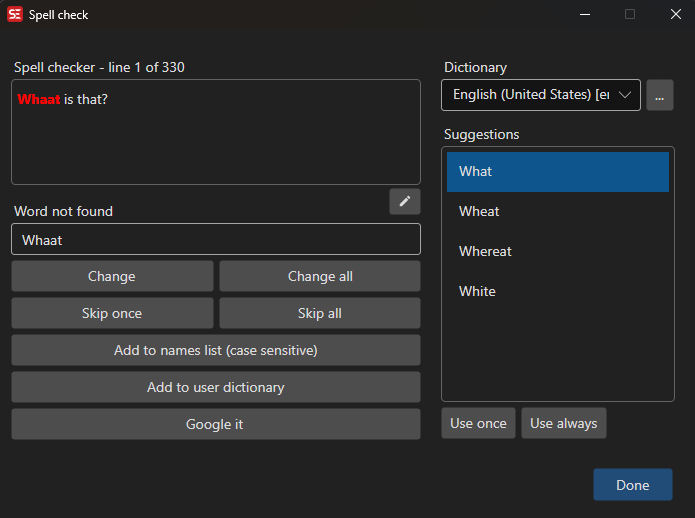

# Spell Check

Check spelling of subtitle text and correct misspelled words.

- **Menu:** Spell check → Spell check...
- **Shortcut:** Configurable

<!-- Screenshot: Spell check window -->

## How to Use

1. Open **Spell check → Spell check...**
2. Select the dictionary language (auto-detected from subtitle content)
3. The spell checker will highlight the first unknown word
4. Choose an action for each flagged word:
   - **Change** — Replace with the text in the word field (once)
   - **Change all** — Replace all occurrences
   - **Skip once** — Ignore this occurrence
   - **Skip all** — Ignore all occurrences of this word
   - **Add to names list** — Add the word to the names/proper nouns list
   - **Add to user dictionary** — Add the word to your personal dictionary
5. The spell checker advances to the next unknown word automatically
6. When all words have been checked, the window closes

## Suggestions

When a misspelled word is found, the spell checker provides a list of suggested corrections.

- **Double-click** a suggestion to use it once
- **Use once** — Replace with the selected suggestion for this occurrence
- **Use always** — Replace all occurrences with the selected suggestion

## Dictionaries

Spell check requires a dictionary to be installed. If no dictionary is found, you will be prompted to download one.

- **Get dictionaries** — Download additional dictionaries
- The dictionary language is auto-detected from the subtitle content
- You can manually select a different dictionary from the dropdown
- The last used dictionary is remembered between sessions

## Additional Features

- **Edit whole text** — Edit the full subtitle text for the current line
- **Google it** — Search Google for the current word
- The current subtitle line is highlighted in the subtitle grid as you check

## Keyboard Shortcuts

| Key | Action |
|-----|--------|
| Escape | Close spell check |
| F1 | Open help |
