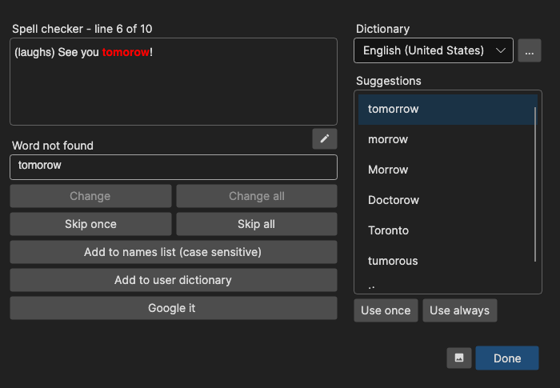

# Spell Check

Check spelling of subtitle text and correct misspelled words.

- **Menu:** Spell check → Spell check...
- **Shortcut:** Configurable

<!-- Screenshot: Spell check window -->

## How to Use

1. Open **Spell check → Spell check...**
2. Select the dictionary language (auto-detected from subtitle content)
3. The spell checker will highlight the first unknown word
4. Choose an action for each flagged word:
   - **Change** — Replace with the text in the word field (once)
   - **Change all** — Replace all occurrences, and remember the correction for future runs
   - **Skip once** — Ignore this occurrence
   - **Skip all** — Ignore all occurrences of this word, for the current session only
   - **Add to names list (case sensitive)** — Add the word to the names/proper nouns list (matches the exact casing)
   - **Add to user dictionary** — Add the word to your personal dictionary
5. The spell checker advances to the next unknown word automatically
6. When all words have been checked, a **Spell check completed** summary shows how many words were changed, skipped and added — tick **Do not show this message again** to turn it off

**Skip all is not saved.** It lasts until the window closes and is not carried over to the
next run, so a mis-click never has lasting consequences. To accept a word permanently use
**Add to user dictionary** (or **Add to names list** for proper nouns); to have a
correction applied automatically from now on use **Change all**.

## Suggestions

When a misspelled word is found, the spell checker provides a list of suggested corrections.

- **Double-click** a suggestion to use it once
- **Use once** — Replace with the selected suggestion for this occurrence
- **Use always** — Replace all occurrences with the selected suggestion

## "Use always" list

**Change all** and **Use always** save the correction per language in the "Use always" list
(`<language>_UseAlways.xml` in the dictionary folder). A saved correction is only applied to words
the dictionary flags as misspelled, so a correctly spelled word is never replaced.

To view or edit the list, click the list button next to the dictionary dropdown in the spell
check window, or use **Edit "Use always" list...** in **Options → Word lists**:

- Pick the language, and search to filter the pairs
- Select a pair to edit it, or type a misspelled word and its replacement and click **Add**
- Remove a pair with its trash button (or **Delete**)
- Pairs whose word is spelled correctly (or is a name or user word) are marked with a warning
  icon - spell check never flags those words, so the pair is never used. **Remove unused** deletes
  them all
- Changes are saved when you click **OK**

The list is only used and saved when **Spell check: remember "Use always" list** is turned on in
**Settings → Tools**.

## Dictionaries

Spell check requires a dictionary to be installed. If no dictionary is found, you will be prompted to download one.

- **Get dictionaries** — Download additional dictionaries
- The dictionary language is auto-detected from the subtitle content
- You can manually select a different dictionary from the dropdown
- The last used dictionary is remembered between sessions

## Additional Features

- **Edit whole text** — Edit the full subtitle text for the current line
- **Google it** — Search Google for the current word
- **Undo** — Reverts the last change; the button only appears once there is something to undo
- **Play current** — Plays the line in the main window's video player and pauses at its end; hidden when no video is loaded
- **Show source images too...** — The image button next to **Done** attaches an image-based subtitle (sup, VobSub, BDN XML, TS, MKV, ...) so the original bitmap is shown for each line; after an OCR run the images are attached automatically
- The current subtitle line is highlighted in the subtitle grid as you check

## Keyboard Shortcuts

| Key | Action |
|-----|--------|
| Escape | Close spell check |
| F1 | Open help |
