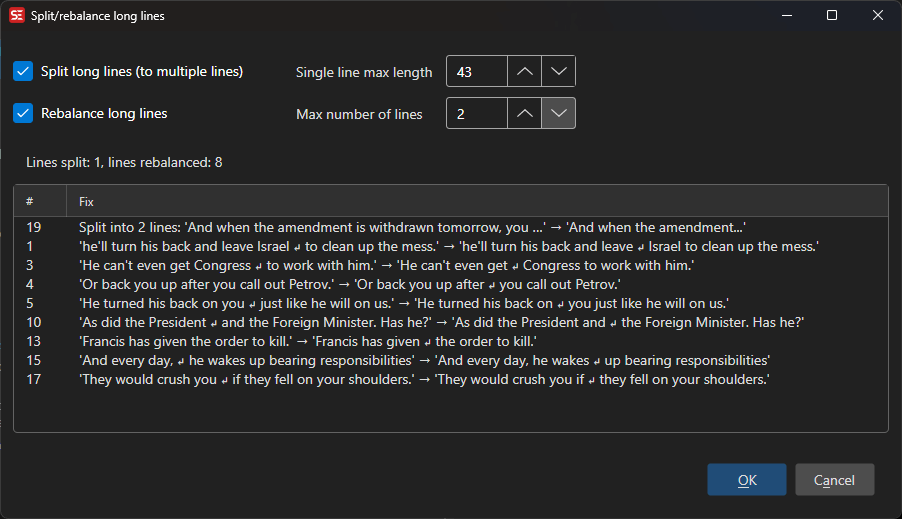

# Split / Rebalance Long Lines

Split or rebalance subtitle lines that exceed maximum character limits.

- **Menu:** Tools → Split/rebalance long lines...

<!-- Screenshot: Split break long lines window -->

## Options

- **Split long lines** — Split subtitles whose total length exceeds the maximum
- **Rebalance long lines** — Re-balance line breaks so lines have a more even length
- **Single line max length** — Maximum characters allowed on a single line
- **Max number of lines** — Maximum number of lines a subtitle may span (1-10)

The preview list updates live and shows all proposed fixes.
